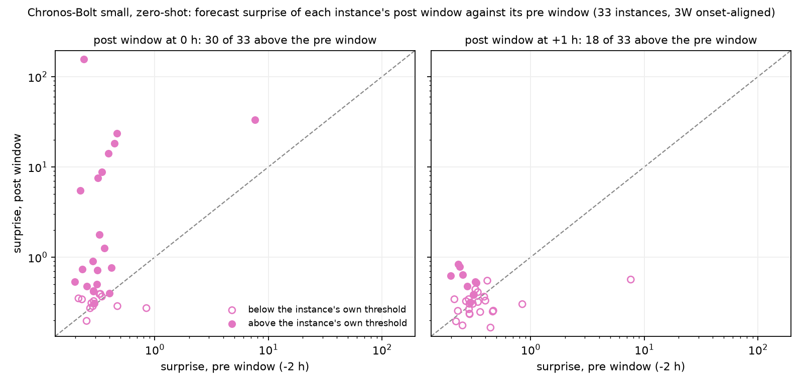

# Chronos-Bolt zero-shot on the onset-aligned 3W windows

## Summary

The study scores the 48 evaluable instances of 3W v2.0.0 (manifest `14bc1397d3ee`, 288 onset-aligned one-hour windows) with `amazon/chronos-bolt-small`, a pretrained time-series forecaster, with nothing fitted on 3W. For each window and each of the six common variables the model forecasts the window hour from the four hours before it at one-minute resolution, and the window score is the mean absolute error of the median forecast in units of the 10-90% forecast band. Under each instance's own worst-baseline threshold the score fires on 18.2% of the pre windows (floor 25.0%) and on 63.6% of the post0 windows; pooled, it ranks post above pre at ROC-AUC 0.675 against 0.621 for the clock control on the same instances, and the paired hit rate is 0.909 at onset and 0.545 an hour later. 15 of 48 instances are refusals because at least one baseline window lacks 60 minutes of context or holds a constant variable. The 48 positives are the first two hours of a transient run-up, so the numbers describe 33 instances and the beginning of a fault. The per-fold table shows the spread.

## Data

The windows are the detector study's onset-aligned cache (`data/3w_windows_aligned/windows.parquet`, manifest sha256 `6f4f097fcd4a`): 48 instances over 21 wells, six windows each at -5, -4, -3 (baseline), -2 (pre), 0 (post0) and +1 h (post1) from the instance's own fault onset, 288 windows in all. The design, the evaluable-set rule and the onset definition are in [the detector report](../3w_detectors/REPORT.md); nothing about them changes here. The raw rows come from the 1 s archives under `data/3w_archives`; only rows with quality `GOOD_ASSUMED` are read. The six variables are `P-ANULAR`, `P-JUS-CKGL`, `P-MON-CKP`, `P-PDG`, `P-TPT`, `T-TPT`. Fold membership per instance is read from the detector study's `examples/studies/3w_detectors/results/aligned_per_instance.csv`, so the per-fold table below cuts the same wells the detector study cut.

The positives are the run-up. All 48 evaluable onsets are transient classes (101-109), and 47 of the 48 post1 windows contain only transient rows (detector report, onset-aligned design). A post window here is the first or second hour after a fault begins, so the question is whether the forecast error rises at the beginning of a fault; the steady fault state is never scored.

## Method

Model: `amazon/chronos-bolt-small`, Hugging Face revision `772f3d25d38aec6d914c8949dab4462e2d46f5d8`, loaded with `chronos.BaseChronosPipeline.from_pretrained` (class `ChronosBoltPipeline`) from `chronos-forecasting` 2.3.1 on `torch` 2.14.0+cpu, cpu, float32, `torch.manual_seed(0)`, 4 threads. Nothing is fitted or fine-tuned on 3W in this study; whether the model's public pretraining corpus contains any 3W series is not checked.

Per window and variable:

1. Context is the 240 minutes before `window_start`, target is the 60 minutes of the window, both as one-minute means of the good rows. Fewer than 60 context minutes with data, fewer than 30 target minutes with data, or a constant context is a refusal with a cause string; the row stays in `results/window_scores.csv` unscored.
2. A missing context minute takes the last observed minute (the first observed minute where none precedes it); 18,381 minutes are filled this way and each row records its count in `n_context_filled`.
3. `predict_quantiles(context, prediction_length=60, quantile_levels=[0.1, 0.5, 0.9])`, batched 128 series at a time.
4. Surprise = mean over the observed target minutes of `|actual - q50| / max(q90 - q10, 0.05 * std(context))`. A target minute without data is skipped and counted (0 in this run).

Per window and instance:

5. The window score is the mean surprise over its scored variables; fewer than 4 scored variables is a window refusal.
6. Each instance's threshold is `worst_baseline_threshold` over its three baseline window scores (`tsdive.eval`); an instance with a refused baseline window has no threshold and is a refusal. `fires` decides pre, post0 and post1 at that threshold; the false-alarm floor is `far_floor(3)` = 0.250 and `over_floor` is the measured rate minus it.
7. Pooled ranking uses `ranking_metrics` with the pre windows as negatives and the post0 and post1 windows as positives, over all instances with a threshold and per fold. The paired hit rate is the share of instances whose post window outscores its own pre window. The detection delay is 0 when post0 fires, 1 when only post1 fires.
8. The clock control is `clock_control` on `window_index`, the window's position in its own record, exactly as the detector study's aligned clock; it is reported over all 48 instances and again over the 33 instances the model scores.

Commands:

```
uv sync --extra tsfm
uv run python examples/studies/3w_chronos/run_chronos.py
uv run python examples/studies/3w_chronos/make_report.py
```

The run takes 58 s on the CPU, 9 of them loading the model. Two runs write byte-identical CSVs; the study checked this with a second run into a scratch directory and `cmp` on every file.

## Results

### Against the detector study

The detector rows are read from the detector study's frozen `results/aligned_summary.csv` (variant `all`, onset-aligned design) and are not recomputed. AUC pools pre windows as negatives and post windows as positives; the range in parentheses is the per-fold minimum and maximum where more than one fold scores. Paired hit is post0 / post1. FAR is the share of pre windows firing at each instance's own threshold, and over floor is that share minus 0.250. The two clock rows differ only in the instance set.

| tool | instances with threshold | ROC-AUC (fold range) | paired hit post0 / post1 | FAR on pre | over floor | detect post1 | source |
|---|---:|---|---|---:|---:|---:|---|
| MAD screen (regime-blind), own history | 48 of 48 | 0.799 (0.729-0.938) | 0.812 / 0.917 | 62.5% | +0.375 | 91.7% | detector study, tagledger 0.1.0 @ `edf2b4ad` |
| SPC individuals rules, own history | 48 of 48 | 0.713 (0.571-0.879) | 0.812 / 0.812 | 43.8% | +0.188 | 85.4% | detector study, tagledger 0.1.0 @ `edf2b4ad` |
| MSPC Hotelling T2, per-instance-standardised | 28 of 48 | 0.541 (0.407-0.750) | 0.643 / 0.630 | 57.1% | +0.321 | 77.8% | detector study, tagledger 0.1.0 @ `edf2b4ad` |
| MSPC SPE, per-instance-standardised | 28 of 48 | 0.658 (0.562-1.000) | 0.893 / 0.852 | 96.4% | +0.714 | 100.0% | detector study, tagledger 0.1.0 @ `edf2b4ad` |
| IsolationForest, per-instance-standardised | 48 of 48 | 0.793 (0.745-0.949) | 0.875 / 0.875 | 100.0% | +0.750 | 100.0% | detector study, tagledger 0.1.0 @ `edf2b4ad` |
| clock control (position in the record) | 48 of 48 | 0.626 (0.626-0.686) | 1.000 / 1.000 | 100.0% | +0.750 | 100.0% | detector study, tagledger 0.1.0 @ `edf2b4ad` |
| Chronos-Bolt small, zero-shot forecast surprise | 33 of 48 | 0.675 (0.469-0.819) | 0.909 / 0.545 | 18.2% | -0.068 | 27.3% | this study, tsdive 0.2.0 @ `3c673377` |
| clock control, the 33 instances Chronos-Bolt scores | 33 of 33 | 0.621 (0.618-0.676) | 1.000 / 1.000 | 100.0% | +0.750 | 100.0% | this study, tsdive 0.2.0 @ `3c673377` |
| clock control (position in the record), all 48 instances | 48 of 48 | 0.626 (0.626-0.686) | 1.000 / 1.000 | 100.0% | +0.750 | 100.0% | this study, tsdive 0.2.0 @ `3c673377` |

### Per fold

Folds are the detector study's 5-fold group holdout by well. The model fits nothing, so a fold here is a subset of instances and nothing else; the spread is how much the pooled number depends on which wells are in it.

| fold | tool | instances | pre / post windows | ROC-AUC | paired hit post0 / post1 | FAR on pre |
|---:|---|---:|---|---:|---|---:|
| 0 | Chronos-Bolt surprise | 8 | 8 / 16 | 0.469 | 0.750 / 0.375 | 25.0% |
| 0 | clock, same instances | 8 | 8 / 16 | 0.641 | 1.000 / 1.000 | 100.0% |
| 1 | Chronos-Bolt surprise | 8 | 8 / 16 | 0.789 | 1.000 / 0.750 | 25.0% |
| 1 | clock, same instances | 8 | 8 / 16 | 0.676 | 1.000 / 1.000 | 100.0% |
| 2 | Chronos-Bolt surprise | 6 | 6 / 12 | 0.819 | 0.833 / 0.667 | 0.0% |
| 2 | clock, same instances | 6 | 6 / 12 | 0.667 | 1.000 / 1.000 | 100.0% |
| 3 | Chronos-Bolt surprise | 5 | 5 / 10 | 0.660 | 1.000 / 0.200 | 20.0% |
| 3 | clock, same instances | 5 | 5 / 10 | 0.660 | 1.000 / 1.000 | 100.0% |
| 4 | Chronos-Bolt surprise | 6 | 6 / 12 | 0.597 | 1.000 / 0.667 | 16.7% |
| 4 | clock, same instances | 6 | 6 / 12 | 0.618 | 1.000 / 1.000 | 100.0% |

### Refusals

Variable rows: 484 of 1728 refused (28.0%). The cause is the first word of the row's `refusal` string in `results/window_scores.csv`.

| cause | variable rows | share of 1,728 |
|---|---:|---:|
| context | 252 | 14.6% |
| context is constant | 229 | 13.3% |
| target | 3 | 0.2% |

| variable | rows refused | by cause |
|---|---:|---|
| `P-ANULAR` | 82 | context 79, context is constant 3 |
| `P-JUS-CKGL` | 25 | context 19, context is constant 6 |
| `P-MON-CKP` | 13 | context 13 |
| `P-PDG` | 202 | context 47, context is constant 152, target 3 |
| `P-TPT` | 78 | context 50, context is constant 28 |
| `T-TPT` | 84 | context 44, context is constant 40 |

Windows: 60 of 288 refused, each with fewer than 4 scored variables.

| window (role) | windows | refused |
|---|---:|---:|
| -5 h (baseline) | 48 | 15 |
| -4 h (baseline) | 48 | 9 |
| -3 h (baseline) | 48 | 9 |
| -2 h (pre) | 48 | 9 |
| +0 h (post0) | 48 | 9 |
| +1 h (post1) | 48 | 9 |

Instances: 15 of 48 have no threshold because at least one of their three baseline windows is refused. Their four test-window scores, where they exist, are in `results/per_instance.csv` and enter no metric.

| instance | well | windows refused | variable refusals by cause |
|---|---|---|---|
| `WELL-00002_20140212160333` | WELL-00002 | -5 h, -4 h, -3 h, -2 h, +0 h, +1 h | context 16, context is constant 5 |
| `WELL-00014_20160306070000` | WELL-00014 | -5 h | context 6, context is constant 3 |
| `WELL-00021_20180611011218` | WELL-00021 | -5 h | context 6, context is constant 5 |
| `WELL-00023_20180826212652` | WELL-00023 | -5 h, -4 h, -3 h, -2 h, +0 h, +1 h | context 24 |
| `WELL-00023_20181014121654` | WELL-00023 | -5 h, -4 h, -3 h, -2 h, +0 h, +1 h | context 18, context is constant 6 |
| `WELL-00023_20181019115124` | WELL-00023 | -5 h, -4 h, -3 h, -2 h, +0 h, +1 h | context 18, context is constant 6 |
| `WELL-00023_20181030045054` | WELL-00023 | -5 h, -4 h, -3 h, -2 h, +0 h, +1 h | context 18, context is constant 6 |
| `WELL-00024_20160729172014` | WELL-00024 | -5 h | context 6, context is constant 5 |
| `WELL-00027_20230918170106` | WELL-00027 | -5 h, -4 h, -3 h, -2 h, +0 h, +1 h | context 12, context is constant 6 |
| `WELL-00031_20140403170404` | WELL-00031 | -5 h, -4 h, -3 h, -2 h, +0 h, +1 h | context 18, context is constant 6 |
| `WELL-00032_20110830235321` | WELL-00032 | -5 h, -4 h, -3 h, -2 h, +0 h, +1 h | context 6, context is constant 12 |
| `WELL-00037_20181011071238` | WELL-00037 | -5 h | context 11 |
| `WELL-00040_20181013160242` | WELL-00040 | -5 h, -4 h, -3 h, -2 h, +0 h, +1 h | context 6, context is constant 15 |
| `WELL-00041_20181013160201` | WELL-00041 | -5 h | context 6, context is constant 10 |
| `WELL-00042_20141221190219` | WELL-00042 | -5 h | context 6 |



Figure 1. Each point is one of the 33 instances with a threshold; the diagonal is post equal to pre, and a filled point fires at the instance's own worst-baseline threshold. Source: `results/per_instance.csv`.

## Discussion

At onset the surprise rises for 30 of 33 instances (paired hit 0.909), and 63.6% of the post0 windows fire at a threshold that fires on 18.2% of the pre windows, 0.068 under the 25.0% floor, which is the false-alarm rate of a score that reads nothing. Under the same threshold rule the detector study's tools fire on 43.8% (SPC) to 100.0% (IsolationForest) of the pre windows, so the forecast surprise is the only row in the table whose false-alarm rate sits at or under the floor. The detector rows cover 48 instances and this row 33; the 15 missing instances are the ones with a refused baseline window, so the two false-alarm rates are not over the same instances.

One hour later the paired hit rate falls to 0.545 and the post1 detection rate to 27.3%. The score is a one-hour forecast error, and for post1 the context already holds the first fault hour. Whether the median forecast tracks the move or the 10-90% band widens is not measured here; either lowers the surprise. The clock control takes both paired hit rates at 1.000 and fires on every window, because under this design every post window sits later in its record than every baseline window.

Pooled, ROC-AUC 0.675 sits +0.053 above the clock on the same 33 instances (0.621) and below the best detector-study tool (0.799, `mad`, on 48 instances). The per-fold range 0.469-0.819 spans one half, and in 1 of 5 folds the AUC is below 0.5, so the pooled AUC depends on which wells are in the pool as much as on the model. The AUC and the paired hit rate answer different questions: the paired rate compares each instance with itself and is the number the clock control is read against, and the AUC compares surprise levels across instances whose variables sit on different scales.

What the numbers do not support: a claim about the steady fault state (never scored), about the 15 refused instances, about any 3W instance outside the evaluable 48, or about Chronos-Bolt as a detector with a tuned threshold. The band floor, the four-hour context and the one-minute aggregation are choices made once before the run and not varied.

## Limits and further work

- 15 instances are refused because a baseline window at -5 h opens the record with under 60 minutes of context (8 instances have `window_index` 0 there) or because a variable is constant over the context (`P-PDG` in 152 variable rows). A shorter context for the first baseline window would score more instances and change the score's scale between windows; the study does not do this.
- Every scored instance is one transient onset; no steady-state fault is in the positives, and 21 wells contribute unevenly to the five folds.
- The context is 240 minutes at one-minute means. Chronos-Bolt accepts up to 2048 points, so a 1 s or 10 s context over a shorter span, or a longer span at one minute, are untried settings.
- The surprise is one statistic of the forecast error. The quantile loss, the share of target minutes outside the 10-90% band, and a per-variable threshold are untried.
- The model runs zero-shot. Fine-tuning on other wells' baseline windows under the group holdout is a different study with a fitted model and its own leakage check.

## Files

| path | what |
|---|---|
| `run_chronos.py` | scores every window and variable, writes `results/` |
| `make_report.py` | this report, `out/01_paired_surprise.png`, `results/benchmarks_section.md` |
| `results/window_scores.csv` | one row per (window, variable): minutes with data, filled, skipped, surprise or refusal |
| `results/windows.csv` | one row per window: scored variables, score or refusal |
| `results/per_instance.csv` | one row per (tool, instance): the detector study's `aligned_per_instance` columns |
| `results/per_fold.csv` | pooled ranking per (tool, fold) |
| `results/summary.csv` | one row per tool: the detector study's `aligned_summary` columns plus `far_floor` and `over_floor` |
| `results/benchmarks_section.md` | the BENCHMARKS.md REAL section |
| `results/run.json` | model id and revision, library versions, code head, manifest hashes, parameters, refusal counts, wall seconds |

Detector-study numbers: tagledger 0.1.0 @ `edf2b4ad`. This study: tsdive 0.2.0 @ `3c673377`.
