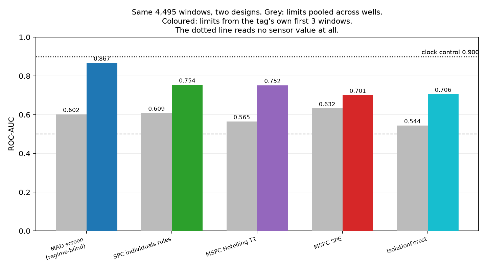
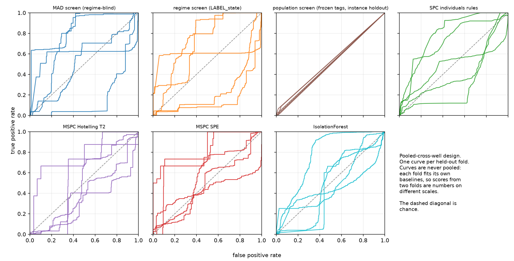
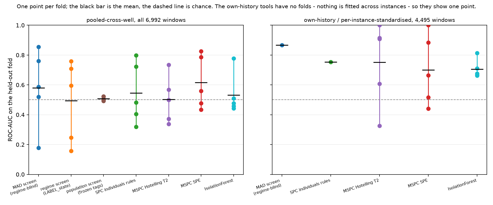
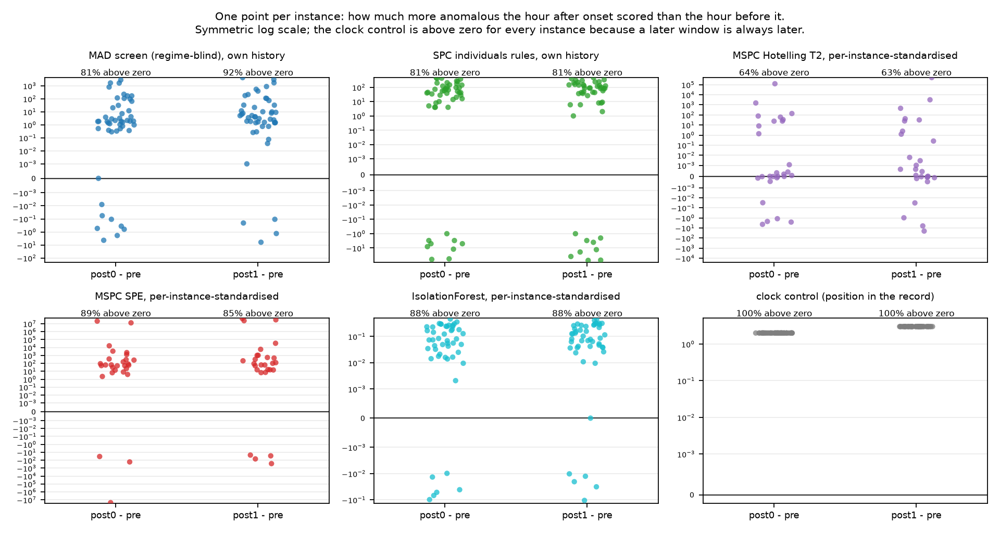
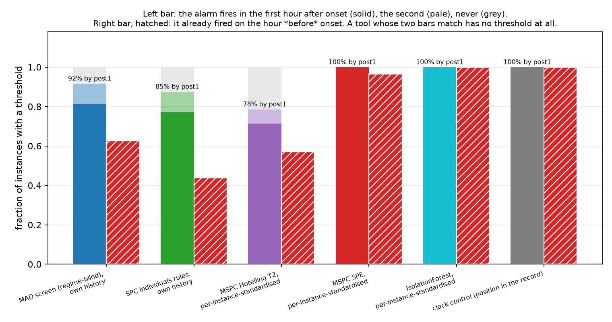
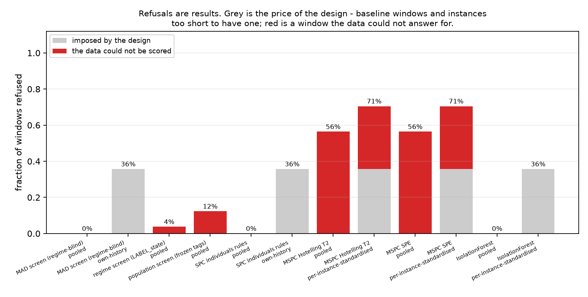

# Stages 3-7 on real data: 3W v2.0.0, three study designs

The first version of this study fitted every per-tag limit on training-fold windows pooled across wells and scored held-out wells with it. For the two tools whose object is a limit *for one tag* that is a study-design error, not a detector result, and it is corrected here. Both designs are run, both are reported, and the pooled rows are kept so the difference is visible.

Correcting it exposed a second problem, which is what the third design is for. A control that reads no sensor value at all - only how many windows into its own record a window sits - scores above every detector on the corrected design, because a 3W instance opens normal and its fault arrives late. [The onset-aligned design](#onset-aligned-design) cuts every instance relative to its own fault onset instead, so that control has nothing left to read.

## Provenance

| field | value |
|---|---|
| dataset | `petrobras/3W` v2.0.0 (CC BY 4.0), real `WELL-*` instances |
| manifest sha256 | `14bc1397d3eef8a671b9f6253d195c161d06157307e47e687829da2070f3b1c2` |
| code | tagledger 0.1.0 @ `f5ab869a` |
| pooled split | 5-fold group holdout by well, seed 42, stratified on folder label |
| own-history split | first 3 windows of each instance, label-blind; all 1,113 instances carrying a window, no group holdout |
| windows | 6,992 of 3600 s over 1,119 instances |
| positive rate | 51.4% (3,596 of 6,992) |
| common variables | `P-ANULAR`, `P-JUS-CKGL`, `P-MON-CKP`, `P-PDG`, `P-TPT`, `T-TPT` |
| runtime | 195 s to build windows on 14 processes, 218 s to score |

```console
uv run python examples/studies/3w_detectors/build_windows.py --jobs 14
uv run python examples/studies/3w_detectors/run_detectors.py
uv run python examples/studies/3w_detectors/make_report.py
```

### The folds

Wells are assigned whole, largest first. `WELL-00002` alone carries 938 windows, so the fold holding it is several times the size of its siblings; that lopsidedness is the shape of 3W, not a defect of the split. `GroupSplit.leakage_check()` runs before any model is fitted.

| fold | windows | wells held out |
|---:|---:|---|
| 0 | 1,688 | `WELL-00002`, `WELL-00023`, `WELL-00028`, `WELL-00029`, `WELL-00031`, `WELL-00034`, `WELL-00038`, `WELL-00039` |
| 1 | 1,533 | `WELL-00003`, `WELL-00005`, `WELL-00007`, `WELL-00016`, `WELL-00022`, `WELL-00027`, `WELL-00030`, `WELL-00035`, `WELL-00040` |
| 2 | 1,603 | `WELL-00008`, `WELL-00009`, `WELL-00010`, `WELL-00014`, `WELL-00015`, `WELL-00019`, `WELL-00024`, `WELL-00036` |
| 3 | 1,120 | `WELL-00004`, `WELL-00006`, `WELL-00012`, `WELL-00013`, `WELL-00025`, `WELL-00032`, `WELL-00041` |
| 4 | 1,048 | `WELL-00001`, `WELL-00011`, `WELL-00020`, `WELL-00021`, `WELL-00026`, `WELL-00033`, `WELL-00037`, `WELL-00042` |

## Two designs

**pooled-cross-well.** Five folds of `group_holdout` over the 40 wells; every model is fitted on the training folds' windows, pooled across wells, and scored on the fold under test.

**own-history.** For each instance and variable the baseline is that instance's first 3 windows, taken by position and never by label, and every later window of the same instance is scored against it. Group holdout is irrelevant here and is not run: nothing is fitted across instances, so there is no cross-instance parameter for a holdout to protect. The split is stated as what it is - own history, first 3 windows, label-blind, all 1,113 instances.

### Why the pooled numbers for stages 3 and 5 are a design artefact

`mad_baseline` returns a median and a MAD for one tag. Pooling the training folds' window medians across wells and calling the result a baseline for `P-PDG` assumes `P-PDG` means the same number on every well. It does not: the six common variables are absolute pressures and a temperature, and their levels differ between wells by orders of magnitude. The robust z that comes out therefore answers *how far is this well from the other wells*, which has nothing to do with whether this hour is abnormal for this tag.

That is what the fold spread was: the pooled MAD screen scores 0.580 on average and **0.178 on fold 1** - well below chance, which is not noise but a sign flip. Hold out a group of wells whose normal level sits further from the pooled median than the faulted windows of the training wells and the ranking inverts. The earlier version of this report read that as the classics failing on 3W. It was the study asking them the wrong question.

Stages 6 and 7 fit a model across instances either way, so they keep the 5-fold well holdout in both designs and differ only in what a column means: pooled autoscaling on training statistics, or a z-score against the same instance's own first-k-window mean and standard deviation.

The own-history design scores 4,495 of 6,992 windows. The rest are the price of it: 1,935 baseline windows and 562 windows in the 468 instances of 3 windows or fewer, which get a typed refusal and no score. Those windows are not comparable to the pooled design's, so every pooled tool is also read back over exactly the 4,495 own-history windows and that row is labelled `pooled-cross-well, own-history windows`. Only those two rows differ in method alone.

## Windows and labels

Each instance is cut into non-overlapping 3600 s windows aligned to its own first sample. The 1,119 windows overlapping the unlabelled 3,600-row prefix are dropped - exactly one per instance, which is what a 3,600-row prefix and a 3,600 s window come to. A window is positive when any row inside it carries a fault class (1-9 steady, 101-109 transient).

| event folder | windows | positive | own-history scored | of those, positive |
|---|---:|---:|---:|---:|
| 0 | 2,213 | 0 | 543 | 0 |
| 1 | 59 | 20 | 47 | 18 |
| 2 | 45 | 34 | 7 | 7 |
| 3 | 127 | 127 | 31 | 31 |
| 4 | 344 | 344 | 0 | 0 |
| 5 | 105 | 90 | 80 | 80 |
| 6 | 12 | 5 | 3 | 2 |
| 7 | 2,131 | 1,862 | 2,023 | 1,838 |
| 8 | 1,315 | 1,054 | 1,273 | 1,054 |
| 9 | 641 | 60 | 488 | 53 |

Folder 4 disappears from the own-history column entirely: every one of its instances is four windows or shorter, so none has a baseline and a window left over. That is a real limit of the design on this corpus, not a rounding detail - the own-history metric is computed over a corpus with a 68.6% positive rate against the pooled design's 51.4%.

3,057 of the 3,596 positive windows (85%) contain only transient rows: the run-up to a fault, not the fault. Folder 9 is the label-noise case the profile study found - its real instances carry no row labelled 9 or 109, so 581 of its 641 windows are negatives sitting in a folder named for an event. Both are held out of the metric in the variants below.

### Baselines that are themselves fault windows

Folders 3 and 4 are all-positive, so an instance's first 3 windows can be fault windows. 34 of the 645 scored instances have a baseline every window of which is labelled positive, covering 42 scored windows. The `no_positive_baseline` row of every table below drops those instances; on this corpus it moves nothing by more than 0.01 AUC, which is what 42 windows in 4,495 can do.

### The common variable set

Six measurement variables are present in at least 60% of real instances, read off each instance's own `present_variables` list: `P-ANULAR`, `P-JUS-CKGL`, `P-MON-CKP`, `P-PDG`, `P-TPT`, `T-TPT`. `T-PDG` (50.3%) and `T-JUS-CKP` (50.2%) miss the threshold, so the set is six, not eight. `ESTADO-*` and the two `LABEL_*` tags are `role=MODE` and carry state names rather than measurements, so no numeric feature is computed for them at all.

## What each tool scored

ROC-AUC with the fold-to-fold range in brackets where there are folds. The own-history tools have none - nothing is fitted across instances - so they carry a single number over all 4,495 scored windows.

| stage | tool | design | windows scored | ROC-AUC | PR-AUC | precision@recall 0.5 | refused |
|---|---|---|---:|---|---:|---:|---:|
| 3 | MAD screen (regime-blind) | pooled-cross-well | 6,992 | 0.580 (0.178-0.854) | 0.619 | 0.759 | 0.0% |
| 3 | MAD screen (regime-blind) | pooled-cross-well, own-history windows | 4,495 | 0.602 (0.272-0.928) | 0.755 | 0.837 | 0.0% |
| 3 | MAD screen (regime-blind) | own-history | 4,495 | 0.867 | 0.929 | 0.956 | 35.7% |
| 4 | regime screen (LABEL_state) | pooled-cross-well | 6,730 | 0.493 (0.158-0.759) | 0.554 | 0.626 | 4.2% |
| 4 | population screen (frozen tags) *(instance holdout)* | pooled-cross-well | 6,133 | 0.508 (0.493-0.524) | 0.482 | 0.476 | 12.3% |
| 5 | SPC individuals rules | pooled-cross-well | 6,992 | 0.545 (0.319-0.797) | 0.578 | 0.624 | 0.0% |
| 5 | SPC individuals rules | pooled-cross-well, own-history windows | 4,495 | 0.609 (0.477-0.805) | 0.745 | 0.775 | 0.0% |
| 5 | SPC individuals rules | own-history | 4,495 | 0.754 | 0.818 | 0.858 | 35.7% |
| 6 | MSPC Hotelling T2 | pooled-cross-well | 3,049 | 0.502 (0.337-0.735) | 0.522 | 0.593 | 53.4% |
| 6 | MSPC Hotelling T2 | pooled-cross-well, own-history windows | 2,095 | 0.565 (0.323-0.786) | 0.630 | 0.701 | 55.2% |
| 6 | MSPC Hotelling T2 | per-instance-standardised | 2,062 | 0.752 (0.326-1.000) | 0.782 | 0.774 | 70.2% |
| 6 | MSPC SPE | pooled-cross-well | 3,049 | 0.617 (0.434-0.826) | 0.600 | 0.642 | 53.4% |
| 6 | MSPC SPE | pooled-cross-well, own-history windows | 2,095 | 0.632 (0.502-0.857) | 0.702 | 0.754 | 55.2% |
| 6 | MSPC SPE | per-instance-standardised | 2,062 | 0.701 (0.441-1.000) | 0.701 | 0.735 | 70.2% |
| 7 | IsolationForest | pooled-cross-well | 6,992 | 0.532 (0.442-0.777) | 0.536 | 0.563 | 0.0% |
| 7 | IsolationForest | pooled-cross-well, own-history windows | 4,495 | 0.544 (0.388-0.709) | 0.679 | 0.734 | 0.0% |
| 7 | IsolationForest | per-instance-standardised | 4,495 | 0.706 (0.663-0.813) | 0.774 | 0.793 | 36.0% |
| none | **clock control** (window position, no sensor read) | own-history | 4,495 | 0.900 | 0.951 | 0.979 | 35.7% |



**The design change is worth more than any of the detectors.** On the identical 4,495 windows the MAD screen goes from 0.602 to 0.867, the SPC rules from 0.609 to 0.754, IsolationForest from 0.544 to 0.706, T2 from 0.565 to 0.752. Nothing about the detectors changed between those two columns; only the question did.

### The clock control, and what is left of the gain

The clock reads no sensor value. Its score is how many windows into its own instance the window sits, and on the same population it scores 0.900 - above every detector in the table. A 3W instance opens normal and the fault, once it arrives, stays, so position alone separates the classes; and the own-history design removes each instance's opening windows, which are the normal ones. Any own-history number below 0.900 on the all-windows target is measuring when the window happened at least as much as what the tag did.

The cut that breaks the clock is the transient one. Drop the transient-only windows - the run-up, where the fault has not arrived and time is all there is - and the clock falls to 0.658, while the own-history SPC rules rise to 0.854 (0.923 with folder 9 also out). That gap is the part of the result that is about the signal:

| tool | design | all windows | transient-only excluded | both cuts |
|---|---|---:|---:|---:|
| clock control | own-history | 0.900 | 0.658 | 0.700 |
| MAD screen (regime-blind) | own-history | 0.867 | 0.693 | 0.677 |
| SPC individuals rules | own-history | 0.754 | 0.854 | 0.923 |
| MSPC Hotelling T2 | per-instance-standardised | 0.752 | 0.716 | 0.613 |
| MSPC SPE | per-instance-standardised | 0.701 | 0.424 | 0.498 |
| IsolationForest | per-instance-standardised | 0.706 | 0.734 | 0.730 |

### Per fold, and per event folder

| tool | design | fold 0 | fold 1 | fold 2 | fold 3 | fold 4 |
|---|---|---:|---:|---:|---:|---:|
| MAD screen (regime-blind) | pooled-cross-well | 0.587 | 0.178 | 0.760 | 0.854 | 0.519 |
| regime screen (LABEL_state) | pooled-cross-well | 0.596 | 0.158 | 0.759 | 0.708 | 0.246 |
| population screen (frozen tags) | pooled-cross-well | 0.498 | 0.506 | 0.493 | 0.521 | 0.524 |
| SPC individuals rules | pooled-cross-well | 0.482 | 0.319 | 0.797 | 0.723 | 0.405 |
| MSPC Hotelling T2 | pooled-cross-well | 0.735 | 0.499 | 0.372 | 0.569 | 0.337 |
| MSPC Hotelling T2 | per-instance-standardised | 1.000 | 0.916 | 0.608 | 0.908 | 0.326 |
| MSPC SPE | pooled-cross-well | 0.826 | 0.560 | 0.476 | 0.786 | 0.434 |
| MSPC SPE | per-instance-standardised | 1.000 | 0.884 | 0.441 | 0.664 | 0.516 |
| IsolationForest | pooled-cross-well | 0.442 | 0.476 | 0.777 | 0.457 | 0.510 |
| IsolationForest | per-instance-standardised | 0.668 | 0.813 | 0.710 | 0.677 | 0.663 |

The own-history tools have no folds. Their equivalent breakdown is by event folder, over the same scored windows - a folder that is all-positive or all-negative among the scored windows has no ranking metric and says so:

| tool | overall | folder 0 | folder 1 | folder 2 | folder 3 | folder 5 | folder 6 | folder 7 | folder 8 | folder 9 |
|---|---:|---:|---:|---:|---:|---:|---:|---:|---:|---:|
| MAD screen (regime-blind) | 0.867 | one class | 0.862 | one class | one class | one class | 1.000 | 0.731 | 0.988 | 0.689 |
| SPC individuals rules | 0.754 | one class | 0.871 | one class | one class | one class | 1.000 | 0.750 | 0.935 | 0.728 |
| clock control | 0.900 | one class | 0.976 | one class | one class | one class | 1.000 | 0.928 | 0.907 | 0.281 |





## Onset-aligned design

Everything above scores a window against a target whose positives arrive late in the record, and the clock control reads 0.900 on it. That is a property of the *design*, not of the corpus: the windows each instance contributes are cut from its first sample, so instances whose fault arrives at hour 3 and instances whose fault arrives at hour 40 are pooled and position becomes a predictor. This section removes that. Every instance is cut relative to *its own onset*, so each contributes the same relative positions and no instance's fault is earlier in the evaluation than another's.

```console
uv run python examples/studies/3w_detectors/build_onsets.py --jobs 14
uv run python examples/studies/3w_detectors/build_windows.py --aligned --jobs 14
uv run python examples/studies/3w_detectors/run_detectors.py --aligned
```

### The six windows

`t_onset` is the timestamp of an instance's first row carrying a fault class - 1-9 steady or 101-109 transient. Relative to it, each evaluable instance contributes:

| offset from onset | role | the design's label |
|---|---|---|
| [-5 h, -4 h) | baseline | negative |
| [-4 h, -3 h) | baseline | negative |
| [-3 h, -2 h) | baseline | negative |
| [-2 h, -1 h) | pre | negative |
| [-1 h, +0 h) | *guard, not built* | none |
| [+0 h, +1 h) | post0 | positive |
| [+1 h, +2 h) | post1 | positive |

The guard hour is dropped on purpose. A fault that shows in the tags a few minutes before its first labelled row would otherwise land inside the window the design calls negative, and the negative would be doing the detector's work. The 3 baseline windows are the own-history baseline every per-tag limit below is fitted on; they are chosen by position relative to onset and never by label.

The design asserts *pre* is normal and *post0*/*post1* are faulted. The rows were read anyway and they agree: 0 of 48 pre windows and 0 of 144 baseline windows carry a fault row, 48 of 48 post0 and 48 of 48 post1 do. 0 test windows disagree with the label the design gives them.

**The positives are the run-up, not the fault.** 47 of the 48 post1 windows contain only transient rows. Two hours after onset the fault has almost never settled into its steady class, so this design asks whether a detector sees the *beginning* of a fault within one to two hours - which is a different and harder question than the one the unaligned tables above ask.

### The evaluable set

Of 1,119 real instances, 482 carry a fault row at all; the other 637 are the negatives-only pool - all of folder 0 and the folder-9 instances the profile study found carrying no row labelled 9 or 109. An instance is *evaluable* when it has 5 whole windows of record before onset and 2 after it:

| event folder | instances | with an onset | ≥3 h pre and ≥2 h post | evaluable |
|---|---:|---:|---:|---:|
| 0 | 594 | 0 | 0 | 0 |
| 1 | 4 | 4 | 3 | 3 |
| 2 | 22 | 22 | 0 | 0 |
| 3 | 32 | 32 | 0 | 0 |
| 4 | 343 | 343 | 0 | 0 |
| 5 | 11 | 11 | 6 | 0 |
| 6 | 6 | 6 | 1 | 1 |
| 7 | 36 | 36 | 25 | 23 |
| 8 | 14 | 14 | 14 | 14 |
| 9 | 57 | 14 | 7 | 7 |
| **all** | 1,119 | 482 | 56 | 48 |

48 instances over 21 wells, 288 windows. The gap between the two right-hand columns is the two extra windows the design needs beyond the 3 of baseline - one scored pre window and one guard hour.

**Every evaluable instance has a transient onset.** 48 of 48, against 0 with a steady one, out of 107 transient and 375 steady onsets in the corpus. That is not a sampling accident: an instance whose first fault row is a steady class is one whose fault was already there when labelling started, and 422 of the 482 instances with an onset have less than 3 h of record before it. The transient-versus-steady sensitivity asked for below therefore has one arm and no other, and that is the finding.

### What the clock is worth now

The clock control reads the same quantity it read above - how many windows into its own record the window sits, no sensor value - and scores **0.626** here against 0.900 under the own-history design. The residual is not noise and it is not signal: it is the fixed two-to-three window spacing the design itself puts between the pre window and the post windows. Take that spacing back out - score every window by `window_index - onset_offset`, which is where the instance's onset sits in its own record and is the same number for all six of its windows - and the AUC is exactly **0.5000**, every comparison a tie. The clock is uninformative under this design up to a constant the design hands it, and the row is in the table below so that claim can be checked rather than believed.

### What each tool scored

Same tools, same thresholds, nothing retuned. **AUC** pools every scored pre window as a negative and every scored post window as a positive. **Paired hit** is the fraction of instances whose post window outscores that instance's own pre window. **FAR** and the detection rates use each instance's own threshold: the largest score the tool gave that instance's baseline windows, fired on strictly above.

That threshold rule carries a false-alarm floor. With 3 baseline windows, a pre window that is exchangeable with them - drawn from the same distribution, the tool reading nothing real - is equally likely to land in any of the 4 rank positions, so it exceeds all 3 of them with probability 1/4 = **25.0%**. That is the number every FAR below has to be read against: it is what a tool that has learned nothing scores, not zero. The **over floor** column is the gap.

| tool | instances | AUC | paired hit post0 | post1 | FAR on pre | over floor | detect post0 | detect post1 | median delay |
|---|---:|---:|---:|---:|---:|---:|---:|---:|---:|
| MAD screen (regime-blind), own history | 48 | 0.799 | 0.812 | 0.917 | 62.5% | +37.5 pt | 81.2% | 91.7% | 0 window(s) |
| SPC individuals rules, own history | 48 | 0.713 | 0.812 | 0.812 | 43.8% | +18.8 pt | 77.1% | 85.4% | 0 window(s) |
| MSPC Hotelling T2, per-instance-standardised | 28 | 0.541 | 0.643 | 0.630 | 57.1% | +32.1 pt | 71.4% | 77.8% | 0 window(s) |
| MSPC SPE, per-instance-standardised | 28 | 0.658 | 0.893 | 0.852 | 96.4% | +71.4 pt | 100.0% | 100.0% | 0 window(s) |
| IsolationForest, per-instance-standardised | 48 | 0.793 | 0.875 | 0.875 | 100.0% | +75.0 pt | 100.0% | 100.0% | 0 window(s) |
| **clock control** (position in the record) | 48 | 0.626 | 1.000 | 1.000 | 100.0% | +75.0 pt | 100.0% | 100.0% | 0 window(s) |
| clock control, design offset removed | 48 | 0.500 | 0.000 | 0.000 | 0.0% | -25.0 pt | 0.0% | 0.0% | never fires |

SPC has the lowest FAR of the five detectors at 43.8%, and that is still 18.8 points above the 25.0% floor: on 43.8% of instances a window taken before the fault beat the worst of that instance's own three quiet hours. A detector whose FAR sat *at* the floor would be firing exactly as often as chance; none of these do.

Each rate is over the instances that have both a threshold and that window, and those counts are not always the same number: MSPC Hotelling T2, per-instance-standardised has a threshold for 28 instances but a scored post1 window for 27; MSPC SPE, per-instance-standardised has a threshold for 28 instances but a scored post1 window for 27. The rest of the rates are over the instance count in the second column.

The three per-instance-standardised tools fit one model per fold under 5-fold group holdout by well over the 21 evaluable wells, on the training instances' baseline and pre windows only - no post window reaches any fit. Their pooled AUC therefore ranks scores five separate models produced; the per-fold range is MSPC Hotelling T2 0.407-0.750, MSPC SPE 0.562-1.000, IsolationForest 0.745-0.949. The own-history tools fit nothing across instances and have no folds.

**Those three FARs (MSPC Hotelling T2 57.1%, MSPC SPE 96.4%, IsolationForest 100.0%) are a design limit, not a measurement of the tools.** `_instance_zscore` takes each column's centre and scale from the same 3 baseline windows the threshold is then read off. After that standardisation those windows are, by construction, the most ordinary rows the model will ever see for that instance - centred at zero with unit spread - while every pre and post window is scored without having contributed to the scaling. Setting the alarm at the maximum of the three in-fit rows and testing out-of-fit rows against it is an unfair comparison in a fixed direction, and it pushes the FAR toward 100% independently of whether the tool sees anything. The correction is a leave-one-out threshold: standardise each baseline window against the other 2 and take the alarm from those held-out scores. It is not done here because `score_mspc` and `score_iforest` fit and score in a single call and do not hand back a fitted model, so every left-out window needs its own refit; that is a change to the scoring interface rather than a few lines in this report. Until it exists, read the standardised tools' AUC and paired hit rate - which never compare in-fit rows against out-of-fit ones - and treat their FAR as unmeasured.



**Read the paired hit rate against the clock's row.** The clock wins it 100% of the time, because a later window is always later. Any score that rises with time takes that column outright, so it says a tool is not *worse* than the clock rather than that it is better.

### Detection at each instance's own threshold



This is the deployable question and it is where the result is thin. With the alarm set at the worst of the 3 baseline hours, the SPC rules fire on 43.8% of the hours *before* onset while catching 85.4% of instances by the second hour after it; the MAD screen catches more (91.7%) and false-alarms more (62.5%). Neither is a usable alarm rate. Every detected instance is detected in the first hour: the median delay is 0 windows for every tool that detects anything, so the second post window adds coverage rather than speed.

**The three standardised tools have no threshold at all.** IsolationForest fires on 100.0% of pre windows - exactly what the clock control does - and MSPC SPE on 96.4%. The mechanism is in the design: each column is z-scored against that instance's own 3 baseline windows, so the baseline rows are the very rows the scale was fitted to and land in a band nothing else can enter. Across all 48 instances IsolationForest scores every baseline window between -0.190 and -0.143 and every pre window above its own instance's baseline maximum. A threshold taken from 3 in-sample points is not a threshold, and the false-alarm column is what says so.

### Per event folder, and folder 9

| tool | folder 1 | folder 6 | folder 7 | folder 8 | folder 9 | folder 9 excluded |
|---|---:|---:|---:|---:|---:|---:|
| MAD screen (regime-blind), own history | 0.778 | 1.000 | 0.619 | 0.969 | 0.888 | 0.790 |
| SPC individuals rules, own history | 0.944 | 1.000 | 0.627 | 0.875 | 0.694 | 0.720 |
| MSPC Hotelling T2, per-instance-standardised | 1.000 | refused | 0.505 | 0.500 | 0.569 | 0.536 |
| MSPC SPE, per-instance-standardised | 0.750 | refused | 0.586 | 1.000 | 0.681 | 0.654 |
| IsolationForest, per-instance-standardised | 1.000 | 0.750 | 0.707 | 0.918 | 0.867 | 0.800 |
| **clock control** (position in the record) | 0.806 | 1.000 | 0.662 | 0.617 | 1.000 | 0.620 |
| clock control, design offset removed | 0.500 | 0.500 | 0.500 | 0.500 | 0.500 | 0.500 |

Folder 9's 7 evaluable instances are the ones that *do* carry a fault row, so they are not the label-noise case the profile study found; dropping them moves nothing by more than 0.008 AUC. The single folder-6 instance carries no ranking metric worth reading and is shown for completeness.

### Refusals under this design

**1,071 of 1,119 instances are refused before any detector runs**: fewer than 5 whole windows before onset or fewer than 2 after it, or no fault row at all. That is the price of the design and it is large - larger than the unaligned design's, and for the same underlying reason, that 3W ships hour-scale excerpts rather than a historian. On a live archive an instance has months of its own past and the refusal disappears; on this corpus it leaves 48 instances.

| tool | instances scored | refused from the data | why |
|---|---:|---:|---|
| MAD screen (regime-blind), own history | 48 | 0 | nothing left to refuse |
| SPC individuals rules, own history | 48 | 0 | nothing left to refuse |
| MSPC Hotelling T2, per-instance-standardised | 28 | 20 | the instance has a window missing one of the six common variables, so no matrix can be aligned without a hole in it (`MspcAlignmentError`) |
| MSPC SPE, per-instance-standardised | 28 | 20 | same alignment refusal as T2 |
| IsolationForest, per-instance-standardised | 48 | 0 | nothing left to refuse |
| **clock control** (position in the record) | 48 | 0 | nothing left to refuse |
| clock control, design offset removed | 48 | 0 | nothing left to refuse |

### What the aligned numbers say

**It does not beat the 0.923 the unaligned tables report for the SPC rules on steady faults - it replaces the question.** That number was measured with transient-only windows *excluded*, so its positives are settled faults. Here 47 of 48 positives are transient-only, because two hours after onset is where the run-up lives. The two numbers are not two answers to one question.

What this design does settle is how much of an own-history AUC was the clock. Under it the clock falls from 0.900 to 0.626, and to exactly 0.5000 once the design's own fixed spacing is removed. Against that floor the MAD screen ranks at 0.799 and the SPC rules at 0.713, both on all 48 evaluable instances with nothing refused. Those are the first numbers in this study that are about the tags rather than the timetable.

And the deployable reading is negative: at a threshold set from 3 hours of the instance's own baseline, the best false-alarm rate any tool reaches is 43.8%, on the hour immediately before onset. Three hours of history is enough to rank windows and not enough to set a limit.

## Refusals

Two kinds, counted separately. A refusal *imposed by the design* is a baseline window or a window in an instance too short to have a baseline; the own-history design cannot score those by construction. A refusal *from the data* is a window the tool was asked about and could not answer for.

| tool | design | refused | imposed by the design | why the rest |
|---|---|---:|---:|---|
| MAD screen (regime-blind) | pooled-cross-well | 0.0% | 0.0% | nothing left to refuse |
| MAD screen (regime-blind) | own-history | 35.7% | 35.7% | nothing left to refuse |
| regime screen (LABEL_state) | pooled-cross-well | 4.2% | 0.0% | the window's modal `LABEL_state` never reached 20 training windows for that variable, or never appeared in training at all (`RegimeTooSparse`) |
| population screen (frozen tags) | pooled-cross-well | 12.3% | 0.0% | the (well, variable) pair has fewer than 20 training windows; under well holdout this is every window (`PopulationTooSparse`) |
| SPC individuals rules | pooled-cross-well | 0.0% | 0.0% | nothing left to refuse |
| SPC individuals rules | own-history | 35.7% | 35.7% | nothing left to refuse |
| MSPC Hotelling T2 | pooled-cross-well | 53.4% | 0.0% | the window is missing one of the six common variables, so no matrix can be aligned without a hole in it (`MspcAlignmentError`) |
| MSPC Hotelling T2 | per-instance-standardised | 70.2% | 35.7% | the same alignment refusal, plus a sub-group cell whose (instance, variable) had no usable baseline statistics |
| MSPC SPE | pooled-cross-well | 53.4% | 0.0% | same alignment refusal as T2 |
| MSPC SPE | per-instance-standardised | 70.2% | 35.7% | same as T2 |
| IsolationForest | pooled-cross-well | 0.0% | 0.0% | nothing left to refuse |
| IsolationForest | per-instance-standardised | 36.0% | 35.7% | nothing left to refuse |



The per-instance-standardised MSPC refuses 70.2% of windows against the pooled design's 53.4%, and the gap is not all design cost: standardising needs baseline statistics for the same (instance, variable), and 169 scored grid rows have none because every sub-group median in their baseline windows was missing. Its AUC is therefore computed over a smaller and easier population than the other tools', which is why the refused fraction sits in the same table as the AUC.

## The population screen, and the split it does not have

The profile study found 1,643 measurement tags holding one distinct value across their whole archive. A self-referencing threshold cannot indict them, which is what `baselines/population.py` was built for: the reference becomes the same (well, variable) pair's other windows. This screen is not a per-tag limit, so the own-history rewrite does not touch it.

**Under holdout by well it refuses everything.** The baseline is that well's other windows and well holdout removes them, so all 5,315 frozen feature rows in the held-out folds come back `PopulationTooSparse` and not one is flagged. That is the answer to the question as posed, and it is the result: the tool asks whether a sensor moves *on this well*, and a split that holds the well out holds out the question.

So it is also run under a second split - 5-fold group holdout by **instance**, same seed - which holds out the window's own instance while leaving the well's other instances in training. Every number in this section is labelled with which split produced it, and the instance-holdout numbers are not held-out-well numbers.

| | well holdout | instance holdout |
|---|---:|---:|
| frozen feature rows on the test side | 5,315 | 5,315 |
| flagged | 0.0% | 4.6% (242) |
| refused | 100.0% | 12.1% (645) |
| whole-life-frozen tags indicted | 0 of 748 reachable | 9 of 748 reachable |

Of the profile study's 1,643 whole-life-frozen measurement tags, 748 sit on one of the six common variables and are therefore reachable at all. Under instance holdout the screen indicts 9 of them:

| variable | whole-life-frozen tags reachable | indicted |
|---|---:|---:|
| `P-ANULAR` | 7 | 1 |
| `P-JUS-CKGL` | 31 | 0 |
| `P-MON-CKP` | 0 | 0 |
| `P-PDG` | 652 | 1 |
| `P-TPT` | 38 | 6 |
| `T-TPT` | 20 | 1 |

**652 of the 748 reachable tags are `P-PDG`, and 1 is indicted.** That is the screen working, not failing. A `P-PDG` that is flat on a well where `P-PDG` is usually flat gets `fired=False` with the reason stated - a normally-still sensor is not indicted for being still. The pairs it does indict are wells where the same tag moves in hundreds of other windows:

- window holds 1 distinct value; (WELL-00002, P-TPT) holds more than one in at least 95% of its 744 training windows (p05 762.6, median 1830)
- window holds 1 distinct value; (WELL-00002, T-TPT) holds more than one in at least 95% of its 744 training windows (p05 481.9, median 1458)
- window holds 1 distinct value; (WELL-00002, P-TPT) holds more than one in at least 95% of its 744 training windows (p05 762.6, median 1830)

## What these numbers mean

Four readings, in order of how much weight they carry.

**1. The pooled numbers for stages 3 and 5 were measuring the wrong thing, and the correction is large.** A per-tag limit fitted across wells is not a per-tag limit. On identical windows the MAD screen moves 0.602 → 0.867 and the below-chance folds go away, because there are no folds: the baseline no longer depends on which wells happened to be in training.

**2. Most of that number is still the clock.** On the all-windows target the clock control scores 0.900, above every detector. The own-history design removes each instance's opening windows, and in 3W those are the normal ones, so the scored population is 68.6% positive and skewed late. Read the all-windows column as a lower bound on how easy the target is, not as detector performance.

**3. What survives the clock is the SPC rules on steady faults.** With transient-only windows and folder 9 out, the clock is 0.700 and the own-history SPC rules are 0.923 over 1,063 windows. That is the one place in this study where a detector clearly beats knowing nothing but the time, and it is the tool whose object - a rule hit against limits from this tag's own history - matches the question the corpus can actually answer.

**4. Take the clock away entirely and the ranking holds, the alarm does not.** Under the onset-aligned design every instance contributes the same six windows relative to its own fault onset, the clock control falls from 0.900 to 0.626 - and to exactly 0.5000 once the fixed spacing the design itself imposes is removed. Against that the MAD screen ranks at 0.799 and the SPC rules at 0.713 over 48 instances. But asked for an alarm rather than a ranking - fire above the worst score of the instance's own three baseline hours - the SPC rules catch 85.4% of onsets within two hours at a 43.8% false-alarm rate on the hour before. Three hours of own history ranks; it does not threshold.

Three specific reasons the target stays hard, all visible in the numbers above rather than inferred:

1. **The label is not a window property.** 85% of positive windows contain only transient rows. A window is called positive because one second in 3,600 carried class 107; a detector reading hour-scale statistics is being scored against a second-scale label. Every number in this study moves when those windows are dropped, in both directions.
2. **The regime key is nearly constant.** `LABEL_state` is `0` in 88.6% of windows, so conditioning on it refines almost nothing - which is why the stage-4 regime screen (0.493) does not beat the regime-blind stage-3 MAD screen (0.580) under the same design.
3. **Half the windows cannot be aligned at all.** Only 3,269 of 6,992 windows carry all six common variables, so MSPC scores fewer than half of them under either design and its AUC is computed over a different, easier population than the other tools'.

And a number that is not a performance figure: the own-history design refuses 35.7% of the corpus before it starts, because 468 of 1,113 instances are 3 windows or shorter. On a corpus of hour-long excerpts that is the design's cost; on a live historian, where a tag has months of its own past, it is not.

## Label-noise sensitivity

Excluding folder 9, excluding transient-only windows, and excluding instances whose baseline windows are themselves fault windows. Each changes the target, so each changes the number.

### pooled-cross-well

| tool | all | no folder 9 | no transients | neither | no positive baseline |
|---|---:|---:|---:|---:|---:|
| MAD screen (regime-blind) | 0.580 | 0.560 | 0.460 | 0.407 | refused |
| regime screen (LABEL_state) | 0.493 | 0.450 | 0.516 | 0.460 | refused |
| population screen (frozen tags) | 0.508 | 0.510 | 0.514 | 0.515 | refused |
| SPC individuals rules | 0.545 | 0.520 | 0.610 | 0.620 | refused |
| MSPC Hotelling T2 | 0.502 | 0.501 | 0.433 | 0.416 | refused |
| MSPC SPE | 0.617 | 0.655 | 0.523 | 0.498 | refused |
| IsolationForest | 0.532 | 0.514 | 0.544 | 0.556 | refused |

### pooled-cross-well, own-history windows

| tool | all | no folder 9 | no transients | neither | no positive baseline |
|---|---:|---:|---:|---:|---:|
| MAD screen (regime-blind) | 0.602 | 0.580 | 0.635 | 0.618 | 0.603 |
| SPC individuals rules | 0.609 | 0.571 | 0.806 | 0.807 | 0.606 |
| MSPC Hotelling T2 | 0.565 | 0.524 | 0.487 | 0.529 | 0.570 |
| MSPC SPE | 0.632 | 0.686 | 0.613 | 0.688 | 0.637 |
| IsolationForest | 0.544 | 0.500 | 0.756 | 0.713 | 0.542 |

### own-history and per-instance-standardised

| tool | all | no folder 9 | no transients | neither | no positive baseline |
|---|---:|---:|---:|---:|---:|
| clock control | 0.900 | 0.934 | 0.658 | 0.700 | 0.908 |
| MAD screen (regime-blind) | 0.867 | 0.883 | 0.693 | 0.677 | 0.874 |
| SPC individuals rules | 0.754 | 0.829 | 0.854 | 0.923 | 0.754 |
| MSPC Hotelling T2 | 0.752 | 0.771 | 0.716 | 0.613 | 0.756 |
| MSPC SPE | 0.701 | 0.769 | 0.424 | 0.498 | 0.707 |
| IsolationForest | 0.706 | 0.698 | 0.734 | 0.730 | 0.708 |

## What the real data broke

1. **A window feature cost eight times its own archive read.** `store/averaging.py` walked its samples with `.iloc` to accumulate the time-weighted mean, and `features/window_features.py` did the same to count value changes. An hour of 1 Hz data is 3,600 rows, which put `extract` at 127 ms against a 16 ms parquet read and the whole study out of reach. Vectorised, `extract` is 1.9 ms; 120 real windows were compared before and after and the time-weighted means agree to the last bit.
2. **`regime_baselines` accepted a mode series on the wrong index.** It checked length, but every regime mask inside it is a pandas boolean operation, which aligns on the index. A same-length series carrying a different index emptied every regime and came back `RegimeTooSparse` - a refusal naming the wrong cause, which is worse than a wrong number because it reads as a correct refusal. It now refuses the misaligned series by name. Before the fix this study reported the regime screen as 48% refused; after it, 4%.
3. **3W ships a null sentinel as a number, and per-tag scaling turns it into the whole model.** Three `WELL-00006` instances hold `P-PDG` pinned at `-1.180116e+42` for their entire life. 3W publishes no engineering ranges, so `eng_range` is `None` and nothing can call it out of range: the window reports coverage 1.000, valid fraction 1.000 and GOOD quality. `IsolationForest` casts to float32 internally, where that value is `-inf`. Worse, dividing by that tag's own near-zero baseline spread gave a z-score of 1.5e26, and the standardised PCA became a model of that one row - Hotelling T2 came back constant to every window on four folds of five, an AUC of exactly 0.500 that looked like a result. The study now blanks every cell beyond float32 range once, for every design: 320 feature cells and 4,795 sub-group cells, over 80 rows. `DataPhysics` now carries `implausible_magnitude_count`, so a profile states the count for any window that holds one: *values beyond float32 range: N (not censored: eng range unknown)*. It is a count, not a verdict - without an engineering range nothing in the library can say the value is wrong.

## Files

| path | what |
|---|---|
| `build_windows.py` | windows, labels, features, sub-group grid (cached under `data/`) |
| `build_onsets.py` | one row per instance: where its fault starts and whether the aligned design can score it |
| `run_detectors.py` | fits and scores every tool under every design |
| `make_report.py` | this report, `out/*.png` |
| `results/per_fold.csv` | one row per (tool, design, split, fold, variant) |
| `results/summary.csv` | the same aggregated across folds |
| `results/scores.csv` | every score the run produced, per window |
| `results/windows.csv` | one row per window: well, folder, label, transient flag |
| `results/run.json` | provenance, fold well lists, own-history layout, population and MSPC detail |
| `results/onsets.json` | onset distribution and the evaluable-set counts |
| `results/aligned_per_instance.csv` | one row per (tool, instance): baseline threshold and the three test scores |
| `results/aligned_summary.csv` | one row per (tool, variant) under the aligned design |
| `results/aligned_scores.csv` | every aligned score, per window |
| `results/aligned_windows.csv` | one row per aligned window: role, offset from onset, design label, row label |
| `results/aligned_run.json` | aligned provenance, onset summary, split, refusals |
