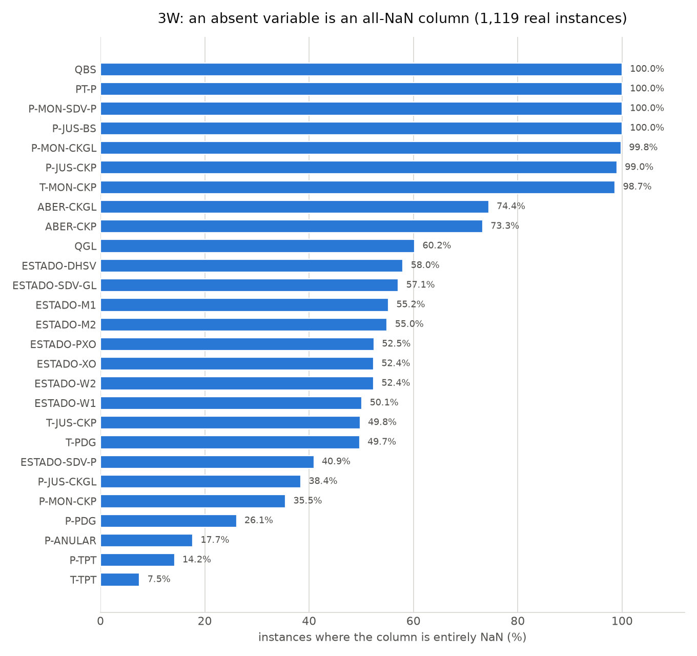
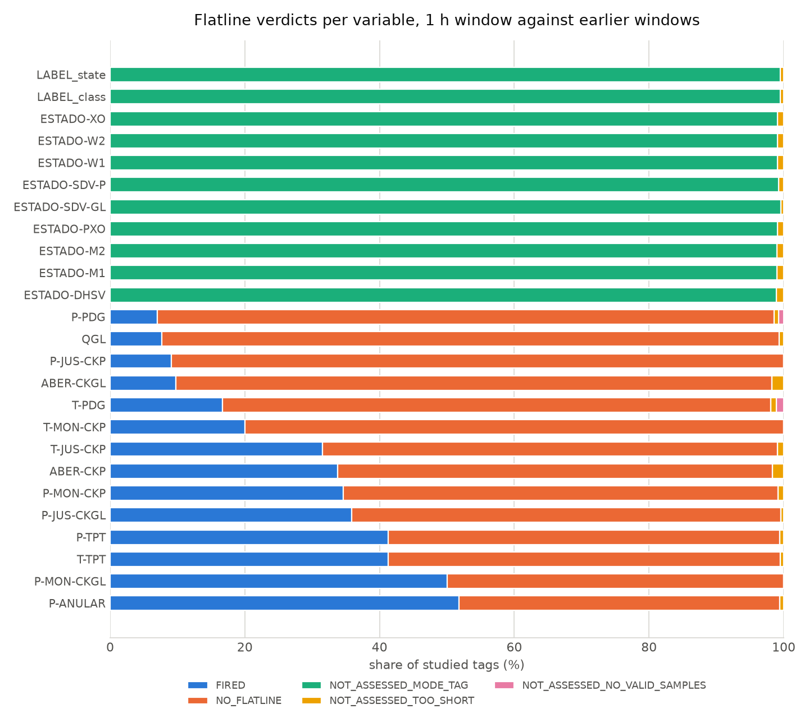
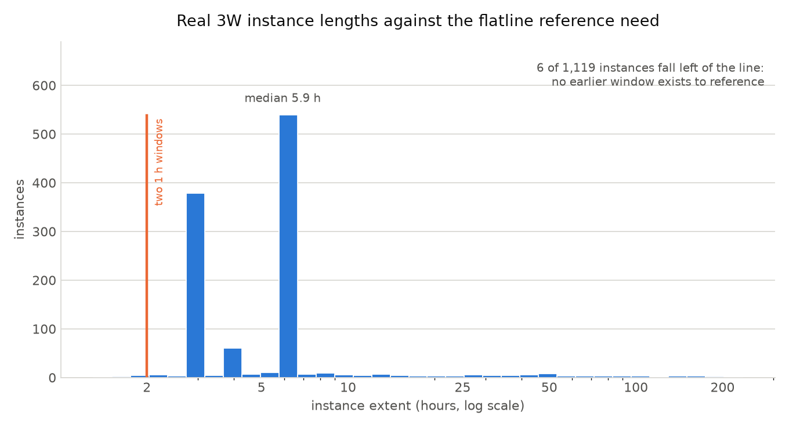

# Stage 1 on real data: 3W v2.0.0

What tagledger's data-physics layer says about real offshore well data, and what it refuses to say. Descriptive only: no detector metric is published here (see *Why no detector numbers* below).

## Provenance

| field | value |
|---|---|
| dataset | `petrobras/3W` @ `d717f0aadbe90b6dc6e15e29f6035e9630d22a5e` (v2.0.0, CC BY 4.0) |
| downloaded | 1,122 files, 515,992,578 bytes |
| fetch filters | `only_real=True`, classes=all |
| manifest sha256 | `14bc1397d3eef8a671b9f6253d195c161d06157307e47e687829da2070f3b1c2` |
| code | tagledger 0.1.0 @ `9ef5f1b08d2fc1d72ee771d9d890f41f7bd8869f` |
| converted | 1,119 instances, 14,347 archives, 40 wells, 32,872,250 source rows |
| studied | 1,119 instances, 14,347 tags, 254 s wall on 14 processes |

Commands:

```console
uv run python scripts/fetch_3w.py --dest data/3w --only-real --yes
uv run python scripts/convert_3w.py --src data/3w --out data/3w_archives --only-real
uv run python examples/studies/3w_profile/run_study.py --jobs 14
uv run python examples/studies/3w_profile/make_report.py
```

## What was studied, and what was not

Every one of the 1,119 real `WELL-*` instances was fetched, converted and profiled: 14,347 tags across 40 wells and all ten event folders, 254 s of wall time on 14 processes. Each archive is read twice - once over its whole extent for the physics block, once over its last 1 h for the flatline assessment - so every number below is over the whole real set, with no subset to argue about.

## Absent variables

3W has 27 process variables. An instance that never instrumented one still carries the column - filled entirely with NaN. Across 1,119 real instances the count of absent variables per instance runs 6-26 (mean 16.2). The converter writes no archive for an absent variable and lists it in `INSTANCE.json`: an archive of nothing but `NO_DATA` would assert the tag existed and failed, which the source never says.

4 of the 27 variables are absent from **every** real instance - `P-JUS-BS`, `P-MON-SDV-P`, `PT-P`, `QBS` never carry a single value on a real well. A schema read off the column list alone would offer them as tags.

| variable | instances where absent | share |
|---|---:|---:|
| `P-JUS-BS` | 1,119 | 100.0% |
| `P-MON-SDV-P` | 1,119 | 100.0% |
| `PT-P` | 1,119 | 100.0% |
| `QBS` | 1,119 | 100.0% |
| `P-MON-CKGL` | 1,117 | 99.8% |
| `P-JUS-CKP` | 1,108 | 99.0% |
| `T-MON-CKP` | 1,104 | 98.7% |
| `ABER-CKGL` | 833 | 74.4% |
| `ABER-CKP` | 820 | 73.3% |
| `QGL` | 674 | 60.2% |
| `ESTADO-DHSV` | 649 | 58.0% |
| `ESTADO-SDV-GL` | 639 | 57.1% |
| `ESTADO-M1` | 618 | 55.2% |
| `ESTADO-M2` | 615 | 55.0% |
| `ESTADO-PXO` | 587 | 52.5% |
| `ESTADO-W2` | 586 | 52.4% |
| `ESTADO-XO` | 586 | 52.4% |
| `ESTADO-W1` | 561 | 50.1% |
| `T-JUS-CKP` | 557 | 49.8% |
| `T-PDG` | 556 | 49.7% |
| `ESTADO-SDV-P` | 458 | 40.9% |
| `P-JUS-CKGL` | 430 | 38.4% |
| `P-MON-CKP` | 397 | 35.5% |
| `P-PDG` | 292 | 26.1% |
| `P-ANULAR` | 198 | 17.7% |
| `P-TPT` | 159 | 14.2% |
| `T-TPT` | 84 | 7.5% |



## Coverage, gaps and the timestamp audit

Coverage over the studied tags: min 1.0000, p05 1.0000, median 1.0000, mean 1.0000, max 1.0000; 0 of 14,347 tags fall below 1.000.

Valid fraction over the same tags - rows carrying a usable value, over rows in the window: min 0.0372, p05 0.6662, median 1.0000, mean 0.9642, max 1.0000; 2,824 of 14,347 tags fall below 1.000. That is the same tag population and a different question, and the two answers disagree on every one of those tags.

No gap of any class was found in any studied tag. 3W is written at a strict 1 s cadence with no interior holes, so the gap classifier - the part of the profile with the most rules - had nothing to classify.

Timestamp audit: 0 duplicate timestamps and 0 non-monotonic positions across the studied tags. The 3W index is clean; the audit's value here is that it says so with a number rather than by silence.

**Coverage 1.000 does not mean every value is there.** 2,824 of 14,347 studied tags contain interior NaNs - 2.07% of all samples - and every one of those tags still reports coverage 1.000. Coverage measures whether the historian emitted a row, and 3W emits one every second whether or not the sensor had a value to put in it. The NaN rows are visible in the severity counts as BAD, and in `valid fraction`, which this study is the reason the layer now reports.

## Quality: assumed, and labelled as assumed

3W carries no quality column. The converter writes `GOOD_ASSUMED` on finite values and `NO_DATA` on NaNs, declares both in the tag's `quality_codes`, and sets `quality_assumed`, so every profile prints *quality ASSUMED at ingest*. Over the studied tags that is 464,444,058 GOOD and 9,816,175 BAD samples, with 0 UNCERTAIN and 0 tag(s) reporting an unmapped code. The BAD samples are not sensor failures: they are the NaN holes inside otherwise-present columns, which no 3W column distinguishes from a failed read.

## Units

The first run of this study left every one of the 7,337 non-MODE tags reporting `unresolved (null); comparison refused`. `dataset.ini` spells its four units `Pa`, `oC`, `%` and `m3/s`; the shipped alias table carried `kPa`, `degC` and `percent` and none of those four. That is a gap in the table, not a property of 3W - a general unit table that cannot resolve pascals is missing the SI base spelling of pressure, and only a real units file was going to say so. The four aliases are now registered, along with the rest of the SI spellings the table lacked (`m³/h`, `MPa`, `mbar`, `t/h`, `l/min`, `m/s`, `rpm`, `mA`, `V`), and a test walks every row of the table to check pint can still read it.

All 7,337 non-MODE tags now resolve. What stays unresolved by design is documented in `docs/SCHEMA.md`: a bare `C` is coulombs as readily as Celsius, and `barg`/`psig` name a datum the table has no column for, so registering them as `bar`/`psi` would make every comparison wrong by about an atmosphere.

## Clipping

3W publishes no engineering ranges, so `eng_range` is `None` on every tag and the clipped fraction is `null` on all 14,347 of them (0 tags produced a number, 0 were censored). A layer that defaulted the range would have reported a clipping percentage for 3W; this one reports that it cannot.

## Flatline verdicts

Each tag's last 1 h window was assessed against the earlier equal-size windows of the same archive.

| verdict | tags | share |
|---|---:|---:|
| `FIRED` | 2,294 | 16.0% |
| `NO_FLATLINE` | 4,977 | 34.7% |
| `NOT_ASSESSED_MODE_TAG` | 6,956 | 48.5% |
| `NOT_ASSESSED_TOO_SHORT` | 108 | 0.8% |
| `NOT_ASSESSED_NO_VALID_SAMPLES` | 12 | 0.1% |





7,010 of those tags are `role=MODE` - the `ESTADO-*` valve states and the two label columns - and not one of them carries a verdict: 6,956 are declined as state-valued and the remaining 54 sit in archives too short to reference themselves. A state tag holds one state until the plant changes it, so stillness is what a settled unit looks like rather than evidence of a stuck sensor. The first run of this study reported them as FIRED, which is why the detector now declines the question.

Of the 7,337 measurement tags, 7,271 could be assessed and 2,294 of those fired (31.5%). Read the spot check below before taking that number at face value.

Measurement variables whose tags fired most often:

| variable | FIRED | assessed |
|---|---:|---:|
| `P-ANULAR` | 477 | 921 |
| `T-TPT` | 427 | 1,035 |
| `P-TPT` | 396 | 960 |
| `P-MON-CKP` | 250 | 722 |
| `P-JUS-CKGL` | 247 | 689 |
| `T-JUS-CKP` | 177 | 562 |
| `ABER-CKP` | 101 | 299 |
| `T-PDG` | 94 | 563 |
| `P-PDG` | 58 | 827 |
| `QGL` | 34 | 445 |
| `ABER-CKGL` | 28 | 286 |
| `T-MON-CKP` | 3 | 15 |

### Spot check: what ten of those fires actually look like

Ten FIRED tags, taken round-robin across variables so no one variable carries the table. Each row states what the last 1 h window did and what the tag's own earlier windows said it usually does. A fire is signal 1 when the stall beats the p99 change interval, signal 2 when the distinct count falls under the p05, or both.

| instance | variable | n_distinct | ref p05 distinct | std | stall (s) | ref p99 interval (s) | fired |
|---|---|---:|---:|---:|---:|---:|---|
| `WELL-00001_20170201010207` | `P-ANULAR` | 565 | 1116.55 | 11213.4 | 36 | 1 | 1;2 |
| `WELL-00001_20170201110124` | `T-TPT` | 16 | 493 | 0.000762442 | 0 | 5 | 2 |
| `WELL-00001_20170201010207` | `P-TPT` | 1344 | 902.55 | 23208.8 | 965 | 1 | 1 |
| `WELL-00001_20170201060114` | `P-MON-CKP` | 3291 | 3319.8 | 163663 | 0 | 1 | 2 |
| `WELL-00001_20170201110124` | `P-JUS-CKGL` | 183 | 727 | 52.7222 | 11 | 6 | 1;2 |
| `WELL-00001_20170201060114` | `T-JUS-CKP` | 3361 | 3429.5 | 0.391087 | 0 | 1 | 2 |
| `WELL-00004_20140804210008` | `ABER-CKP` | 3292 | 3600 | 0.0733854 | 0 | 1 | 2 |
| `WELL-00001_20170627000333` | `T-PDG` | 1 | 1 | 0 | 3600 | 1 | 1 |
| `WELL-00001_20170627000333` | `P-PDG` | 1 | 1 | 0 | 3600 | 1 | 1 |
| `WELL-00001_20170824050000` | `QGL` | 1 | 1 | 0 | 3600 | 1 | 1 |

**Read that table before believing the 31.5% headline.** The p99 change interval is 1 s on 3,580 of the 5,582 assessed tags that have one - 64.1% of them, which really do move at every 1 Hz sample. The first run of this study reported 5,584 of 5,586, and read that as a fact about 3W: dense sampling, sensors moving constantly, a tag's own history saying it never holds a value for two seconds. It was a fact about the library. `reference_history` collected the sample spacing preceding each changed sample instead of the time between successive change events, so on an evenly sampled archive the reference came back as the sampling period whatever the tag did (`fix(api): time reference change intervals between change events`; the TEP profile study has the full diagnosis). With the intervals timed between change events, 2,002 of those tags turn out to hold values for longer than a second.

The fix moves FIRED from 2,580 tags (35.5% of the 7,271 assessed) to 2,294 (31.5%). Signal 1 stopped firing on 425 tags; 139 of those still fire on signal 2, which is why the verdict count falls by 286 rather than 425. Signal 2 is untouched by the fix and fires on the same 1,779 tags it did before. Signal 1 is now held against a threshold that means something: 5 of the 515 tags that fired on signal 1 alone did so on a stall of 5 s or less, against 142 of 801 before, and the median such stall moved from 123 s to 471 s. Signal 2 remains the steadier of the two, and still 802 of its 1,779 fires land within a tenth of the p05 they had to beat - visible in the rows above where the distinct count sits a percent or two under the threshold.

| fired on signal(s) | tags |
|---|---:|
| 2 | 1,388 |
| 1 | 515 |
| 1;2 | 391 |

A per-tag p99 is now the quantity the detector promises, but on the 3,580 tags that genuinely move at every sample it is still a 2 s bar, and a stall of 2 s on a 1 Hz record is not a frozen transmitter. A per-(well, variable) baseline over other instances is the reference that would settle it, and it is stage-4 work. Until then these counts are a description of what the shipped detector does on 3W, not a claim that 3W has 2,294 frozen sensors.

### Frozen for the whole archive

1,643 of 7,337 measurement tags (22.4%, across 903 instances) hold exactly **one** distinct value across their entire archive, not merely across the final window. Such a tag establishes no history of movement, so its own p99 of change intervals is empty and its reference distinct counts are all 1 - the detector's two self-referencing thresholds are computed from a record that never moved. Their verdicts come out NO_FLATLINE on 1,618, NOT_ASSESSED_TOO_SHORT on 13, NOT_ASSESSED_NO_VALID_SAMPLES on 12. A self-referencing threshold cannot reach such a tag; catching it needs a baseline from other instances of the same (well, variable), which is stage-4 work. This count is the gate on that: it is how much of the real set a self-referencing threshold cannot reach.

| variable | tags frozen for the whole archive |
|---|---:|
| `P-PDG` | 652 |
| `T-PDG` | 332 |
| `QGL` | 298 |
| `ABER-CKGL` | 237 |
| `P-TPT` | 38 |
| `P-JUS-CKGL` | 31 |
| `ABER-CKP` | 24 |
| `T-TPT` | 20 |
| `P-ANULAR` | 7 |
| `T-JUS-CKP` | 2 |
| `P-JUS-CKP` | 1 |
| `T-MON-CKP` | 1 |

## Refusals

No archive was refused. All 14,347 studied tags read cleanly: the conversion had already turned every condition the profile refuses (naive timestamps, a missing quality column, string values on a measurement tag) into an explicit, recorded decision.

## Labels

Every one of the 1,119 real instances opens with exactly 3,600 rows whose `class` and `state` are `<NA>` - one unlabelled hour before the labelled record starts. Distinct prefix lengths across the whole real set: 3600 rows in 1,119 instances. Those rows are not normal operation and they are not the event either; a loader that filled them with the folder's label would invent an hour of ground truth per instance.

**The folder name is not the row label.** 43 of 1,119 instances contain no row labelled with their own folder's event (neither `F` nor the transient `F+100`) - folder 9: 43 of 57. The labels those instances do carry: `0` in 43 of them. Any pipeline that took the directory name as the target would train on labels the rows do not carry.

## What the profile study found that a synthetic backbone could not

The synthetic backbone is generated by the same code that reads it, so every field it needs exists. Real 3W disagrees on seven points, and each one is a path the backbone never exercises.

1. **Absent is not missing.** 6-26 of 27 variables per instance are present as entirely-NaN columns. The backbone has no concept of a column that exists but was never instrumented, so nothing before this study forced a decision about whether such a column becomes an archive. It does not.
2. **A dataset can ship no quality at all.** The backbone writes quality codes because its generator does. 3W has none, which is what `quality_assumed` and the per-tag `quality_codes` map were built for - and it took real data to run them together end to end.
3. **The alias table does not survive contact with a real units file.** All 7,337 non-MODE tags carry `Pa`, `oC`, `%` or `m3/s`, and the shipped table knew none of the four. The backbone only ever emits units the table already has, so unit resolution had never failed at scale before - and a table with `kPa` but no `Pa` is a bug nobody was going to spot from synthetic data.
4. **Coverage answers a narrower question than it looks.** Every studied tag reports coverage 1.000, and 2,824 of them still contain interior NaNs. On a historian that emits a row per second regardless, coverage is a statement about rows, not about values. The backbone's gaps are always missing rows, so the two questions never came apart there - which is why the physics block had no second number to report until this study forced one.
5. **Instances too short to reference themselves.** Flatline thresholds come from earlier windows of the same archive, so an instance shorter than two 1 h windows can never be assessed: 108 tags across 6 instances (0.8% of studied tags) get NOT ASSESSED for that reason alone. A further 12 tags are present in the instance but entirely NaN across their final window - a sensor that stopped mid-record, which is neither an absent variable nor an assessable one. The backbone is 48 h long and never hits either case.
6. **A tag frozen for its whole life carries no usable history.** 1,643 measurement tags (22.4%) hold one value across the entire archive, so their own p99 of change intervals is empty and their reference distinct counts are all 1. Self-referencing thresholds cannot reach them; catching these needs a cross-instance baseline per (well, variable), which is stage-4 work this study did not do.
7. **Stillness means something else on a state tag.** 3W ships 7,010 `role=MODE` tags - valve states and the two label columns. The first run of this study reported many of them as FIRED, which read as a fault and was really a settled unit holding a state. The backbone has MODE tags too, but they cycle on a schedule the generator wrote, so they never sit still long enough for the question to arise.

The study also surfaced five library defects. `reference_history` built its flatline thresholds with `good_mask(chunk)` and never passed the tag's declared `quality_codes`, so every 3W reference window contained zero GOOD samples and every verdict came back `no flatline` from an empty reference. The alias table shipped without `Pa`. The physics block reported coverage but no valid fraction, so a column of NaNs read as fully covered with nothing beside it to say otherwise. And the read path walked its windows a row at a time in Python, which put the full real set out of reach: vectorising it took one 21,474-row archive from 1.18 s to 0.027 s and is why this run covers all 1,119 instances rather than a subset. And `reference_history` timed its change intervals from the wrong pair of samples, which is the defect the flatline section above is about. All five are fixed; the reference-case and benchmark outputs are byte-identical across the quality, performance and interval fixes, because the synthetic archives declare no `quality_codes`, the vectorised path computes the same numbers, and the synthetic backbone changes at every 60 s sample so its change interval and its sample spacing are the same number.

## Why no detector numbers

3W instances are grouped by well, and the same well appears in many instances and many folders. Any detector number computed without holding whole wells out would be measuring memorisation of a well's own signature. `src/tagledger/data/splits.py` slices rows inside each stratum, so a well lands on both sides of the cut; it has no group-holdout mode, so **group holdout is the gate on any stage-3-and-above number over 3W**. Until it exists, this study publishes counts only.

## Files

| path | what |
|---|---|
| `run_study.py` | profiles every archive, writes `results/per_tag.csv` |
| `make_report.py` | this report, `results/summary.json`, `out/*.png` |
| `results/summary.json` | every number above, machine-readable (committed) |
| `results/per_tag.csv` | one row per studied tag, 38 columns (committed) |
| `results/run.json` | subset selection, window size, wall time (committed) |
