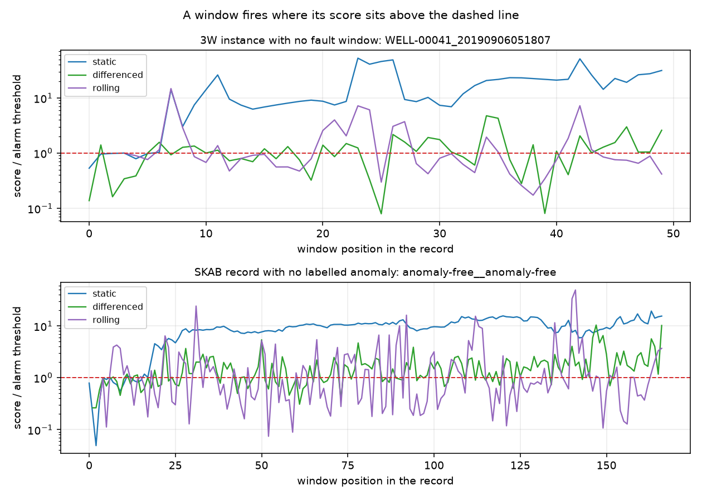

# Baseline drift: static, differenced and rolling baselines

## Summary

A static own-history baseline fires on 71.2% of the stream windows of 3W records that carry no fault and on 95.7% of the SKAB anomaly-free record, against a 25.0% floor. Scoring the minute-to-minute difference takes those rates to 41.4% and 68.3%, and moving the baseline to the 3 windows before each scored window takes them to 29.3% and 47.2%. Detection on the 3W records whose fault arrives later falls from 98.0% to 81.6% for the differenced score and 89.8% for the rolling baseline, and the median delay goes from 0.0 windows to 2.0. A 3W fault that lasts a median of 38 windows stays above a rolling threshold for a median of 2.0 consecutive fault windows before the baseline has absorbed it, against 10.0 for the static baseline. The alarm rule needs seven windows, so it scores 25 of the 538 3W records with no fault window.

## Data

Two beds come from the 3W window caches the detector study builds, and two from the SKAB archives.

- 3W v2.0.0, dataset manifest sha256 `14bc1397d3ee`. The own-history cache is `data/3w_windows`, manifest `bfff4f2e897b`, 1113 instances and 6992 one-hour windows, each window holding 60 one-minute sub-group medians for the six variables every instance shares. The onset-aligned cache is `data/3w_windows_aligned`, manifest `6f4f097fcd4a`, 48 instances of six windows.
- SKAB, dataset manifest sha256 `c0d612939333`, 35 records converted to tsdive archives under `data/skab_archives`. The windows are 60 s from each record's first timestamp, the same ones `examples/studies/skab/results/windows.csv` carries, and the minute median of a window is the median of its GOOD values.

Nothing is fitted across records, so no group holdout applies. The 3W folds are wells and the SKAB folds are the upstream folders; both are recorded in the result frames so a later reader can group by them.

| bed and group | records |
|---|---|
| 3w_aligned:aligned | 48 |
| 3w_own_history:mixed | 53 |
| 3w_own_history:normal | 538 |
| 3w_own_history:positive_baseline | 54 |
| 3w_own_history:short | 468 |
| skab:labelled | 34 |
| skab_anomaly_free:anomaly_free | 1 |

Records whose baseline windows already carry a fault row, and records with 3 windows or fewer, are counted and not scored.

## Method

Run the study and render this report:

```
uv run python examples/studies/baseline_drift/run_drift.py
uv run python examples/studies/baseline_drift/make_report.py --update-benchmarks
```

Every scoring gives one score per window: the largest robust z over the usable variables and over the window's minutes. The centre and scale are the median and 1.4826 x MAD of a set of minute medians, the constants `tsdive.baselines.mad_baseline` uses, computed with numpy so that a set smaller than the 30 samples that function requires still yields a number.

- `static`: the set is the minute medians of the first 3 windows.
- `differenced`: the set is the minute-to-minute differences inside those windows, and a window's score reads the differences inside it. The first minute of a window whose predecessor is missing from the cache carries no difference.
- `rolling`: the set is the minute medians of the 3 windows immediately before the scored window, recomputed for every window and label-blind.
- `clock`: the window's position in its own record, through `tsdive.eval.clock_control`. It reads no sensor value.

A variable is unusable when the scale over its baseline set is zero or when that set holds no finite minute median. For `rolling` the verdict is per window. A window with no usable variable is refused with the reason.

The alarm rule is the same for all four. On the own-history beds the threshold is `worst_baseline_threshold` over the scores of window positions 3, 4 and 5, which are the first three windows a rolling baseline can score, and the stream is position 6 onward. On the onset-aligned bed the threshold comes from the three baseline windows, as in the detector study, and the stream is pre, post0 and post1. `fires` is strict, so `far_floor(3)` = 25.0% is the rate a score that reads nothing already reaches.

## Results

### 3W records with no fault window, own history

25 of 538 records carry the seven windows the rule needs. Their stream lengths run from 1 to 46 windows.

| scoring | stream windows | false-alarm rate per window | over the 25.0% floor | records with an alarm |
|---|---|---|---|---|
| static | 372 | 71.2% | +0.462 | 60.0% |
| differenced | 372 | 41.4% | +0.164 | 68.0% |
| rolling | 372 | 29.3% | +0.043 | 72.0% |
| clock control | 372 | 100.0% | +0.750 | 100.0% |

### 3W records whose fault arrives later, own history

49 of 53 records carry the seven windows the rule needs. The median record holds 48 windows and its fault runs for 38 of them.

| scoring | AUC | false-alarm rate before the first fault window | over the 25.0% floor | detect | median delay (windows) | median fault windows firing in a row |
|---|---|---|---|---|---|---|
| static | 0.855 | 70.9% | +0.459 | 98.0% | 0.0 | 10.0 |
| differenced | 0.569 | 40.1% | +0.151 | 81.6% | 0.5 | 2.0 |
| rolling | 0.575 | 27.9% | +0.029 | 89.8% | 2.0 | 2.0 |
| clock control | 0.893 | 100.0% | +0.750 | 100.0% | 0.0 | 38.0 |

### 3W onset-aligned instances

`rolling` is refused on this bed: no threshold window scored: a rolling baseline needs 3 windows before the scored window, and the threshold windows of this design are the instance's first three, which have no predecessors in the cache.

| scoring | instances scored | false-alarm rate on pre | over the 25.0% floor | first alarm in post0 | detect by the end of post1 |
|---|---|---|---|---|---|
| static | 48 | 54.2% | +0.292 | 72.9% | 83.3% |
| differenced | 48 | 29.2% | +0.042 | 54.2% | 60.4% |
| rolling | 0 | refused |  | refused | refused |
| clock control | 48 | 100.0% | +0.750 | 100.0% | 100.0% |

### SKAB labelled records

34 records, each about 20 minutes long, every one returning to normal after its fault.

| scoring | AUC | false-alarm rate before onset | over the 25.0% floor | detect | median delay (windows) | false-alarm rate after the span | recovered within 2 windows |
|---|---|---|---|---|---|---|---|
| static | 0.617 | 36.6% | +0.116 | 82.3% | 0.0 | 67.4% | 30.8% |
| differenced | 0.547 | 28.2% | +0.032 | 75.8% | 1.0 | 35.6% | 86.4% |
| rolling | 0.530 | 29.0% | +0.040 | 84.9% | 1.0 | 36.8% | 76.0% |
| clock control | 0.591 | 100.0% | +0.750 | 100.0% | 0.0 | 100.0% | 0.0% |

### SKAB anomaly-free record

| scoring | stream windows | false-alarm rate per window | over the 25.0% floor |
|---|---|---|---|
| static | 161 | 95.7% | +0.707 |
| differenced | 161 | 68.3% | +0.433 |
| rolling | 161 | 47.2% | +0.222 |
| clock control | 161 | 100.0% | +0.750 |

### Variables a scoring could not use

One row per (record, variable) pair dropped, over the records the rule scores.

| bed | scoring | pairs with a zero scale | pairs with no finite minute median | variable dropped most often |
|---|---|---|---|---|
| 3w_own_history | static | 67 | 73 | `P-PDG` (48) |
| 3w_own_history | differenced | 84 | 73 | `P-PDG` (48) |
| 3w_own_history | rolling | 123 | 73 | `P-PDG` (48) |
| 3w_aligned | static | 55 | 35 | `P-PDG` (33) |
| 3w_aligned | differenced | 67 | 35 | `P-PDG` (33) |
| skab | static | 61 | 0 | `Pressure` (34) |
| skab | differenced | 55 | 0 | `Pressure` (34) |
| skab | rolling | 77 | 0 | `Pressure` (34) |
| skab_anomaly_free | static | 1 | 0 | `Pressure` (1) |
| skab_anomaly_free | differenced | 1 | 0 | `Pressure` (1) |
| skab_anomaly_free | rolling | 2 | 0 | `Pressure` (1) |



The figure plots each scoring's score divided by its own alarm threshold, so a window fires where its curve sits above 1. The upper panel is `WELL-00041_20190906051807`, the 3W record with no fault window whose static score fires on the largest share of its stream. The lower panel is the SKAB record with no labelled anomaly.

## Discussion

On both beds the static baseline reaches a false-alarm rate that the floor does not explain: 71.2% per window on the 3W records with no fault (+0.462 over the floor) and 95.7% on the SKAB anomaly-free record (+0.707). The clock control reaches 100.0% on both, because a score that rises with position crosses the worst of three early windows at every later window. The static score sits between the two, which is what a level that keeps moving away from the fit windows produces.

Differencing removes most of that. It takes the 3W rate to 41.4% (+0.164) and the SKAB anomaly-free rate to 68.3% (+0.433). The cost is detection: on the 3W records whose fault arrives later it detects 81.6% against 98.0%, and on the onset-aligned instances it raises a first alarm in post0 on 54.2% of them against 72.9%. A differenced score reads the edge of a fault, so a fault that arrives inside a window it does not cover is gone from the score by the next window.

The rolling baseline takes the rates lowest: 29.3% on the 3W records with no fault (+0.043) and 47.2% on the SKAB anomaly-free record (+0.222), the lowest of the three on that record. It keeps 89.8% detection on the 3W records whose fault arrives later, above the differenced score, and pays for it in delay: the median first alarm arrives 2.0 windows after the first fault window against 0.0 for the static baseline.

A moving baseline also stops seeing a fault that stays. On the 3W records whose fault arrives later the median fault runs for 38 windows; the rolling score keeps a median of 2.0 consecutive fault windows above its threshold, against 10.0 for the static baseline and 38.0 for the clock, which fires on every window after the threshold ones. Three windows of history absorb an hour-scale step in about two windows. On SKAB, where the fault ends and the record returns to normal, that same property cuts the false alarms after the span: the rolling baseline's rate there is 36.8% against 67.4% for the static baseline, and it goes quiet within two windows on 76.0% of the records against 30.8%.

The record-level rates move the other way. On the 3W records with no fault the share of records raising at least one alarm is 60.0% for the static baseline and 72.0% for the rolling one, while the per-window rates are 71.2% and 29.3%. A local threshold is a low threshold, so any single window that steps out of its own three-window history crosses it. A rolling baseline shortens an alarm. It does not stop one from starting.

The ranking metrics run the same way. On the 3W records whose fault arrives later the static AUC is 0.855 and the clock control takes 0.893, so the static score ranks below a timer; the differenced and rolling AUCs are 0.569 and 0.575, which is what a score that reads only the edge of a fault gives on a record where most fault windows are steady. On SKAB the order is different: the clock takes 0.591 and the static score 0.617, because a SKAB fault ends and position alone no longer separates the labels.

## Limits and further work

- The rule needs seven windows, so it scores 25 of the 538 3W records with no fault window and 49 of the 53 whose fault arrives later. The static rate here is not comparable with the 76.3% the conformal study reports over 537 records under a rule that needs four windows (`examples/studies/3w_conformal/REPORT.md`).
- A SKAB window is 60 s, so its minute median is one number and a baseline of three windows is three numbers. That is why `Pressure` is unusable in every SKAB record here while the SKAB study, whose baseline reads 180 one-second samples, keeps it in five of them.
- `rolling` is refused on the onset-aligned bed. The design keeps six windows per instance and the threshold windows are the first three, which have no predecessors in the cache.
- The study scores the one-minute medians only. It says nothing about a scoring's behaviour on the raw one-second samples, which is what `screen` and `spc` read when you point them at an archive.
- No scoring here is wired into `screen`, `spc` or `mspc`. The package still fits one baseline over a fixed history.

## Files

| file | holds |
|---|---|
| `run_drift.py` | the study runner |
| `make_report.py` | this report, the figure and the BENCHMARKS section |
| `results/windows.csv` | one row per window of every record the rule scores |
| `results/scores.csv` | one row per (bed, record, scoring, window): the score or the refusal |
| `results/per_record.csv` | the alarm rule and its metrics per record |
| `results/summary.csv` | one row per (bed, group, scoring) |
| `results/usability.csv` | one row per variable a scoring could not use |
| `results/run.json` | manifests, code version, parameters, counts |
| `results/benchmarks_section.md` | the BENCHMARKS.md REAL section |
| `out/01_score_over_threshold.png` | the figure above |
