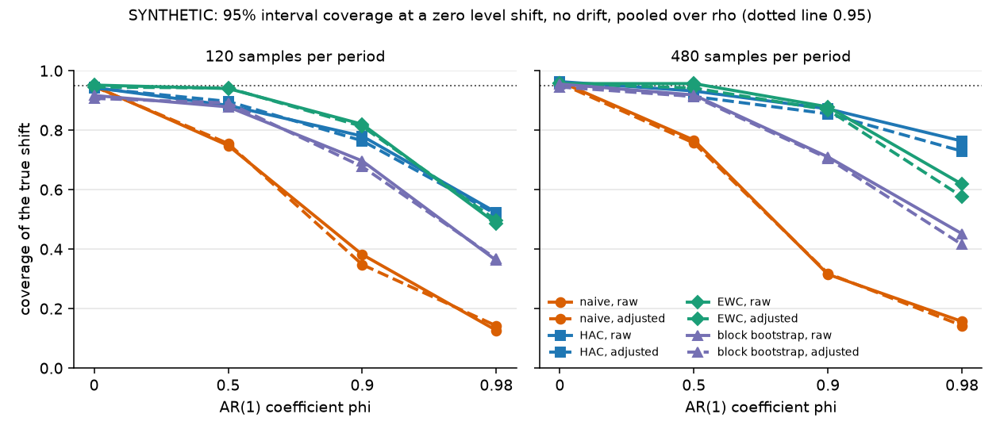

# Shift intervals: before/after level and spread on autocorrelated records

## Summary

The study asks which 95% interval for a before/after level or spread shift keeps its coverage on autocorrelated process records, and whether regressing the target on the other tags of the record narrows it, on SYNTHETIC AR(1) series, placebo dates and fault onsets on 3W and SKAB, injected and published changes on the Turbine Upgrade pairs, and TEP fault onsets. No method keeps its coverage at 0.95 minus 2 MCSE or above in every synthetic cell with phi up to 0.9 and 480 samples per period: the best, `ewc` raw base+R1, holds in 7 of 9 cells. On the 538 3W instances with no fault window a placebo date gets an interval that excludes 0 on 65.6% of answered (instance, tag) pairs with `hac` and 63.8% with `ewc`, and on the turbine placebo weeks on 24.4% and 41.5%. On the TEP fault-free runs `ewc` covers the level at 0.924 to 0.942 over the three variable groups and passes criterion 5 in 2 of 3; with the post-hoc persistence refusal R4 it passes in 3 of 3 while answering 83.7% of the rows. Criteria 1, 2, 3, 5 and 6 fail for every registered configuration, so the roadmap parks the interval.

## Data

- 3W v2.0.0, dataset manifest sha256 `14bc1397d3ee`. The placebo bed reads the own-history cache `data/3w_windows` (manifest `bfff4f2e897b`): 640 instances have no fault window, and 538 of them from 16 wells hold 4 consecutive one-hour windows; 102 do not and are counted. The known-change bed reads the onset-aligned cache `data/3w_windows_aligned` (manifest `6f4f097fcd4a`), 48 instances from 21 wells. Each window carries 60 one-minute sub-group medians for the 6 variables every instance shares.
- SKAB, dataset manifest sha256 `c0d612939333`, 35 records under `data/skab_archives`: 34 labelled records and the anomaly-free record, 8 tags at 1 s, quality assumed GOOD, read as recorded. Records with a hole over 60 s between rows, the same 4 records `examples/studies/skab/REPORT.md` names:

| record | rows | gaps over 60 s | longest gap (s) |
|---|---|---|---|
| other__2 | 780 | 1 | 247 |
| valve1__2 | 1075 | 1 | 76 |
| valve1__7 | 1094 | 1 | 65 |
| valve2__1 | 1063 | 1 | 64 |

- Turbine Upgrade Dataset (Zenodo record 5516556, CC BY 4.0), manifest sha256 `31b2b0c7e33a` under `data/turbine_upgrade`. Two turbine pairs from one wind farm, 10 min rows, `y_test` the normalised power of the turbine that is upgraded and `y_ctrl` its unchanged sister. The pitch pair's upgrade is simulated by the dataset: `y_test` is multiplied by 1.05 on upgraded rows with V over 9 m/s, and the Table 7.3 file repeats the pair at r 0.02 to 0.09. The study finds 2,666 modified rows, exactly the upgraded rows with V > 9 (7 upgraded rows at V = 9.00 are unmodified), and reconstructs the unmodified `y_test` to within 0.0001 across r. Rows with V under 3.5 are absent, so the sequence is irregular:

| pair | rows | span | upgraded rows | 10 min steps | longer steps |
|---|---|---|---|---|---|
| pitch pair | 28,486 | 2010-07-30 to 2011-06-25 | 7,000 from 2011-04-25T21:50 | 27,467 | 1,018 (5 over a day, longest 57.0 days) |
| VG pair | 45,114 | 2010-04-29 to 2011-08-15 | 5,000 from 2011-06-20T00:00 | 43,311 | 1,802 (12 over a day, longest 29.9 days) |

- TEP (Rieth and others, Harvard Dataverse `doi:10.7910/DVN/6C3JR1`), dataset manifest sha256 `f57ab3ee3443`, the testing split: 500 runs per condition of 960 samples at 180 s. `build_tep_cache.py` keeps runs 1 to 350 and samples 1 to 320 of fault-free and faults 1 to 20 (cache sha256 `ee6e1d65cb2c`, peak process memory 15.4 GiB while reading the testing files). Fault 6 zeroes `xmeas_1` at sample 161 (ensemble mean -0.0001 against 0.2526 fault-free), so samples 1 to 160 precede the fault.

Nothing is fitted across records: every interval, coefficient and refusal reads one record's before and after periods, and each TEP truth reads runs the scored runs do not. Group holdout holds by construction. The 3W tables give placebo rates averaged per well as well as pooled, because wells contribute unequal instance counts.

| design | splits | records | wells, folders or pairs |
|---|---|---|---|
| 3W placebo (`3w_placebo`) | 538 | 538 | 16 |
| SKAB anomaly-free placebo (`skab_free_placebo`) | 8 | 1 | 1 |
| SKAB pre-onset placebo (`skab_preonset_placebo`) | 34 | 34 | 3 |
| 3W onset-aligned (`3w_aligned_onset`) | 48 | 48 | 21 |
| SKAB labelled onset (`skab_labelled_onset`) | 34 | 34 | 3 |
| `turbine_injected_r0.02` | 44 | 2 | 2 |
| `turbine_injected_r0.05` | 44 | 2 | 2 |
| `turbine_injected_r0.09` | 44 | 2 | 2 |
| `turbine_pitch_change` | 9 | 9 | 1 |
| `turbine_placebo` | 44 | 2 | 2 |
| `turbine_vg_change` | 1 | 1 | 1 |
| `tep_fault_onset` | 2100 | 21 conditions x 100 runs | 21 |

## Method

Run the study and render this report:

```
uv run python examples/studies/shift_intervals/fetch_turbine.py --dest data/turbine_upgrade
uv run python examples/studies/shift_intervals/build_tep_cache.py
uv run python examples/studies/shift_intervals/run_shift.py
uv run python examples/studies/shift_intervals/make_report.py --update-benchmarks
```

`run_shift.py --beds synthetic` runs one bed. Wall seconds: synthetic 115.1 with 200 replicates per cell, placebo 6.7, known change 2.3, turbine 2.7, TEP 166.9. Estimators and rules are in `shift.py`.

### Estimators

Every period is an ordered sequence read as evenly spaced: 3W minute medians, SKAB 1 s rows, turbine 10 min rows, TEP samples. The level estimate is mean(after) - mean(before), reported in before-period SDs of the target. The spread estimate is log(SD after / SD before). Intervals are 95%.

- `naive`: Welch-style standard error that treats the samples as independent, normal quantile 1.959964.
- `hac`: per-period long-run variance with the Newey-West Bartlett kernel and the Andrews (1991) AR(1) plug-in bandwidth, capped at n - 1, normal quantile. Level only.
- `ewc`: the rule of Lazarus, Lewis, Stock and Watson (2018, Journal of Business and Economic Statistics, "HAR Inference: Recommendations for Practice"). Per period, the long-run variance is (1/nu) sum of L_j^2 over nu = max(1, floor(0.4 n^(2/3))) type II cosine projections of the demeaned series. The critical value is Student t on the Welch-Satterthwaite degrees of freedom of the two periods. Level only.
- `block_bootstrap`: moving block bootstrap inside each period, block min(max(10, n^(1/3)), n) as `tsdive compare` uses, 200 resamples, seed 42, percentile interval on the difference of resampled means or on the resampled log SD ratio.
- Spread `naive`: standard error 0.5 sqrt(2/(n_a - 1) + 2/(n_b - 1)) on the log SD ratio.

`raw` runs the method on the target. `adjusted` fits OLS of the target on the covariates over the before period only, applies the coefficients to both periods and runs the same method on the residuals. The covariates are declared by rule. On 3W, SKAB and TEP they are every other tag of the record that passes R0 on the split. On the turbine pairs they are V, VcosD, VsinD, rho, S, I and `y_ctrl` where they pass R0 (D is covered by its cosine and sine). The variance reduction is 1 - var(residual before) / var(target before).

### Rules

A refused interval is a row with its reason.

- R0 `too_few`: fewer than 30 samples in either period. `no_spread`: the before-period MAD of the target is 0, or the before-period residual MAD is 0 (below 1e-9 of the target's MAD, the float noise of an exact linear copy). `no_covariate`: no declared covariate passes R0.
- `too_many_covariates`: more than one covariate per 10 before-period samples. Refuses the adjusted arm. It refuses every adjusted TEP row (51 covariates against 160 samples), and on the earlier beds it refuses the 7 adjusted targets of the SKAB pre-onset placebo of `other__2`, whose halves are too short for 6 covariates.
- R1 `before_trend`: the HAC t statistic of an OLS slope over the before period exceeds 1.96 in absolute value, on the series the interval reads.
- R2 `covariate_outside`: a covariate's after-period median lies outside its before-period 1st to 99th percentile. Refuses the adjusted arm.
- R3 `covariate_shifted`: a covariate's own `hac` level interval excludes 0. A flag on the adjusted arm.
- R4 `too_persistent`, post hoc: in either period n (1 - r) / (1 + r) < 10, with r the lag-1 autocorrelation of the series the interval reads, floored at 0. It was chosen after the 3W placebo result below, so it does not count toward criterion 2; the turbine and TEP beds, which ran after it was fixed, are where it is tested.

R0, R2 and `too_many_covariates` refuse in every refusal set. The sets add the flags: `base`, `base+R1`, `base+R3` and `base+R1+R3` (R3 on the adjusted arm only), and the post-hoc `base+R4` and `base+R1+R4`.

### Beds

- SYNTHETIC: y = delta 1[after] + rho x + sqrt(1 - rho^2) e + drift, with x and e independent unit-variance AR(1) series sharing phi. The level grid crosses phi {0, 0.5, 0.9, 0.98}, rho {0, 0.5, 0.9}, drift {0, 1 SD of linear rise over both periods}, delta {0, 0.25, 0.5, 1} and n {120, 480} per period. The affected-covariate cells set rho 0.9, delta {0.25, 0.5, 1} and drift 0, and the recorded covariate steps by 0.5 delta after the change date while y reads the unstepped x, so the target's true shift stays delta. The spread grid crosses phi, n and SD ratio {1, 0.7, 0.5}. Each cell draws 200 replicates from a seed derived from its parameters alone. Coverage has Monte Carlo SE sqrt(c(1 - c)/m) over the m answered replicates.
- Placebo dates, the control: the date moves and nothing was changed. `3w_placebo` takes, per instance, the first 2 of the first 4 consecutive windows (120 minute medians) against the next 2, label-blind. `skab_free_placebo` takes non-overlapping 10 min before and 10 min after pairs of the anomaly-free record. `skab_preonset_placebo` splits each labelled record's rows before its first anomaly row in half. `turbine_placebo` takes non-overlapping 1 week before and 1 week after pairs over each pair's rows before its upgrade, from the first timestamp, label-blind.
- Injected shifts with a known truth: `turbine_injected_r<r>` repeats each placebo week pair with the after week's `y_test` times (1 + r) where V > 9, for r 0.02, 0.05 and 0.09, the rule the dataset applies to its pitch pair. The truth is the mean injected increment over the after rows, for both arms, because the covariates are untouched. Adjacent week pairs share weather, so they are not independent replicates.
- Known change dates: `3w_aligned_onset` takes the 3 windows nearest before the onset (offsets -4, -3, -2) against the 2 after it (offsets 0, 1); `skab_labelled_onset` takes the rows before the first anomaly row against the first to the last anomaly row; both are fault onsets, not planned changes. `turbine_pitch_change` takes the 7,000 upgraded rows of the pitch pair against the 7,000 before them, once per published r and once on the reconstructed unmodified `y_test` (r 0), with the truth the mean of y_r minus the unmodified `y_test` over the after rows. `turbine_vg_change` takes the 5,000 rows after the vortex generator retrofit against the 5,000 before them; no truth is known.
- TEP: before is samples 1-160, after is 161-320. The truth per (condition, variable) is the mean over runs 1-250 of the run's own estimate, and runs 251-350 are scored, 100 per condition, every variable as the target. The fault-free level truth is 0. The fault-free spread truth is the ensemble estimate: the fault-free runs start with a lower spread, and the ensemble log SD ratio reaches |z| 15.9 against 0, while the ensemble level estimate stays within |z| 2.51. Variables fall in three groups: `xmeas_1_22` continuous measurements, `xmeas_23_41` sampled analysers held between samples, `xmv_1_11` manipulated variables.

A claim rate is the share of answered rows whose interval excludes 0 on a placebo date; a detection rate is the same share on a known change. The record-level rate counts a record when any of its k answered tags has a p-value under 0.05 / k (Bonferroni). For `block_bootstrap` the p-value is twice the smaller share of resampled differences on either side of 0.

### Pre-registered criteria

Criteria 1 to 4 were fixed in the first pass, before any result was computed. Criteria 5 to 7 were fixed in this pass, before the turbine and TEP beds ran. Criteria 1 to 3 are re-evaluated with `ewc` added and are otherwise unchanged. The registered sets are `base` and `base+R1` for the raw arm and `base`, `base+R1`, `base+R3` and `base+R1+R3` for the adjusted arm; the R4 sets are post hoc.

1. An interval method holds when its synthetic coverage at a zero shift is at least 0.95 - 2 MCSE in every drift-0 cell with phi up to 0.9 and n = 480: the 9 level cells of phi {0, 0.5, 0.9} and rho {0, 0.5, 0.9}, and for spread the 3 cells of phi {0, 0.5, 0.9} at SD ratio 1. The MCSE is the cell's own.
2. It is usable on real records when its 3W placebo claim rate per (instance, tag) is at most 0.10, pooled and averaged per well, after the refusals of its set.
3. Adjustment is kept when, on the 3W placebo, the median adjusted/raw width ratio is at most 0.8 and the adjusted claim rate (pooled and averaged per well) is not above raw, and R3 flags at least 80% of the replicates of the affected-covariate cells, pooled over its 24 cells.
4. If no (method, adjustment, refusal set) passes, the roadmap parks the study with the measured reason.
5. TEP: a method holds when its coverage over the fault-free runs is at least 0.95 - 2 MCSE in each variable group.
6. Turbine: a method is usable when its `turbine_placebo` claim rate is at most 0.10 and its `turbine_injected` coverage is at least 0.95 - 2 MCSE at every r.
7. R4 is confirmed when, for some method, adding R4 moves a failing criterion 5 or 6 to passing while answering at least half the rows.

## Results

### Synthetic coverage

The dumbest check first: with phi 0, rho 0 and no drift every method should cover near 0.95. Coverage (MCSE):

| method | adjustment | n 120 | n 480 |
|---|---|---|---|
| naive | raw | 0.960 (0.014) | 0.970 (0.012) |
| naive | adjusted | 0.970 (0.012) | 0.970 (0.012) |
| HAC | raw | 0.955 (0.015) | 0.970 (0.012) |
| HAC | adjusted | 0.965 (0.013) | 0.970 (0.012) |
| EWC | raw | 0.955 (0.015) | 0.955 (0.015) |
| EWC | adjusted | 0.945 (0.016) | 0.955 (0.015) |
| block bootstrap | raw | 0.935 (0.017) | 0.955 (0.015) |
| block bootstrap | adjusted | 0.925 (0.019) | 0.955 (0.015) |

Every cell lies within 2 MCSE of 0.95, so the estimators pass the check. `block_bootstrap` sits lowest: its percentile endpoints carry the noise of 200 resamples, and at n 120 a period holds 12 blocks of 10.

Coverage at a zero shift, no drift, n 480, pooled over the three rho cells (MCSE):

| method | adjustment | phi 0 | phi 0.5 | phi 0.9 | phi 0.98 |
|---|---|---|---|---|---|
| naive | raw | 0.963 (0.008) | 0.767 (0.017) | 0.315 (0.019) | 0.157 (0.015) |
| naive | adjusted | 0.958 (0.008) | 0.757 (0.018) | 0.318 (0.019) | 0.143 (0.014) |
| HAC | raw | 0.963 (0.008) | 0.932 (0.010) | 0.872 (0.014) | 0.763 (0.017) |
| HAC | adjusted | 0.957 (0.008) | 0.913 (0.011) | 0.855 (0.014) | 0.729 (0.018) |
| EWC | raw | 0.957 (0.008) | 0.957 (0.008) | 0.878 (0.013) | 0.618 (0.020) |
| EWC | adjusted | 0.957 (0.008) | 0.942 (0.010) | 0.868 (0.014) | 0.576 (0.020) |
| block bootstrap | raw | 0.955 (0.008) | 0.918 (0.011) | 0.710 (0.019) | 0.452 (0.020) |
| block bootstrap | adjusted | 0.945 (0.009) | 0.913 (0.011) | 0.705 (0.019) | 0.415 (0.020) |

The same at n 120:

| method | adjustment | phi 0 | phi 0.5 | phi 0.9 | phi 0.98 |
|---|---|---|---|---|---|
| naive | raw | 0.948 (0.009) | 0.748 (0.018) | 0.382 (0.020) | 0.127 (0.014) |
| naive | adjusted | 0.947 (0.009) | 0.755 (0.018) | 0.348 (0.019) | 0.142 (0.016) |
| HAC | raw | 0.943 (0.009) | 0.883 (0.013) | 0.780 (0.017) | 0.523 (0.020) |
| HAC | adjusted | 0.942 (0.010) | 0.897 (0.012) | 0.764 (0.017) | 0.517 (0.023) |
| EWC | raw | 0.952 (0.009) | 0.940 (0.010) | 0.820 (0.016) | 0.487 (0.020) |
| EWC | adjusted | 0.945 (0.009) | 0.942 (0.010) | 0.813 (0.016) | 0.497 (0.023) |
| block bootstrap | raw | 0.917 (0.011) | 0.878 (0.013) | 0.697 (0.019) | 0.362 (0.020) |
| block bootstrap | adjusted | 0.907 (0.012) | 0.892 (0.013) | 0.677 (0.019) | 0.367 (0.022) |



`naive` covers 0.315 (0.019) at phi 0.9, where neighbouring samples correlate at 0.9. `hac` and `ewc` are the best of the four and still fall under the line at phi 0.9. The adjusted arm tracks the raw arm, because the covariate carries the same phi.

Criterion 1 over the registered sets. In these cells R4 refuses at most 20.0% of the replicates, and adding it moves no verdict:

| quantity | method | adjustment | refusal set | cells passing | worst | verdict |
|---|---|---|---|---|---|---|
| level | block bootstrap | adjusted | base | 5 of 9 | 0.675 | does not hold |
| level | block bootstrap | adjusted | base+R1 | 5 of 9 | 0.660 | does not hold |
| level | block bootstrap | adjusted | base+R1+R3 | 5 of 9 | 0.630 | does not hold |
| level | block bootstrap | adjusted | base+R3 | 5 of 9 | 0.650 | does not hold |
| level | block bootstrap | raw | base | 6 of 9 | 0.660 | does not hold |
| level | block bootstrap | raw | base+R1 | 6 of 9 | 0.665 | does not hold |
| level | EWC | adjusted | base | 6 of 9 | 0.850 | does not hold |
| level | EWC | adjusted | base+R1 | 6 of 9 | 0.846 | does not hold |
| level | EWC | adjusted | base+R1+R3 | 6 of 9 | 0.836 | does not hold |
| level | EWC | adjusted | base+R3 | 6 of 9 | 0.844 | does not hold |
| level | EWC | raw | base | 6 of 9 | 0.845 | does not hold |
| level | EWC | raw | base+R1 | 7 of 9 | 0.839 | does not hold |
| level | HAC | adjusted | base | 6 of 9 | 0.825 | does not hold |
| level | HAC | adjusted | base+R1 | 6 of 9 | 0.815 | does not hold |
| level | HAC | adjusted | base+R1+R3 | 6 of 9 | 0.801 | does not hold |
| level | HAC | adjusted | base+R3 | 6 of 9 | 0.817 | does not hold |
| level | HAC | raw | base | 6 of 9 | 0.830 | does not hold |
| level | HAC | raw | base+R1 | 7 of 9 | 0.820 | does not hold |
| level | naive | adjusted | base | 3 of 9 | 0.285 | does not hold |
| level | naive | adjusted | base+R1 | 3 of 9 | 0.284 | does not hold |
| level | naive | adjusted | base+R1+R3 | 3 of 9 | 0.288 | does not hold |
| level | naive | adjusted | base+R3 | 3 of 9 | 0.294 | does not hold |
| level | naive | raw | base | 3 of 9 | 0.260 | does not hold |
| level | naive | raw | base+R1 | 3 of 9 | 0.255 | does not hold |
| spread | block bootstrap | adjusted | base | 2 of 3 | 0.835 | does not hold |
| spread | block bootstrap | adjusted | base+R1 | 2 of 3 | 0.863 | does not hold |
| spread | block bootstrap | adjusted | base+R1+R3 | 2 of 3 | 0.852 | does not hold |
| spread | block bootstrap | adjusted | base+R3 | 2 of 3 | 0.821 | does not hold |
| spread | block bootstrap | raw | base | 2 of 3 | 0.835 | does not hold |
| spread | block bootstrap | raw | base+R1 | 2 of 3 | 0.857 | does not hold |
| spread | naive | adjusted | base | 1 of 3 | 0.450 | does not hold |
| spread | naive | adjusted | base+R1 | 1 of 3 | 0.487 | does not hold |
| spread | naive | adjusted | base+R1+R3 | 1 of 3 | 0.486 | does not hold |
| spread | naive | adjusted | base+R3 | 1 of 3 | 0.447 | does not hold |
| spread | naive | raw | base | 1 of 3 | 0.445 | does not hold |
| spread | naive | raw | base+R1 | 1 of 3 | 0.460 | does not hold |

Drift of 1 SD over both periods, raw, zero shift, n 480, coverage (MCSE) and the share refused:

| method | drift | refusal set | phi 0 | phi 0.5 | phi 0.9 | phi 0.98 |
|---|---|---|---|---|---|---|
| HAC | 0 | base | 0.963 (0.008), refused 0.0% | 0.932 (0.010), refused 0.0% | 0.872 (0.014), refused 0.0% | 0.763 (0.017), refused 0.0% |
| HAC | 0 | base+R1 | 0.963 (0.008), refused 5.0% | 0.929 (0.011), refused 10.7% | 0.874 (0.015), refused 16.7% | 0.754 (0.023), refused 39.0% |
| HAC | 1 | base | 0.000 (0.000), refused 0.0% | 0.007 (0.003), refused 0.0% | 0.443 (0.020), refused 0.0% | 0.625 (0.020), refused 0.0% |
| HAC | 1 | base+R1 | 0.000 (0.000), refused 89.7% | 0.010 (0.006), refused 52.2% | 0.456 (0.024), refused 27.7% | 0.630 (0.025), refused 37.0% |
| EWC | 0 | base | 0.957 (0.008), refused 0.0% | 0.957 (0.008), refused 0.0% | 0.878 (0.013), refused 0.0% | 0.618 (0.020), refused 0.0% |
| EWC | 0 | base+R1 | 0.960 (0.008), refused 5.0% | 0.953 (0.009), refused 10.7% | 0.880 (0.015), refused 16.7% | 0.637 (0.025), refused 39.0% |
| EWC | 1 | base | 0.000 (0.000), refused 0.0% | 0.010 (0.004), refused 0.0% | 0.440 (0.020), refused 0.0% | 0.435 (0.020), refused 0.0% |
| EWC | 1 | base+R1 | 0.000 (0.000), refused 89.7% | 0.010 (0.006), refused 52.2% | 0.456 (0.024), refused 27.7% | 0.434 (0.025), refused 37.0% |

The drift moves mean(after) - mean(before) by about 0.5 SD, so the intervals centre off the true shift. For `hac`, R1 refuses 89.7% of the drifting replicates at phi 0 and 52.2% at phi 0.5, and the replicates it answers still cover 0.000 and 0.010. At phi 0.9 and 0.98 it refuses 27.7% and 37.0%, against 16.7% and 39.0% without drift: the before-period slope is lost in the noise of a persistent series.

Affected covariate, `hac`, n 480: coverage of the target's true shift and the mean bias, raw and adjusted, the share of replicates R3 flags, and the adjusted coverage over the replicates `base+R3` answers:

| delta | phi | raw | adjusted | R3 flags | adjusted, base+R3 |
|---|---|---|---|---|---|
| 0.25 | 0 | 0.940, bias 0.007 | 0.020, bias -0.110 | 56.5% | 0.000 of 87 |
| 0.25 | 0.5 | 0.950, bias 0.004 | 0.315, bias -0.110 | 24.0% | 0.309 of 152 |
| 0.25 | 0.9 | 0.915, bias 0.006 | 0.730, bias -0.118 | 15.5% | 0.763 of 169 |
| 0.25 | 0.98 | 0.740, bias 0.052 | 0.744, bias -0.092 | 24.0% | 0.737 of 152 |
| 0.5 | 0 | 0.945, bias -0.003 | 0.000, bias -0.225 | 96.0% | 0.000 of 8 |
| 0.5 | 0.5 | 0.935, bias -0.003 | 0.000, bias -0.230 | 71.0% | 0.000 of 58 |
| 0.5 | 0.9 | 0.915, bias -0.019 | 0.350, bias -0.240 | 25.0% | 0.347 of 150 |
| 0.5 | 0.98 | 0.750, bias -0.035 | 0.544, bias -0.231 | 28.5% | 0.538 of 143 |
| 1 | 0 | 0.965, bias 0.006 | 0.000, bias -0.451 | 100.0% | none answered of 0 |
| 1 | 0.5 | 0.920, bias 0.004 | 0.000, bias -0.450 | 99.0% | 0.000 of 2 |
| 1 | 0.9 | 0.905, bias 0.000 | 0.010, bias -0.436 | 56.5% | 0.000 of 87 |
| 1 | 0.98 | 0.795, bias 0.046 | 0.333, bias -0.433 | 37.0% | 0.294 of 126 |

Adjusting on a covariate that moved with the change date subtracts rho x its step, 0.45 delta, from the estimate. R3 flags 47.0% of the replicates over the 24 affected cells (both n). It flags the large steps at low phi and misses the small ones and the persistent series, and the replicates it misses carry the full bias. On the unaffected rho 0.9 cells R3 flags 15.3% of replicates, from 5.1% at phi 0 to 33.0% at phi 0.98.

Width of the adjusted interval over the raw one at a zero shift, phi 0.5, n 480, with the median variance reduction:

| rho | naive | HAC | EWC | block bootstrap |
|---|---|---|---|---|
| 0 | 0.999 (reduction 0.002) | 1.000 (reduction 0.002) | 0.998 (reduction 0.002) | 1.001 (reduction 0.002) |
| 0.5 | 0.868 (reduction 0.246) | 0.868 (reduction 0.246) | 0.881 (reduction 0.246) | 0.878 (reduction 0.246) |
| 0.9 | 0.439 (reduction 0.810) | 0.436 (reduction 0.810) | 0.445 (reduction 0.810) | 0.439 (reduction 0.810) |

Detection rate at rho 0.9, phi 0.5, n 480 (raw, then adjusted):

| delta | naive raw | naive adjusted | HAC raw | HAC adjusted | EWC raw | EWC adjusted | block bootstrap raw | block bootstrap adjusted |
|---|---|---|---|---|---|---|---|---|
| 0.25 | 87.0% | 100.0% | 72.0% | 100.0% | 61.5% | 100.0% | 70.5% | 100.0% |
| 0.5 | 100.0% | 100.0% | 99.5% | 100.0% | 99.5% | 100.0% | 99.0% | 100.0% |
| 1 | 100.0% | 100.0% | 100.0% | 100.0% | 100.0% | 100.0% | 100.0% | 100.0% |

With an untouched covariate at rho 0.9 the adjusted `hac` interval is 0.436 of the raw width, against sqrt(1 - 0.81) = 0.436, and the 0.25 SD shift that raw `hac` detects in 72.0% of replicates is detected in 100.0%.

Spread, raw arm: coverage of the true log SD ratio and the share of intervals excluding 0 (a claim at ratio 1, a detection below it):

| method | n | SD ratio | phi 0 | phi 0.5 | phi 0.9 | phi 0.98 |
|---|---|---|---|---|---|---|
| naive | 120 | 1 | 0.950, clears 5.0% | 0.905, clears 9.5% | 0.530, clears 47.0% | 0.335, clears 66.5% |
| naive | 120 | 0.7 | 0.945, clears 97.5% | 0.855, clears 91.5% | 0.530, clears 77.0% | 0.360, clears 74.0% |
| naive | 120 | 0.5 | 0.935, clears 100.0% | 0.845, clears 100.0% | 0.520, clears 97.5% | 0.305, clears 90.0% |
| naive | 480 | 1 | 0.960, clears 4.0% | 0.885, clears 11.5% | 0.445, clears 55.5% | 0.190, clears 81.0% |
| naive | 480 | 0.7 | 0.950, clears 100.0% | 0.790, clears 100.0% | 0.450, clears 99.0% | 0.245, clears 87.5% |
| naive | 480 | 0.5 | 0.955, clears 100.0% | 0.875, clears 100.0% | 0.475, clears 100.0% | 0.215, clears 98.5% |
| block bootstrap | 120 | 1 | 0.910, clears 9.0% | 0.950, clears 5.0% | 0.845, clears 15.5% | 0.695, clears 30.5% |
| block bootstrap | 120 | 0.7 | 0.910, clears 96.5% | 0.895, clears 90.5% | 0.840, clears 48.0% | 0.700, clears 43.0% |
| block bootstrap | 120 | 0.5 | 0.905, clears 100.0% | 0.860, clears 100.0% | 0.825, clears 93.0% | 0.670, clears 74.0% |
| block bootstrap | 480 | 1 | 0.935, clears 6.5% | 0.960, clears 4.0% | 0.835, clears 16.5% | 0.555, clears 44.5% |
| block bootstrap | 480 | 0.7 | 0.920, clears 100.0% | 0.860, clears 100.0% | 0.815, clears 84.0% | 0.600, clears 67.5% |
| block bootstrap | 480 | 0.5 | 0.950, clears 100.0% | 0.935, clears 100.0% | 0.830, clears 100.0% | 0.595, clears 94.5% |

### Placebo dates on 3W

538 instances from 16 wells, 6 tags each. Level, answered rows, claim rate pooled and averaged per well, and the record-level rate. The R4 rows are post hoc and do not count toward criterion 2:

| method | adjustment | refusal set | answered | pooled | well-averaged | record-level |
|---|---|---|---|---|---|---|
| naive | raw | base | 1802 (55.8%) | 83.1% | 77.4% | 99.4% of 537 |
| naive | raw | base+R1 | 547 (17.0%) | 66.0% | 61.1% | 80.5% of 318 |
| naive | raw | base+R4 (post hoc) | 448 (13.9%) | 59.8% | 54.7% | 63.4% of 246 |
| naive | raw | base+R1+R4 (post hoc) | 261 (8.1%) | 50.2% | 47.0% | 52.3% of 193 |
| naive | adjusted | base | 371 (11.5%) | 86.5% | 72.2% | 96.5% of 227 |
| naive | adjusted | base+R1 | 231 (7.2%) | 83.5% | 71.7% | 92.2% of 142 |
| naive | adjusted | base+R3 | 124 (3.8%) | 82.3% | 78.4% | 92.5% of 93 |
| naive | adjusted | base+R1+R3 | 78 (2.4%) | 78.2% | 69.0% | 89.8% of 59 |
| naive | adjusted | base+R4 (post hoc) | 105 (3.2%) | 73.3% | 61.3% | 80.8% of 52 |
| naive | adjusted | base+R1+R4 (post hoc) | 69 (2.1%) | 63.8% | 55.5% | 68.4% of 38 |
| HAC | raw | base | 1802 (55.8%) | 65.6% | 56.5% | 94.0% of 537 |
| HAC | raw | base+R1 | 547 (17.0%) | 47.3% | 44.1% | 62.0% of 318 |
| HAC | raw | base+R4 (post hoc) | 448 (13.9%) | 46.4% | 38.8% | 50.4% of 246 |
| HAC | raw | base+R1+R4 (post hoc) | 261 (8.1%) | 37.9% | 27.5% | 39.4% of 193 |
| HAC | adjusted | base | 371 (11.5%) | 74.1% | 56.7% | 90.3% of 227 |
| HAC | adjusted | base+R1 | 231 (7.2%) | 69.3% | 54.3% | 83.8% of 142 |
| HAC | adjusted | base+R3 | 124 (3.8%) | 65.3% | 61.7% | 79.6% of 93 |
| HAC | adjusted | base+R1+R3 | 78 (2.4%) | 60.3% | 50.8% | 74.6% of 59 |
| HAC | adjusted | base+R4 (post hoc) | 105 (3.2%) | 61.9% | 49.1% | 73.1% of 52 |
| HAC | adjusted | base+R1+R4 (post hoc) | 69 (2.1%) | 55.1% | 46.3% | 63.2% of 38 |
| EWC | raw | base | 1802 (55.8%) | 63.8% | 54.3% | 93.5% of 537 |
| EWC | raw | base+R1 | 547 (17.0%) | 40.2% | 40.7% | 51.6% of 318 |
| EWC | raw | base+R4 (post hoc) | 448 (13.9%) | 39.5% | 32.7% | 41.1% of 246 |
| EWC | raw | base+R1+R4 (post hoc) | 261 (8.1%) | 31.0% | 25.4% | 30.0% of 193 |
| EWC | adjusted | base | 371 (11.5%) | 70.6% | 53.7% | 87.2% of 227 |
| EWC | adjusted | base+R1 | 231 (7.2%) | 64.9% | 50.1% | 81.0% of 142 |
| EWC | adjusted | base+R3 | 124 (3.8%) | 62.9% | 59.2% | 76.3% of 93 |
| EWC | adjusted | base+R1+R3 | 78 (2.4%) | 56.4% | 47.3% | 67.8% of 59 |
| EWC | adjusted | base+R4 (post hoc) | 105 (3.2%) | 58.1% | 47.9% | 69.2% of 52 |
| EWC | adjusted | base+R1+R4 (post hoc) | 69 (2.1%) | 50.7% | 44.5% | 63.2% of 38 |
| block bootstrap | raw | base | 1802 (55.8%) | 70.5% | 62.5% | 96.7% of 537 |
| block bootstrap | raw | base+R1 | 547 (17.0%) | 49.7% | 48.7% | 64.5% of 318 |
| block bootstrap | raw | base+R4 (post hoc) | 448 (13.9%) | 47.8% | 45.5% | 51.6% of 246 |
| block bootstrap | raw | base+R1+R4 (post hoc) | 261 (8.1%) | 40.6% | 37.8% | 40.9% of 193 |
| block bootstrap | adjusted | base | 371 (11.5%) | 77.6% | 61.6% | 92.1% of 227 |
| block bootstrap | adjusted | base+R1 | 231 (7.2%) | 73.2% | 59.3% | 86.6% of 142 |
| block bootstrap | adjusted | base+R3 | 124 (3.8%) | 74.2% | 68.9% | 83.9% of 93 |
| block bootstrap | adjusted | base+R1+R3 | 78 (2.4%) | 69.2% | 58.2% | 79.7% of 59 |
| block bootstrap | adjusted | base+R4 (post hoc) | 105 (3.2%) | 63.8% | 54.6% | 73.1% of 52 |
| block bootstrap | adjusted | base+R1+R4 (post hoc) | 69 (2.1%) | 56.5% | 49.8% | 63.2% of 38 |

Spread:

| method | adjustment | refusal set | answered | pooled | well-averaged | record-level |
|---|---|---|---|---|---|---|
| naive | raw | base | 1797 (55.7%) | 61.6% | 64.5% | 88.6% of 537 |
| naive | raw | base+R1 | 547 (17.0%) | 52.1% | 53.6% | 65.4% of 318 |
| naive | raw | base+R4 (post hoc) | 447 (13.9%) | 33.1% | 34.6% | 41.5% of 246 |
| naive | raw | base+R1+R4 (post hoc) | 261 (8.1%) | 27.6% | 31.9% | 32.1% of 193 |
| naive | adjusted | base | 371 (11.5%) | 74.9% | 64.3% | 85.5% of 227 |
| naive | adjusted | base+R1 | 231 (7.2%) | 75.3% | 60.0% | 87.3% of 142 |
| naive | adjusted | base+R3 | 124 (3.8%) | 70.2% | 60.3% | 78.5% of 93 |
| naive | adjusted | base+R1+R3 | 78 (2.4%) | 73.1% | 66.9% | 81.4% of 59 |
| naive | adjusted | base+R4 (post hoc) | 105 (3.2%) | 51.4% | 36.9% | 59.6% of 52 |
| naive | adjusted | base+R1+R4 (post hoc) | 69 (2.1%) | 43.5% | 33.4% | 52.6% of 38 |
| block bootstrap | raw | base | 1771 (54.9%) | 38.6% | 40.8% | 61.5% of 537 |
| block bootstrap | raw | base+R1 | 543 (16.8%) | 34.8% | 36.5% | 42.1% of 316 |
| block bootstrap | raw | base+R4 (post hoc) | 442 (13.7%) | 23.3% | 22.0% | 29.1% of 244 |
| block bootstrap | raw | base+R1+R4 (post hoc) | 260 (8.1%) | 21.1% | 16.5% | 22.4% of 192 |
| block bootstrap | adjusted | base | 371 (11.5%) | 56.1% | 46.6% | 63.4% of 227 |
| block bootstrap | adjusted | base+R1 | 231 (7.2%) | 59.7% | 47.5% | 69.7% of 142 |
| block bootstrap | adjusted | base+R3 | 124 (3.8%) | 47.6% | 39.0% | 54.8% of 93 |
| block bootstrap | adjusted | base+R1+R3 | 78 (2.4%) | 51.3% | 45.3% | 59.3% of 59 |
| block bootstrap | adjusted | base+R4 (post hoc) | 105 (3.2%) | 33.3% | 20.1% | 42.3% of 52 |
| block bootstrap | adjusted | base+R1+R4 (post hoc) | 69 (2.1%) | 29.0% | 19.6% | 42.1% of 38 |

With R4 (post hoc) the lowest 3W claim rate is 21.1% pooled and 16.5% well-averaged (`block_bootstrap` raw base+R1+R4, spread), over 260 answered rows.

Per-well cut, level, `hac` raw, with and without the rows R1 flags:

| well | instances | answered | claim rate | answered without R1 flag | claim rate without R1 flag |
|---|---|---|---|---|---|
| WELL-00001 | 92 | 404 | 51.2% | 178 | 34.8% |
| WELL-00002 | 198 | 582 | 75.4% | 99 | 75.8% |
| WELL-00003 | 26 | 130 | 61.5% | 49 | 42.9% |
| WELL-00005 | 19 | 95 | 69.5% | 31 | 67.7% |
| WELL-00006 | 113 | 420 | 67.9% | 129 | 45.7% |
| WELL-00008 | 57 | 56 | 89.3% | 6 | 66.7% |
| WELL-00010 | 5 | 15 | 46.7% | 3 | 33.3% |
| WELL-00016 | 1 | 6 | 83.3% | 2 | 50.0% |
| WELL-00019 | 1 | 5 | 0.0% | 4 | 0.0% |
| WELL-00033 | 5 | 10 | 60.0% | 4 | 25.0% |
| WELL-00034 | 4 | 8 | 37.5% | 5 | 40.0% |
| WELL-00035 | 4 | 8 | 50.0% | 6 | 50.0% |
| WELL-00037 | 1 | 3 | 33.3% | 2 | 50.0% |
| WELL-00038 | 2 | 9 | 88.9% | 2 | 100.0% |
| WELL-00039 | 2 | 6 | 50.0% | 1 | 0.0% |
| WELL-00041 | 8 | 45 | 40.0% | 26 | 23.1% |

Refusals and diagnostics per design, level, `hac`, `base`: hard refusals by reason, the shares R1 and R4 flag, the median lag-1 autocorrelation of the before period of the series the arm reads, and the share of HAC bandwidths at their n - 1 cap:

| design | adjustment | rows | hard refusals | R1 flags | R4 flags | median lag-1 | bandwidth capped |
|---|---|---|---|---|---|---|---|
| 3W placebo | raw | 3228 | no_spread:636;too_few:790 | 38.9% | 41.9% | 0.978 | 36.9% |
| 3W placebo | adjusted | 3228 | covariate_outside:1372;no_covariate:65;no_spread:635;too_few:785 | 4.3% | 8.2% | 0.879 | 8.6% |
| SKAB anomaly-free placebo | raw | 64 | no_spread:8 | 53.1% | 12.5% | 0.464 | 0.0% |
| SKAB anomaly-free placebo | adjusted | 64 | covariate_outside:42;no_spread:8 | 10.9% | 1.6% | 0.540 | 0.0% |
| SKAB pre-onset placebo | raw | 272 | no_spread:42 | 34.9% | 15.8% | 0.298 | 2.6% |
| SKAB pre-onset placebo | adjusted | 272 | covariate_outside:98;no_spread:42;too_many_covariates:7 | 14.3% | 5.1% | 0.356 | 0.0% |
| 3W onset-aligned | raw | 288 | no_spread:54;too_few:35 | 38.9% | 39.9% | 0.847 | 15.1% |
| 3W onset-aligned | adjusted | 288 | covariate_outside:151;no_spread:54;too_few:35 | 6.6% | 5.6% | 0.333 | 6.2% |
| SKAB labelled onset | raw | 272 | no_spread:47 | 37.9% | 16.5% | 0.380 | 2.2% |
| SKAB labelled onset | adjusted | 272 | covariate_outside:185;no_spread:47 | 4.8% | 2.6% | 0.468 | 0.0% |

### Placebo dates on SKAB

Level, claim rate over answered rows for the anomaly-free pairs and the pre-onset halves, the pre-onset rate averaged per folder and its record-level rate:

| method | adjustment | refusal set | anomaly-free | pre-onset | pre-onset folder-averaged | pre-onset record-level |
|---|---|---|---|---|---|---|
| naive | raw | base | 69.6% of 56 | 57.4% of 230 | 58.4% | 100.0% |
| naive | raw | base+R1 | 40.9% of 22 | 45.9% of 135 | 46.0% | 82.3% |
| naive | raw | base+R4 (post hoc) | 64.6% of 48 | 50.3% of 187 | 51.7% | 100.0% |
| naive | adjusted | base | 85.7% of 14 | 68.0% of 125 | 68.6% | 96.9% |
| naive | adjusted | base+R1 | 71.4% of 7 | 63.9% of 86 | 63.6% | 95.8% |
| naive | adjusted | base+R4 (post hoc) | 84.6% of 13 | 66.7% of 111 | 65.5% | 100.0% |
| HAC | raw | base | 62.5% of 56 | 43.9% of 230 | 42.5% | 100.0% |
| HAC | raw | base+R1 | 31.8% of 22 | 34.8% of 135 | 33.4% | 70.6% |
| HAC | raw | base+R4 (post hoc) | 58.3% of 48 | 41.7% of 187 | 41.0% | 94.1% |
| HAC | adjusted | base | 78.6% of 14 | 54.4% of 125 | 55.5% | 90.6% |
| HAC | adjusted | base+R1 | 57.1% of 7 | 52.3% of 86 | 52.5% | 87.5% |
| HAC | adjusted | base+R4 (post hoc) | 76.9% of 13 | 54.0% of 111 | 54.3% | 95.8% |
| EWC | raw | base | 62.5% of 56 | 38.7% of 230 | 38.6% | 100.0% |
| EWC | raw | base+R1 | 31.8% of 22 | 28.1% of 135 | 26.9% | 73.5% |
| EWC | raw | base+R4 (post hoc) | 58.3% of 48 | 31.6% of 187 | 31.0% | 82.3% |
| EWC | adjusted | base | 78.6% of 14 | 47.2% of 125 | 48.1% | 93.8% |
| EWC | adjusted | base+R1 | 57.1% of 7 | 40.7% of 86 | 38.8% | 79.2% |
| EWC | adjusted | base+R4 (post hoc) | 76.9% of 13 | 44.1% of 111 | 42.4% | 91.7% |
| block bootstrap | raw | base | 66.1% of 56 | 47.8% of 230 | 47.4% | 100.0% |
| block bootstrap | raw | base+R1 | 36.4% of 22 | 36.3% of 135 | 34.5% | 79.4% |
| block bootstrap | raw | base+R4 (post hoc) | 60.4% of 48 | 40.6% of 187 | 40.1% | 91.2% |
| block bootstrap | adjusted | base | 78.6% of 14 | 56.0% of 125 | 56.7% | 96.9% |
| block bootstrap | adjusted | base+R1 | 57.1% of 7 | 50.0% of 86 | 48.5% | 79.2% |
| block bootstrap | adjusted | base+R4 (post hoc) | 76.9% of 13 | 54.0% of 111 | 52.3% | 95.8% |

### Known change dates beside their placebo

Level, pooled rate over answered rows. A detection rate reads only against the placebo rate of the same bed:

| method | adjustment | refusal set | 3W onset detect | 3W placebo claim | SKAB onset detect | SKAB pre-onset claim |
|---|---|---|---|---|---|---|
| naive | raw | base | 84.9% of 199 | 83.1% of 1802 | 66.2% of 225 | 57.4% of 230 |
| naive | raw | base+R1 | 77.0% of 87 | 66.0% of 547 | 50.8% of 122 | 45.9% of 135 |
| naive | raw | base+R4 (post hoc) | 76.2% of 84 | 59.8% of 448 | 58.3% of 180 | 50.3% of 187 |
| naive | adjusted | base | 87.5% of 48 | 86.5% of 371 | 82.5% of 40 | 68.0% of 125 |
| naive | adjusted | base+R1 | 82.8% of 29 | 83.5% of 231 | 77.8% of 27 | 63.9% of 86 |
| naive | adjusted | base+R4 (post hoc) | 81.2% of 32 | 73.3% of 105 | 78.8% of 33 | 66.7% of 111 |
| HAC | raw | base | 75.9% of 199 | 65.6% of 1802 | 54.7% of 225 | 43.9% of 230 |
| HAC | raw | base+R1 | 69.0% of 87 | 47.3% of 547 | 41.0% of 122 | 34.8% of 135 |
| HAC | raw | base+R4 (post hoc) | 66.7% of 84 | 46.4% of 448 | 48.3% of 180 | 41.7% of 187 |
| HAC | adjusted | base | 83.3% of 48 | 74.1% of 371 | 72.5% of 40 | 54.4% of 125 |
| HAC | adjusted | base+R1 | 79.3% of 29 | 69.3% of 231 | 63.0% of 27 | 52.3% of 86 |
| HAC | adjusted | base+R4 (post hoc) | 81.2% of 32 | 61.9% of 105 | 69.7% of 33 | 54.0% of 111 |
| EWC | raw | base | 76.4% of 199 | 63.8% of 1802 | 53.3% of 225 | 38.7% of 230 |
| EWC | raw | base+R1 | 70.1% of 87 | 40.2% of 547 | 39.3% of 122 | 28.1% of 135 |
| EWC | raw | base+R4 (post hoc) | 67.9% of 84 | 39.5% of 448 | 44.4% of 180 | 31.6% of 187 |
| EWC | adjusted | base | 81.2% of 48 | 70.6% of 371 | 67.5% of 40 | 47.2% of 125 |
| EWC | adjusted | base+R1 | 79.3% of 29 | 64.9% of 231 | 55.6% of 27 | 40.7% of 86 |
| EWC | adjusted | base+R4 (post hoc) | 78.1% of 32 | 58.1% of 105 | 60.6% of 33 | 44.1% of 111 |
| block bootstrap | raw | base | 78.9% of 199 | 70.5% of 1802 | 58.7% of 225 | 47.8% of 230 |
| block bootstrap | raw | base+R1 | 71.3% of 87 | 49.7% of 547 | 44.3% of 122 | 36.3% of 135 |
| block bootstrap | raw | base+R4 (post hoc) | 67.9% of 84 | 47.8% of 448 | 50.6% of 180 | 40.6% of 187 |
| block bootstrap | adjusted | base | 89.6% of 48 | 77.6% of 371 | 77.5% of 40 | 56.0% of 125 |
| block bootstrap | adjusted | base+R1 | 86.2% of 29 | 73.2% of 231 | 70.4% of 27 | 50.0% of 86 |
| block bootstrap | adjusted | base+R4 (post hoc) | 84.4% of 32 | 63.8% of 105 | 72.7% of 33 | 54.0% of 111 |

Spread:

| method | adjustment | refusal set | 3W onset detect | 3W placebo claim | SKAB onset detect | SKAB pre-onset claim |
|---|---|---|---|---|---|---|
| naive | raw | base | 71.4% of 196 | 61.6% of 1797 | 52.0% of 225 | 39.6% of 230 |
| naive | raw | base+R1 | 67.4% of 86 | 52.1% of 547 | 37.7% of 122 | 27.4% of 135 |
| naive | raw | base+R4 (post hoc) | 45.7% of 81 | 33.1% of 447 | 41.7% of 180 | 26.7% of 187 |
| naive | adjusted | base | 56.2% of 48 | 74.9% of 371 | 70.0% of 40 | 58.4% of 125 |
| naive | adjusted | base+R1 | 41.4% of 29 | 75.3% of 231 | 63.0% of 27 | 51.2% of 86 |
| naive | adjusted | base+R4 (post hoc) | 43.8% of 32 | 51.4% of 105 | 63.6% of 33 | 53.1% of 111 |
| block bootstrap | raw | base | 57.4% of 195 | 38.6% of 1771 | 44.9% of 225 | 34.4% of 230 |
| block bootstrap | raw | base+R1 | 55.8% of 86 | 34.8% of 543 | 32.8% of 122 | 22.2% of 135 |
| block bootstrap | raw | base+R4 (post hoc) | 38.3% of 81 | 23.3% of 442 | 37.2% of 180 | 23.0% of 187 |
| block bootstrap | adjusted | base | 41.7% of 48 | 56.1% of 371 | 50.0% of 40 | 48.0% of 125 |
| block bootstrap | adjusted | base+R1 | 34.5% of 29 | 59.7% of 231 | 55.6% of 27 | 43.0% of 86 |
| block bootstrap | adjusted | base+R4 (post hoc) | 31.2% of 32 | 33.3% of 105 | 48.5% of 33 | 43.2% of 111 |

### Adjustment on real records

Level, `base`: median variance reduction over the before period, median var(residual) / var(target) over the after period, median adjusted/raw width ratio over the rows both arms answer, adjusted and raw claim or detection rate, and the share of rows R2 refuses and R3 flags:

| design | method | variance reduction | after-period variance ratio | width ratio | pairs | adjusted rate | raw rate | R2 refuses | R3 flags |
|---|---|---|---|---|---|---|---|---|---|
| 3W placebo | naive | 0.438 | 1.049 | 0.963 | 371 | 86.5% | 83.1% | 42.5% | 49.7% |
| 3W placebo | HAC | 0.438 | 1.049 | 0.927 | 371 | 74.1% | 65.6% | 42.5% | 49.7% |
| 3W placebo | EWC | 0.438 | 1.049 | 0.943 | 371 | 70.6% | 63.8% | 42.5% | 49.7% |
| 3W placebo | block bootstrap | 0.438 | 1.049 | 0.939 | 371 | 77.6% | 70.5% | 42.5% | 49.7% |
| SKAB pre-onset placebo | naive | 0.176 | 0.950 | 0.945 | 125 | 68.0% | 57.4% | 36.0% | 80.5% |
| SKAB pre-onset placebo | HAC | 0.176 | 0.950 | 0.925 | 125 | 54.4% | 43.9% | 36.0% | 80.5% |
| SKAB pre-onset placebo | EWC | 0.176 | 0.950 | 0.963 | 125 | 47.2% | 38.7% | 36.0% | 80.5% |
| SKAB pre-onset placebo | block bootstrap | 0.176 | 0.950 | 0.955 | 125 | 56.0% | 47.8% | 36.0% | 80.5% |
| 3W onset-aligned | naive | 0.103 | 0.996 | 0.966 | 48 | 87.5% | 84.9% | 52.4% | 67.4% |
| 3W onset-aligned | HAC | 0.103 | 0.996 | 0.960 | 48 | 83.3% | 75.9% | 52.4% | 67.4% |
| 3W onset-aligned | EWC | 0.103 | 0.996 | 0.935 | 48 | 81.2% | 76.4% | 52.4% | 67.4% |
| 3W onset-aligned | block bootstrap | 0.103 | 0.996 | 0.937 | 48 | 89.6% | 78.9% | 52.4% | 67.4% |
| turbine placebo | naive | 0.949 | 0.076 | 0.266 | 37 | 70.3% | 87.8% | 9.1% | 75.0% |
| turbine placebo | HAC | 0.949 | 0.076 | 0.129 | 37 | 32.4% | 24.4% | 9.1% | 75.0% |
| turbine placebo | EWC | 0.949 | 0.076 | 0.202 | 37 | 32.4% | 41.5% | 9.1% | 75.0% |
| turbine placebo | block bootstrap | 0.949 | 0.076 | 0.208 | 37 | 46.0% | 61.0% | 9.1% | 75.0% |

### Turbine Upgrade pairs

44 placebo week pairs (29 on the VG pair, 15 on the pitch pair; the long holes in the record leave fewer weeks than the span holds). Level, placebo claim rate over answered week pairs, and for each injected r the coverage of the injected truth (MCSE) and the share of intervals excluding 0:

| method | adjustment | refusal set | placebo claim | injected r 0.02: coverage (MCSE) | injected r 0.05: coverage (MCSE) | injected r 0.09: coverage (MCSE) |
|---|---|---|---|---|---|---|
| naive | raw | base | 87.8% of 41 | 0.122 (0.051), clears 92.7% | 0.122 (0.051), clears 90.2% | 0.122 (0.051), clears 90.2% |
| naive | raw | base+R1 | 91.2% of 34 | 0.088 (0.049), clears 97.1% | 0.088 (0.049), clears 94.1% | 0.088 (0.049), clears 91.2% |
| naive | raw | base+R4 (post hoc) | 91.3% of 23 | 0.091 (0.061), clears 95.5% | 0.087 (0.059), clears 95.7% | 0.083 (0.056), clears 91.7% |
| naive | adjusted | base | 70.3% of 37 | 0.297 (0.075), clears 78.4% | 0.297 (0.075), clears 91.9% | 0.324 (0.077), clears 86.5% |
| naive | adjusted | base+R1 | 67.7% of 31 | 0.323 (0.084), clears 77.4% | 0.323 (0.084), clears 90.3% | 0.355 (0.086), clears 90.3% |
| naive | adjusted | base+R4 (post hoc) | 70.3% of 37 | 0.297 (0.075), clears 78.4% | 0.297 (0.075), clears 91.9% | 0.324 (0.077), clears 86.5% |
| HAC | raw | base | 24.4% of 41 | 0.756 (0.067), clears 19.5% | 0.805 (0.062), clears 19.5% | 0.805 (0.062), clears 21.9% |
| HAC | raw | base+R1 | 23.5% of 34 | 0.765 (0.073), clears 20.6% | 0.794 (0.069), clears 20.6% | 0.794 (0.069), clears 23.5% |
| HAC | raw | base+R4 (post hoc) | 21.7% of 23 | 0.773 (0.089), clears 18.2% | 0.826 (0.079), clears 13.0% | 0.833 (0.076), clears 16.7% |
| HAC | adjusted | base | 32.4% of 37 | 0.676 (0.077), clears 24.3% | 0.703 (0.075), clears 27.0% | 0.784 (0.068), clears 48.6% |
| HAC | adjusted | base+R1 | 35.5% of 31 | 0.645 (0.086), clears 25.8% | 0.677 (0.084), clears 29.0% | 0.774 (0.075), clears 51.6% |
| HAC | adjusted | base+R4 (post hoc) | 32.4% of 37 | 0.676 (0.077), clears 24.3% | 0.703 (0.075), clears 27.0% | 0.784 (0.068), clears 48.6% |
| EWC | raw | base | 41.5% of 41 | 0.585 (0.077), clears 46.3% | 0.585 (0.077), clears 46.3% | 0.585 (0.077), clears 39.0% |
| EWC | raw | base+R1 | 41.2% of 34 | 0.588 (0.084), clears 47.1% | 0.588 (0.084), clears 41.2% | 0.588 (0.084), clears 35.3% |
| EWC | raw | base+R4 (post hoc) | 34.8% of 23 | 0.636 (0.103), clears 40.9% | 0.652 (0.099), clears 39.1% | 0.667 (0.096), clears 37.5% |
| EWC | adjusted | base | 32.4% of 37 | 0.703 (0.075), clears 21.6% | 0.703 (0.075), clears 35.1% | 0.757 (0.070), clears 46.0% |
| EWC | adjusted | base+R1 | 35.5% of 31 | 0.677 (0.084), clears 22.6% | 0.677 (0.084), clears 38.7% | 0.742 (0.079), clears 51.6% |
| EWC | adjusted | base+R4 (post hoc) | 32.4% of 37 | 0.703 (0.075), clears 21.6% | 0.703 (0.075), clears 35.1% | 0.757 (0.070), clears 46.0% |
| block bootstrap | raw | base | 61.0% of 41 | 0.415 (0.077), clears 61.0% | 0.415 (0.077), clears 61.0% | 0.415 (0.077), clears 63.4% |
| block bootstrap | raw | base+R1 | 58.8% of 34 | 0.441 (0.085), clears 58.8% | 0.441 (0.085), clears 58.8% | 0.441 (0.085), clears 61.8% |
| block bootstrap | raw | base+R4 (post hoc) | 56.5% of 23 | 0.455 (0.106), clears 54.5% | 0.478 (0.104), clears 56.5% | 0.458 (0.102), clears 62.5% |
| block bootstrap | adjusted | base | 46.0% of 37 | 0.513 (0.082), clears 40.5% | 0.568 (0.081), clears 48.6% | 0.595 (0.081), clears 67.6% |
| block bootstrap | adjusted | base+R1 | 48.4% of 31 | 0.484 (0.090), clears 41.9% | 0.548 (0.089), clears 51.6% | 0.581 (0.089), clears 71.0% |
| block bootstrap | adjusted | base+R4 (post hoc) | 46.0% of 37 | 0.513 (0.082), clears 40.5% | 0.568 (0.081), clears 48.6% | 0.595 (0.081), clears 67.6% |

On the placebo weeks `hac` raw claims 24.4% and the adjusted `hac` interval 32.4%, at a median 0.129 of the raw width: `y_ctrl` removes a median 94.9% of the before-week variance. The before-week lag-1 autocorrelation of `y_test` is a median 0.957, and R4 flags 40.9% of the raw rows.

The published pitch change, one record per r: truth and estimate in before-period SDs of `y_test`, 95% interval, and whether it covers the truth:

| r | truth | HAC raw | EWC raw | adjusted (every method) |
|---|---|---|---|---|
| 0.00 | +0.0000 | -0.133 [-0.405, +0.139], covers | -0.133 [-0.329, +0.063], covers | refused: `covariate_outside` |
| 0.02 | +0.0183 | -0.115 [-0.389, +0.160], covers | -0.115 [-0.313, +0.084], covers | refused: `covariate_outside` |
| 0.03 | +0.0274 | -0.105 [-0.382, +0.171], covers | -0.105 [-0.305, +0.094], covers | refused: `covariate_outside` |
| 0.04 | +0.0365 | -0.096 [-0.374, +0.181], covers | -0.096 [-0.296, +0.104], covers | refused: `covariate_outside` |
| 0.05 | +0.0456 | -0.087 [-0.366, +0.192], covers | -0.087 [-0.288, +0.114], covers | refused: `covariate_outside` |
| 0.06 | +0.0548 | -0.078 [-0.358, +0.202], covers | -0.078 [-0.280, +0.124], covers | refused: `covariate_outside` |
| 0.07 | +0.0639 | -0.069 [-0.351, +0.213], covers | -0.069 [-0.272, +0.134], covers | refused: `covariate_outside` |
| 0.08 | +0.0730 | -0.060 [-0.343, +0.223], covers | -0.060 [-0.264, +0.144], covers | refused: `covariate_outside` |
| 0.09 | +0.0821 | -0.051 [-0.335, +0.234], covers | -0.051 [-0.256, +0.155], covers | refused: `covariate_outside` |

The vortex generator retrofit has no known truth. Estimate and interval in before-period SDs of `y_test`, beside the turbine placebo claim rate of the same method and arm:

| method | adjustment | estimate [95% interval] | excludes 0 | turbine placebo claim rate |
|---|---|---|---|---|
| naive | raw | -0.564 [-0.599, -0.529] | yes | 87.8% |
| naive | adjusted | -0.001 [-0.009, +0.007] | no | 70.3% |
| HAC | raw | -0.564 [-0.827, -0.301] | yes | 24.4% |
| HAC | adjusted | -0.001 [-0.025, +0.024] | no | 32.4% |
| EWC | raw | -0.564 [-0.757, -0.371] | yes | 41.5% |
| EWC | adjusted | -0.001 [-0.028, +0.026] | no | 32.4% |
| block bootstrap | raw | -0.564 [-0.668, -0.442] | yes | 61.0% |
| block bootstrap | adjusted | -0.001 [-0.022, +0.022] | no | 46.0% |

The raw arm reads the retrofit as -0.564 SD for `hac` and compares different weeks of wind. The adjusted arm reads `y_test` against `y_ctrl` and the weather over the same weeks and gives -0.0005 SD.

### TEP fault onsets

Fault-free runs, raw arm (the adjusted arm is refused by `too_many_covariates` on every row): coverage of the truth (MCSE) and the answered share per variable group:

| quantity | method | refusal set | xmeas_1_22: coverage (MCSE) | xmeas_23_41: coverage (MCSE) | xmv_1_11: coverage (MCSE) |
|---|---|---|---|---|---|
| level | naive | base | 0.701 (0.010), answered 100.0% | 0.646 (0.011), answered 100.0% | 0.742 (0.013), answered 100.0% |
| level | naive | base+R1 | 0.742 (0.010), answered 81.8% | 0.678 (0.012), answered 82.0% | 0.786 (0.013), answered 83.4% |
| level | naive | base+R4 (post hoc) | 0.846 (0.009), answered 72.5% | 0.651 (0.011), answered 94.0% | 0.803 (0.013), answered 88.3% |
| level | naive | base+R1+R4 (post hoc) | 0.861 (0.009), answered 63.4% | 0.680 (0.012), answered 77.5% | 0.831 (0.013), answered 76.4% |
| level | HAC | base | 0.911 (0.006), answered 100.0% | 0.898 (0.007), answered 100.0% | 0.908 (0.009), answered 100.0% |
| level | HAC | base+R1 | 0.916 (0.006), answered 81.8% | 0.900 (0.008), answered 82.0% | 0.918 (0.009), answered 83.4% |
| level | HAC | base+R4 (post hoc) | 0.930 (0.006), answered 72.5% | 0.893 (0.007), answered 94.0% | 0.927 (0.008), answered 88.3% |
| level | HAC | base+R1+R4 (post hoc) | 0.933 (0.007), answered 63.4% | 0.895 (0.008), answered 77.5% | 0.930 (0.009), answered 76.4% |
| level | EWC | base | 0.924 (0.006), answered 100.0% | 0.942 (0.005), answered 100.0% | 0.938 (0.007), answered 100.0% |
| level | EWC | base+R1 | 0.931 (0.006), answered 81.8% | 0.942 (0.006), answered 82.0% | 0.948 (0.007), answered 83.4% |
| level | EWC | base+R4 (post hoc) | 0.950 (0.005), answered 72.5% | 0.939 (0.006), answered 94.0% | 0.955 (0.007), answered 88.3% |
| level | EWC | base+R1+R4 (post hoc) | 0.950 (0.006), answered 63.4% | 0.940 (0.006), answered 77.5% | 0.956 (0.007), answered 76.4% |
| level | block bootstrap | base | 0.868 (0.007), answered 100.0% | 0.875 (0.008), answered 100.0% | 0.884 (0.010), answered 100.0% |
| level | block bootstrap | base+R1 | 0.877 (0.008), answered 81.8% | 0.881 (0.008), answered 82.0% | 0.897 (0.010), answered 83.4% |
| level | block bootstrap | base+R4 (post hoc) | 0.910 (0.007), answered 72.5% | 0.871 (0.008), answered 94.0% | 0.909 (0.009), answered 88.3% |
| level | block bootstrap | base+R1+R4 (post hoc) | 0.911 (0.008), answered 63.4% | 0.876 (0.009), answered 77.5% | 0.913 (0.010), answered 76.4% |
| spread | naive | base | 0.697 (0.010), answered 100.0% | 0.679 (0.011), answered 100.0% | 0.759 (0.013), answered 100.0% |
| spread | naive | base+R1 | 0.731 (0.011), answered 81.8% | 0.692 (0.012), answered 82.0% | 0.789 (0.013), answered 83.4% |
| spread | naive | base+R4 (post hoc) | 0.854 (0.009), answered 72.5% | 0.700 (0.011), answered 94.0% | 0.828 (0.012), answered 88.3% |
| spread | naive | base+R1+R4 (post hoc) | 0.865 (0.009), answered 63.4% | 0.710 (0.012), answered 77.5% | 0.842 (0.013), answered 76.4% |
| spread | block bootstrap | base | 0.812 (0.008), answered 100.0% | 0.838 (0.008), answered 100.0% | 0.840 (0.011), answered 100.0% |
| spread | block bootstrap | base+R1 | 0.824 (0.009), answered 81.8% | 0.850 (0.009), answered 82.0% | 0.850 (0.012), answered 83.4% |
| spread | block bootstrap | base+R4 (post hoc) | 0.876 (0.008), answered 72.5% | 0.847 (0.009), answered 94.0% | 0.865 (0.011), answered 88.3% |
| spread | block bootstrap | base+R1+R4 (post hoc) | 0.877 (0.009), answered 63.4% | 0.857 (0.009), answered 77.5% | 0.867 (0.012), answered 76.4% |

Criterion 5 per configuration:

| quantity | method | refusal set | groups passing | worst | answered | verdict |
|---|---|---|---|---|---|---|
| level | block bootstrap | base | 0 of 3 | 0.868 | 100.0% | does not hold |
| level | block bootstrap | base+R1 | 0 of 3 | 0.877 | 82.2% | does not hold |
| level | block bootstrap | base+R1+R4 (post hoc) | 0 of 3 | 0.876 | 71.3% | does not hold |
| level | block bootstrap | base+R4 (post hoc) | 0 of 3 | 0.871 | 83.7% | does not hold |
| level | EWC | base | 2 of 3 | 0.924 | 100.0% | does not hold |
| level | EWC | base+R1 | 2 of 3 | 0.931 | 82.2% | does not hold |
| level | EWC | base+R1+R4 (post hoc) | 3 of 3 | 0.940 | 71.3% | holds |
| level | EWC | base+R4 (post hoc) | 3 of 3 | 0.939 | 83.7% | holds |
| level | HAC | base | 0 of 3 | 0.898 | 100.0% | does not hold |
| level | HAC | base+R1 | 0 of 3 | 0.900 | 82.2% | does not hold |
| level | HAC | base+R1+R4 (post hoc) | 0 of 3 | 0.895 | 71.3% | does not hold |
| level | HAC | base+R4 (post hoc) | 0 of 3 | 0.893 | 83.7% | does not hold |
| level | naive | base | 0 of 3 | 0.646 | 100.0% | does not hold |
| level | naive | base+R1 | 0 of 3 | 0.678 | 82.2% | does not hold |
| level | naive | base+R1+R4 (post hoc) | 0 of 3 | 0.680 | 71.3% | does not hold |
| level | naive | base+R4 (post hoc) | 0 of 3 | 0.651 | 83.7% | does not hold |
| spread | block bootstrap | base | 0 of 3 | 0.812 | 100.0% | does not hold |
| spread | block bootstrap | base+R1 | 0 of 3 | 0.824 | 82.2% | does not hold |
| spread | block bootstrap | base+R1+R4 (post hoc) | 0 of 3 | 0.857 | 71.3% | does not hold |
| spread | block bootstrap | base+R4 (post hoc) | 0 of 3 | 0.847 | 83.7% | does not hold |
| spread | naive | base | 0 of 3 | 0.679 | 100.0% | does not hold |
| spread | naive | base+R1 | 0 of 3 | 0.692 | 82.2% | does not hold |
| spread | naive | base+R1+R4 (post hoc) | 0 of 3 | 0.710 | 71.3% | does not hold |
| spread | naive | base+R4 (post hoc) | 0 of 3 | 0.700 | 83.7% | does not hold |

Faults 1 to 20, level, raw, `base`: the range over faults of the detection rate and of the coverage of the ensemble truth, per group:

| method | xmeas_1_22: detection, coverage | xmeas_23_41: detection, coverage | xmv_1_11: detection, coverage |
|---|---|---|---|
| naive | 14.1% to 86.3%; coverage 0.487 to 0.980 | 20.5% to 92.4%; coverage 0.416 to 0.904 | 21.4% to 88.4%; coverage 0.462 to 0.973 |
| HAC | 1.2% to 77.5%; coverage 0.726 to 0.987 | 1.0% to 82.4%; coverage 0.830 to 0.992 | 6.0% to 79.5%; coverage 0.682 to 0.986 |
| EWC | 0.4% to 72.1%; coverage 0.758 to 0.996 | 0.3% to 81.7%; coverage 0.845 to 0.997 | 2.5% to 78.0%; coverage 0.734 to 0.996 |
| block bootstrap | 1.1% to 76.7%; coverage 0.660 to 0.989 | 1.6% to 86.1%; coverage 0.750 to 0.987 | 6.8% to 82.3%; coverage 0.634 to 0.986 |

The truth's own standard error is a median 0.017 of the median `hac` interval width (range 0.003 to 0.033 over conditions and groups), so the error of the truth is small against the intervals it scores.

### Verdict

Registered criteria:

| criterion | measured | verdict |
|---|---|---|
| 1. holds on synthetic series (first pass) | best level: `ewc` raw base+R1, 7 of 9 cells, worst 0.839 | fails for every configuration |
| 2. usable on real records (first pass) | lowest 3W placebo claim rate: `block_bootstrap` raw base+R1 (spread), pooled 34.8%, well-averaged 36.5% | fails for every configuration |
| 3. adjustment kept (first pass) | smallest 3W placebo width ratio 0.927 (`hac` base, level); R3 flags 47.0% of affected-covariate replicates | fails |
| 5. TEP fault-free coverage (this pass) | best: `ewc` base+R1 (level), 2 of 3 groups, worst 0.931 | fails for every registered configuration |
| 6. usable on the turbine pairs (this pass) | lowest placebo claim rate: `hac` raw base+R1, 23.5%; its injected coverage 0.765, 0.794, 0.794 at r 0.02, 0.05, 0.09 | fails for every registered configuration |

Post hoc, not counted above: R4 on 3W brings the lowest placebo claim rate to 21.1%, still over the 10% bar. Criterion 7 reads R4 on the beds that ran after it was fixed:

| bed | quantity | method | adjustment | fails under | passes under | answered |
|---|---|---|---|---|---|---|
| TEP (criterion 5) | level | `ewc` | raw | base | base+R4 | 83.7% |
| TEP (criterion 5) | level | `ewc` | raw | base+R1 | base+R1+R4 | 71.3% |

R4 is confirmed under criterion 7. The pass is narrow: the smallest margin over 0.95 - 2 MCSE is 0.0004, in `xmeas_23_41` under base+R4, where R4 takes the coverage from 0.942 to 0.939. The MCSE treats the 19 variables of each of the 100 runs as independent replicates although the variables of one run move together, so the Monte Carlo error is larger than stated and the 0.0004 margin lies inside it. The group that moves from failing to passing is `xmeas_1_22`. No configuration passes criteria 1 and 2 together, and adjustment fails criterion 3. Under criterion 4 the roadmap parks the interval, and `compare` keeps reporting the level shift and spread ratio without one.

## Discussion

The synthetic bed separates the methods: an independent-samples interval covers 0.315 (0.019) at phi 0.9, and `hac` and `ewc` recover most of the gap without closing it. TEP, a closed loop simulated 500 times per condition, is the bed where a long-run variance estimated inside each period comes closest: with `ewc` the fault-free level coverage is 0.924 to 0.942, and 0.939 to 0.955 once R4 refuses the persistent rows.

The 3W and turbine records sit at the persistent end of the grid and move between periods on their own. The median lag-1 autocorrelation of a 3W before period is 0.978, and 36.9% of the Andrews bandwidths hit their n - 1 cap. The placebo claim rate says how often a method would report a shift where nothing was changed: with `hac` it is 65.6% on 3W, 62.5% on the SKAB anomaly-free pairs, 43.9% on the SKAB pre-onset halves and 24.4% on the turbine weeks. The fault onsets clear at 75.9% on 3W and 54.7% on SKAB, 10.3 and 10.8 percentage points above the 3W placebo rate and the SKAB pre-onset placebo rate.

R1 lowers the 3W placebo claim rate for `hac` from 65.6% to 47.3% and for `ewc` from 63.8% to 40.2%. The rows it keeps show no trend inside the before period, and their level still moves between the periods.

Adjustment narrows the interval on synthetic series by sqrt(1 - rho^2) when the covariate is untouched and biases it by rho times the covariate's step when the covariate moved with the change date. On 3W the covariates remove a median 43.8% of the before-period variance, but R2 refuses 42.5% of the adjusted rows, and in the after period the residual variance is a median 1.049 times the target's own. On the turbine pairs, where `y_ctrl` is a sister turbine in the same wind, the adjusted interval is 0.129 to 0.266 of the raw width, and adjusted `hac` still claims a shift on 32.4% of the placebo weeks.

## Limits and further work

- The 3W, SKAB and turbine change dates are fault onsets, a simulated upgrade and one retrofit. No bed carries a documented setpoint or tuning change on a plant.
- The 3W periods are 2 hours (placebo) and 3 and 2 hours (onset), the SKAB periods are minutes and the turbine weeks are one week. A before period taken from several other days, to estimate the between-period variance, is the next design to measure.
- The onset-aligned 3W cache holds 2 windows after the onset, so that bed compares 180 minute medians against 120.
- The turbine placebo and injected beds have 44 week pairs, and adjacent pairs share weather, so their coverage MCSE understates the uncertainty.
- R4 was chosen after the 3W result. Its confirmation rests on TEP, a simulation.
- `block_bootstrap` uses 200 resamples, as `compare` did at tsdive 0.3.0 @ `12653ee5`, the code this study ran. Its percentile endpoints carry that resampling noise.

## Files

| file | holds |
|---|---|
| `shift.py` | estimators, rules and the synthetic generator |
| `run_shift.py` | the beds and their result frames |
| `fetch_turbine.py` | the Turbine Upgrade fetch, pinned to its size and sha256 |
| `build_tep_cache.py` | the local TEP cache of samples 1-320 |
| `make_report.py` | this report, the figure and the BENCHMARKS section |
| `results/synthetic.csv` | one row per (cell, quantity, method, adjustment, refusal set) |
| `results/placebo.csv` | one row per (split, tag, quantity, method, adjustment) on placebo dates |
| `results/known_change.csv` | the same on known change dates |
| `results/turbine.csv` | the same on the turbine pairs, with the truth where one is known |
| `results/tep.csv` | one row per (condition, variable group, quantity, method, refusal set) |
| `results/summary.csv` | one row per (design, quantity, method, adjustment, refusal set) |
| `results/run.json` | provenance, parameters, counts and wall seconds per bed |
| `results/benchmarks_section.md` | the BENCHMARKS.md REAL section |
| `out/01_coverage_at_zero_shift.png` | synthetic coverage at a zero shift against phi |

The per-row TEP results stay in the local cache (`data/tep_shift_cache/shift_rows.parquet`, 1,310,400 rows).
