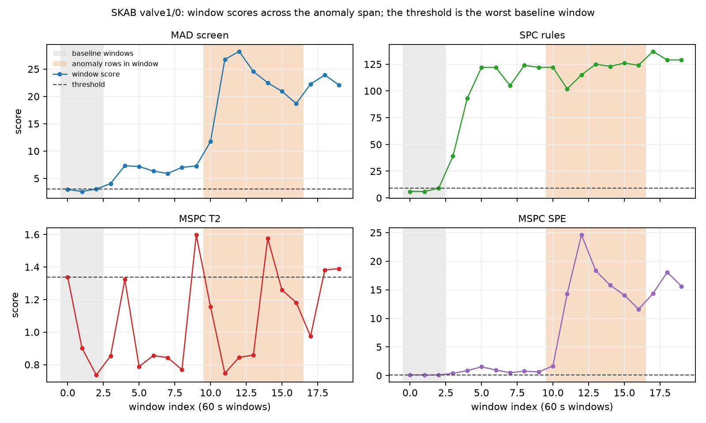

# The detectors and the clock control on SKAB

## Summary

The study scores 34 labelled SKAB records (manifest `c0d612939333`, 581 stream windows of 60 s, 255 of them holding an anomaly row) and the anomaly-free record (164 stream windows) with `screen`, `spc` and `mspc` through the package API, each record against its own first 3 windows, and publishes the clock control beside every number. The profile finds two sensors with a zero MAD over the whole record (`Pressure` in 35 of 35 records, `Volume Flow RateRMS` in 1 of 35 records) and 4 records with a gap over its 60 s threshold, the longest 247 s, before any detector runs. Pooled over the stream windows the best ranking is SPC rules at ROC-AUC 0.735 against 0.716 for the clock control, so window position alone accounts for most of the ranking. Under the worst-baseline threshold the lowest false-alarm rate before onset is 31.0% for MSPC T2 against a 25.0% floor, and after the anomaly span the MAD screen fires on 74.7% of the normal windows and comes back under its threshold within 2 windows on 18.5% of the records that fired. The conformal martingale alarm at delta 0.05 fires before onset on 72.7% of the labelled records; the permutation check gives 0.3%.

## Data

SKAB (`waico/SKAB` @ `b2c0d46c`, GPL-3.0), manifest sha256 `c0d612939333fdd8fbe77b7830af5b39f4a886c22c6d8a424f4a4e4ef98efa98`, fetched and converted as [docs/DATA.md](../../../docs/DATA.md) describes: 34 labelled experiments on a water-circulation testbed, each about 20 minutes with one anomaly run that ends before the record does, and one anomaly-free run. Eight sensors per record at a 1 s step, no quality column (`quality_assumed`), no units, timestamps localised as UTC. The study reads 35 records and 850 fixed 60 s windows from each record's first timestamp. A window is positive when any of its rows is an anomaly row (`label`); `label_majority` is also scored and reported beside it.

Groups by position, label-blind: 34 records are `labelled` (no anomaly row in the first 3 windows), 0 are `positive_baseline` (an anomaly row inside the baseline, reported without a claim) and 1 is `anomaly_free`, its own bed. Folds are the three upstream folders (valve1, valve2, other); nothing is fitted across records, so group holdout holds by construction and the per-folder AUCs are the only cross-record cut.

### What the profile found before any detector ran

`api.profile(path, flatline=True)` on every archive, then again on every 60 s window with the earlier windows as its reference history:

| tag | records | frozen whole record | MAD 0 whole record | distinct values, min / median | records with a gap | longest gap (s) | flatline windows fired / assessed |
|---|---|---|---|---|---|---|---|
| `Accelerometer1RMS` | 35 | 0 | 0 | 739 / 1094 | 4 | 247 | 19 / 786 |
| `Accelerometer2RMS` | 35 | 0 | 0 | 718 / 1118 | 4 | 247 | 23 / 786 |
| `Current` | 35 | 0 | 0 | 743 / 1137 | 4 | 247 | 17 / 786 |
| `Pressure` | 35 | 0 | 35 | 5 / 6 | 4 | 247 | 79 / 786 |
| `Temperature` | 35 | 0 | 0 | 738 / 1097 | 4 | 247 | 28 / 786 |
| `Thermocouple` | 35 | 0 | 0 | 421 / 692 | 4 | 247 | 71 / 786 |
| `Voltage` | 35 | 0 | 0 | 742 / 1122 | 4 | 247 | 18 / 786 |
| `Volume Flow RateRMS` | 35 | 0 | 1 | 33 / 54 | 4 | 247 | 122 / 786 |

Two tags carry a zero MAD over the whole record (`Pressure` in 35 of 35 records, `Volume Flow RateRMS` in 1 of 35 records). The score reads the MAD over the first 3 windows instead, and that scale is zero for `Pressure` in 30 records, `Volume Flow RateRMS` in 13 records (`tag_usability.csv`). A tag with a zero baseline scale gives no robust z, so it is left out of that record's score. The flatline check fires on 377 of 6,288 assessed windows over all tags. The profile reports a gap when a hole runs longer than 60 s, the larger of 2.5 times the median interval and 60 s. Shorter holes are common on this bed and [docs/DATA.md](../../../docs/DATA.md) lists them. The records with a reported gap:

| record | rows | gaps | longest gap (s) | coverage |
|---|---|---|---|---|
| `other__2` | 780 | 1 | 247 | 0.768 |
| `valve1__2` | 1,075 | 1 | 76 | 0.937 |
| `valve1__7` | 1,094 | 1 | 65 | 0.946 |
| `valve2__1` | 1,063 | 1 | 64 | 0.947 |

A window inside one of those gaps holds no rows and is a refusal for every tool. The unusable tags per record:

| tag | records where unusable | reason (records) |
|---|---|---|
| `Pressure` | 30 | 30 baseline MAD scale is zero |
| `Volume Flow RateRMS` | 13 | 13 baseline MAD scale is zero |

## Method

1. Windows: fixed 60 s windows from the first timestamp of each record. Archive reads are inclusive at both ends, so every API window string ends one second before the next window starts.
2. Own history: the first 3 windows of each record are its baseline, the rest its stream. The baseline string covers the first 3 minutes; the monitored string is the scored minute.
3. `screen(archive, baseline, window, k=3)` per usable tag and window; the tag score is the largest |value - centre| / scale over the window's valid rows, with centre and scale from the returned MAD baseline; the window score is the maximum over the usable tags. The baseline windows are scored from the same baseline read.
4. `spc(archive, baseline, window)` per usable tag and window; the window score is the rule-hit count summed over the usable tags. Baseline windows apply the same `apply_rules` with the returned limits to the baseline read.
5. `mspc(archives, baseline, window, rate_s=1)` over the usable tags; the T2 and SPE scores are the window means. Baseline windows are scored by `detect` on the fitted model's own training matrix. A record with fewer than two usable tags, or a baseline whose aligned grid coverage is under the package's 0.95, is a refusal with the error's message.
6. `clock_control` over the window index. A tag is unusable for a record when the profile says it holds one distinct value or its baseline MAD scale is zero.
7. Alarm rule: `worst_baseline_threshold` over the record's own baseline scores, `fires` strictly above it. FAR before onset is pooled over the stream windows before the first anomaly window; detect is any anomaly window firing; delay is the first firing anomaly window minus the first anomaly window; FAR after recovery is pooled over the normal windows after the last anomaly window; recovered means the score is back under the threshold within 2 windows after the span, among records that fired in the span and have a window after it. `far_floor(3)` = 0.250 sits beside every FAR.
8. Ranking: `ranking_metrics` pooled over the labelled stream windows, per folder and per record, with the one-class refusal.
9. Conformal bed: per record, median and MAD per usable tag on windows 1 to 2, calibration on window 3 (40 to 58 one-second scores, one per row of that window; nonconformity = largest robust z over the usable tags), stream from window 4; `conformal_p_values`, `mixture_martingale` (epsilons 0.1, 0.2, 0.3, 0.4, 0.5, 0.6, 0.7, 0.8, 0.9) and `martingale_alarm` at delta 0.05, 0.01. The permutation check shuffles calibration and stream together, 10 seeds.

```
uv run python examples/studies/skab/fetch_skab.py --dest data/skab
uv run python examples/studies/skab/build_archives.py
uv run python examples/studies/skab/run_skab.py
uv run python examples/studies/skab/make_report.py --update-benchmarks
```

The scoring run takes 311.7 s. Two runs write byte-identical CSVs.

## Results

### Ranking on the labelled records

| tool | stream windows scored / refused | ROC-AUC | PR-AUC | ROC-AUC, majority label | AUC valve1 | AUC valve2 | AUC other | per-record AUC median (records) |
|---|---|---|---|---|---|---|---|---|
| MAD screen | 577 / 4 | 0.677 | 0.640 | 0.670 | 0.561 | 0.549 | 0.843 | 0.831 (34) |
| SPC rules | 577 / 4 | 0.735 | 0.696 | 0.724 | 0.676 | 0.710 | 0.807 | 0.822 (34) |
| MSPC T2 | 402 / 179 | 0.480 | 0.439 | 0.484 | 0.480 | refused | 0.479 | 0.500 (26) |
| MSPC SPE | 402 / 179 | 0.734 | 0.738 | 0.740 | 0.684 | refused | 0.821 | 0.864 (26) |
| clock control | 581 / 0 | 0.716 | 0.550 | 0.687 | 0.705 | 0.725 | 0.725 | 0.700 (34) |

The clock control ranks at 0.716 pooled, which is what window position alone is worth on this bed. The anomaly run sits in the later part of most records, so position ranks above chance, and it ends before the record does, so position does not separate the classes. SPC rules ranks highest at 0.735, +0.019 over the clock. The MSPC tools refuse 179 stream windows, so their AUCs read over fewer windows than the univariate ones. No window of a valve2 record is scored by MSPC T2 or MSPC SPE, so those cells carry no AUC (`roc_auc_valve2_refusal` in `summary.csv`).

### The alarm rule on the labelled records

| tool | records with / without a threshold | FAR before onset | detected | median delay (windows) | FAR after recovery | recovered within 2 windows |
|---|---|---|---|---|---|---|
| MAD screen | 33 / 1 | 56.1% (+0.311 over the 25.0% floor, 230 windows) | 93.9% (31) | 0 | 74.7% (87 windows) | 18.5% (5 of 27) |
| SPC rules | 33 / 1 | 78.7% (+0.537 over the 25.0% floor, 230 windows) | 97.0% (32) | 0 | 82.8% (87 windows) | 3.6% (1 of 28) |
| MSPC T2 | 26 / 8 | 31.0% (+0.060 over the 25.0% floor, 174 windows) | 53.8% (14) | 0 | 23.9% (46 windows) | 71.4% (10 of 14) |
| MSPC SPE | 26 / 8 | 76.4% (+0.514 over the 25.0% floor, 174 windows) | 96.2% (25) | 0 | 84.8% (46 windows) | 9.1% (2 of 22) |
| clock control | 34 / 0 | 100.0% (+0.750 over the 25.0% floor, 233 windows) | 100.0% (34) | 0 | 100.0% (92 windows) | 0.0% (0 of 30) |

The clock control fires on every stream window (FAR 100.0%, recovered 0.0%), which is what a score that grows with position does under a threshold set on the first windows. MSPC T2 has the lowest FAR before onset, 31.0% (+0.060 over the floor). A record has no threshold when one of its baseline windows is refused: MAD screen and SPC rules on 1 (`other__2`); MSPC T2 and MSPC SPE on 8 (`other__12`, `other__13`, `other__2`, `valve1__14`, `valve2__0`, `valve2__1`, `valve2__2`, `valve2__3`). Those rows are in `per_record.csv`.

### The anomaly-free record

| tool | stream windows scored / refused | threshold | false-alarm rate over the stream |
|---|---|---|---|
| MAD screen | 164 / 0 | 3.476 | 99.4% (+0.744 over the 25.0% floor, 164 windows) |
| SPC rules | 164 / 0 | 11.000 | 98.8% (+0.738 over the 25.0% floor, 164 windows) |
| MSPC T2 | 0 / 164 | refused | refused |
| MSPC SPE | 0 / 164 | refused | refused |
| clock control | 164 / 0 | 2.000 | 100.0% (+0.750 over the 25.0% floor, 164 windows) |

### Level movement on the anomaly-free record

| tag | median, first 10 min | median, last 10 min | change | Spearman rho | flagged after a baseline at min 0-3 (164 min) | min 3-6 (161 min) | min 60-63 (104 min) |
|---|---|---|---|---|---|---|---|
| `Accelerometer1RMS` | 0.202 | 0.217 | +0.015 | 0.68 | 92.1% | 97.5% | 72.1% |
| `Accelerometer2RMS` | 0.277 | 0.271 | -0.005 | -0.66 | 97.6% | 100.0% | 59.6% |
| `Current` | 2.549 | 2.606 | +0.057 | -0.09 | 76.2% | 99.4% | 45.2% |
| `Pressure` | 0.055 | 0.055 | +0.000 | 0.13 | refused | refused | refused |
| `Temperature` | 90.954 | 88.862 | -2.091 | -0.91 | 89.6% | 91.3% | 14.4% |
| `Thermocouple` | 26.996 | 29.353 | +2.357 | 1.00 | 99.4% | 99.4% | 98.1% |
| `Voltage` | 228.685 | 229.285 | +0.600 | 0.12 | 9.8% | 98.1% | 69.2% |
| `Volume Flow RateRMS` | 122.000 | 126.323 | +4.323 | 0.80 | 98.2% | 98.1% | 55.8% |
| max over usable tags |  |  |  |  | 100.0% | 100.0% | 100.0% |

Each row is one tag on the anomaly-free record. The medians are of the per-minute medians over the first and last ten minutes. Spearman rho is the per-minute median against the minute index. A flagged share is the share of the minutes after the baseline whose largest |value - centre| / scale is above 3, with centre and scale from a three-minute MAD baseline at that position. `Thermocouple` rises from 27.0 to 29.4 over 167 minutes (rho 1.00) and `Temperature` falls from 91.0 to 88.9 (rho -0.91). The last row takes the maximum over the usable tags, the quantity `screen` scores, and flags 100.0%, 100.0% and 100.0% of the later minutes for the three baseline positions. `Pressure` has a zero MAD in every baseline, so its shares are refusals (`refusal` in `drift.csv`).

### Which tag sets the window score

| tag | MAD screen: largest robust z | SPC rules: largest rule-hit count |
|---|---|---|
| `Thermocouple` | 38.0% (321) | 31.2% (264) |
| `Volume Flow RateRMS` | 24.1% (204) | 11.0% (93) |
| `Temperature` | 17.3% (146) | 29.7% (251) |
| `Accelerometer1RMS` | 6.0% (51) | 18.3% (155) |
| `Current` | 5.9% (50) | 4.5% (38) |
| `Accelerometer2RMS` | 4.6% (39) | 4.4% (37) |
| `Voltage` | 4.0% (34) | 0.8% (7) |

Share of the 845 scored windows on which the tag holds the per-tag maximum, over all records. `screen` takes the maximum over the usable tags, so that tag sets the window score. `spc` sums the rule hits, so that tag contributes the most of them.

### Where the anomaly span sits in the stream

| per labelled record | mean | median | min | max |
|---|---|---|---|---|
| stream windows | 17.1 | 17.0 | 11 | 21 |
| pre-onset windows | 6.9 | 7.0 | 2 | 11 |
| in-span windows | 7.5 | 8.0 | 5 | 11 |
| post-span windows | 2.7 | 3.0 | 0 | 5 |

Over the 34 labelled records, 4 have no window after the anomaly span and 1 (`valve2/1`) holds more than one span.

### Score by phase

| tool | pre-onset median (windows) | in-span median (windows) | post-span median (windows) | post-span / in-span |
|---|---|---|---|---|
| MAD screen | 6.37 (230) | 19.20 (255) | 12.81 (92) | 0.667 |
| SPC rules | 45.50 (230) | 116.00 (255) | 93.50 (92) | 0.806 |
| MSPC T2 | 1.00 (174) | 0.99 (182) | 0.98 (46) | 0.997 |
| MSPC SPE | 0.84 (174) | 2.93 (182) | 0.89 (46) | 0.304 |
| clock control | 6.00 (233) | 13.00 (256) | 18.00 (92) | 1.385 |

Median window score over the labelled records' scored stream windows before the first anomaly window, inside the span and after the last anomaly window. A score is only comparable with itself, so read along a row, never down a column.

### Refusals

| tool | stream windows refused | cause (windows) |
|---|---|---|
| MAD screen | 4 | 4 no rows in window |
| SPC rules | 4 | 4 no rows in window |
| MSPC T2 | 343 | 343 MspcAlignmentError |
| MSPC SPE | 343 | 343 MspcAlignmentError |
| clock control | 0 |  |

### Conformal martingale bed

| group | delta | records scored / refused | no alarm | false alarm | alarm inside the span | alarm after recovery | median delay (s) | permutation check |
|---|---|---|---|---|---|---|---|---|
| anomaly_free | 0.05 | 1 / 0 | 0 | 1 (100.0%) | 0 (0.0%) | 0 (0.0%) |  | 0.0% |
| anomaly_free | 0.01 | 1 / 0 | 0 | 1 (100.0%) | 0 (0.0%) | 0 (0.0%) |  | 0.0% |
| labelled | 0.05 | 33 / 1 | 0 | 24 (72.7%) | 9 (27.3%) | 0 (0.0%) | 29 | 0.3% |
| labelled | 0.01 | 33 / 1 | 0 | 24 (72.7%) | 9 (27.3%) | 0 (0.0%) | 34 | 0.0% |

At delta 0.05 the alarm fires before onset on 72.7% of the labelled records and inside the span on 27.3%; the permutation check, which makes the scores exchangeable, gives 0.3%. On the anomaly-free record the alarm is raised.



Figure 1: `valve1/0`, one window score per tool with its own threshold; the baseline windows are grey and the windows holding anomaly rows are orange.

## Discussion

The clock control scores ROC-AUC 0.716 and fires on 100.0% of the pre-onset windows. On 3W the same control outscored every detector because the fault, once present, stayed to the end of the instance. On SKAB the records return to normal, so position stops at 0.716 and a detector has to beat that number to have read anything from the sensors. The gap is +0.019 for SPC rules. The anomaly span starts after a mean 6.9 pre-onset windows, covers 7.5 and leaves 2.7 post-span windows of a mean 17.1-window stream (`stream_layout.csv`), so the post-span stretch is short and position still orders most anomaly windows above the normal ones.

The MAD screen fires on 56.1% of the pre-onset windows, 74.7% of the post-recovery windows and 99.4% of the anomaly-free stream. Two tags change level over the anomaly-free record. The `Thermocouple` minute median rises from 27.0 to 29.4 over 167 minutes, Spearman 1.00 against the minute index, and `Temperature` falls from 91.0 to 88.9 (-0.91). A three-minute MAD baseline at minutes 0-3, 3-6 or 60-63 leaves 100.0%, 100.0% and 100.0% of the later minutes above 3 MAD on the maximum over the usable tags (`drift.csv`). A baseline an hour into the record gives the same share as one at the start, so the false-alarm rates on the anomaly-free record and before onset measure that level movement wherever the baseline sits. The tag holding the screen's window maximum is `Thermocouple` on 38.0%, `Volume Flow RateRMS` on 24.1% and `Temperature` on 17.3% of the 845 scored windows (`window_max_tag.csv`). MSPC T2 fires on 31.0% before onset and detects 53.8% of the records, with 23.9% after recovery.

The profile found the two low-information sensors (`Pressure` in 35 of 35 records, `Volume Flow RateRMS` in 1 of 35 records) and the 4 gapped records before any detector ran. The refusal rows carry them through the tables. A zero baseline scale leaves `Pressure` in 30 records, `Volume Flow RateRMS` in 13 records out of a score, and a window inside a gap is refused by name.

## Limits

- SKAB is a testbed with 34 short records; a 60 s window and a three-window baseline leave 7 to 9 pre-onset windows per record, so every FAR is read against a 25.0% floor.
- The baseline is the first three minutes of each record by position and its centre and scale are static. `Thermocouple` moves +2.36 and `Temperature` -2.09 over the anomaly-free record, and the maximum over the usable tags stays above 3 MAD on 100.0% of the later minutes for a baseline placed at minutes 60-63, so the level movement sets the `screen` and `spc` false-alarm rates.
- The label end may precede the physical recovery of the loop, so a recovered rate read against the labels understates recovery to the pre-fault state. The post-span median score over the in-span median is 0.667 for MAD screen, 0.806 for SPC rules, 0.997 for MSPC T2, 0.304 for MSPC SPE and 1.385 for clock control (`score_by_phase.csv`).
- `mspc` refuses a baseline whose aligned coverage is under 0.95, so the gapped records and the anomaly-free record carry no MSPC number.
- The anomaly label is per row and the window label is any anomaly row; the majority label is reported beside it and moves the AUC little.
- Timestamps are naive and localised as UTC; nothing here depends on the offset.

## Files

| file | holds |
|---|---|
| `results/profile_per_tag.csv` | one row per archive from `api.profile` |
| `results/profile_summary.csv` | the profile per tag over the records |
| `results/windows.csv` | the fixed windows with their labels and group |
| `results/scores.csv` | one row per (tool, window), score or refusal |
| `results/tag_scores.csv` | the per-tag `screen` and `spc` scores |
| `results/tag_usability.csv` | why a tag is left out of a record's score |
| `results/per_record.csv` | the alarm rule per (tool, record) |
| `results/summary.csv` | the pooled numbers per tool and group |
| `results/conformal.csv` | the conformal bed per record and delta |
| `results/conformal_summary.csv` | the conformal bed per group and delta |
| `results/permutation.csv` | the permutation check per record, delta, seed |
| `results/drift.csv` | level movement per tag on the anomaly-free record |
| `results/window_max_tag.csv` | the tag holding the per-tag maximum per window |
| `results/stream_layout.csv` | pre, span and post window counts per record |
| `results/score_by_phase.csv` | median score per tool and phase |
| `results/run.json` | provenance, parameters, counts, wall seconds |
| `results/benchmarks_section.md` | the BENCHMARKS.md REAL section |
| `out/01_score_trace.png` | Figure 1 |
