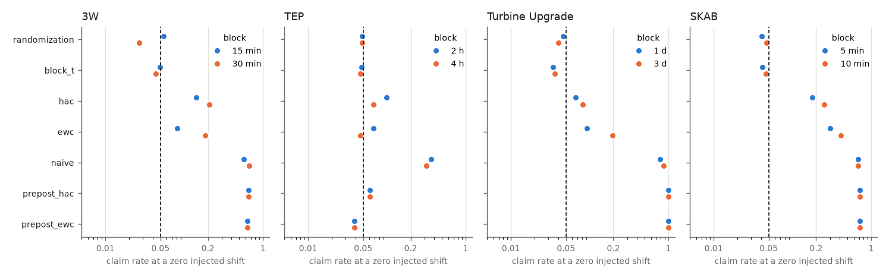
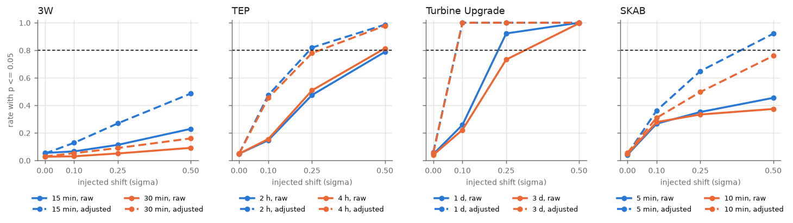

# Switchback schedules on real records

## Summary

The study adds a known shift to randomly assigned blocks of records where nothing was changed: 538 3W instances, 100 TEP fault-free testing runs, the two Turbine Upgrade pairs before their upgrades and the SKAB anomaly-free record. Under the first registration the `randomization` arm misses W1 in 1 of 78 cells, W2 in 3 of 72 and W3 in 4 of 72, and the command is parked; that registration demanded every cell within 2 MCSE with no multiplicity control and read the median bias where randomization makes the mean unbiased. On fresh assignments (seed offset 100000) the pooled claim rate at a zero injected shift is 3.9% to 5.3% per bed and adjustment, where the first-half against second-half split of the same 3W records claims a shift on 65.2% of tags. Detection of a 0.25 sigma shift reaches 0.8 only on the turbine pairs with 1-day blocks (0.922 on the fresh draws). Under the corrected criteria, registered before the fresh draws, W1', W2' and W3' pass and W4 passes on Turbine Upgrade, so the numbers support a switchback plan-and-analyze command.

## Data

| bed | dataset manifest sha256 | records | usable targets | block (K) | draws per record |
|---|---|---|---|---|---|
| 3W | `14bc1397d3ee` | 538 | 1833 of 3228 | 15 min: K 16; 30 min: K 8; 1 h: K 4 (refused) | 4 |
| TEP | `f57ab3ee3443` | 100 | 5200 of 5200 | 2 h: K 24; 4 h: K 12 | 10 |
| Turbine Upgrade | `31b2b0c7e33a` | 2 | 2 of 2 | 1 d: K 212/414; 3 d: K 70/138 | 250 |
| SKAB | `c0d612939333` | 1 | 7 of 8 | 5 min: K 32; 10 min: K 16 | 500 |

- 3W v2.0.0 through `run_shift.placebo_3w` on the window cache (manifest `bfff4f2e897b`): the 538 instances with no fault window and 4 consecutive one-hour windows, 240 minute medians of the first such run, 16 wells. Every tag with 30 finite samples and MAD > 0 is the target in turn.
- TEP fault-free testing runs 251 to 350, 960 samples at 180 s, from `build_tep_cache.py` (cache sha256 `49ffa27703fe`). Every variable is the target in turn.
- Turbine Upgrade, the rows of each pair before its upgrade (40114 VG pair rows and 21486 pitch pair rows), target `y_test`. Calendar blocks start at each pair's first timestamp, so the holes of up to 57 days leave some blocks empty.
- SKAB, the anomaly-free record, 1 s rows as recorded, calendar blocks. Every tag with MAD > 0 is the target in turn.

## Method

### Schedule and injected shift

- Schedule: K = floor(T / L) blocks of L steps from the first sample (the last block is dropped when K is odd), exactly K/2 of them assigned to B by balanced complete randomization. The seed comes from (bed, record, L, draw), so every tag of a record shares a draw's schedule.
- Refusal `design_too_small`: fewer than 20 balanced assignments, or a smallest attainable two-sided p above 0.05. A refused design gives a row with its reason for every arm.
- Injected response: u = delta sigma in B blocks and 0 in A blocks, sigma = 1.4826 MAD of the target over the whole record, through a first-order lag with time constant tau. The setting of a sample applies from the previous sample to it; over a hole of dt steps the response moves 1 - exp(-dt / tau) of the way.
- Washout: the samples in the first w steps of every block are dropped. The grid is w = 0 and the registered w = ceil(3 tau).
- Truth: the mean of the response over kept B samples minus its mean over kept A samples. Bias is also read against the steady state delta sigma.
- Grid: delta 0, 0.1, 0.25 and 0.5 sigma; tau 0, L/10 and L/4 steps (the steps are min on 3W, samples on TEP, steps of 10 min on the turbine pairs and s on SKAB); raw and adjusted.

### Inference arms

All arms read the kept samples and report 95% two-sided intervals.

- `randomization`: the coefficient of z in OLS of y on [1, z] (B mean minus A mean) or on [1, z, X], and its randomization p-value over the balanced assignments. Designs with at most 1000 assignments are enumerated; larger ones draw 1000 fresh assignments and use (1 + #{|T_j| >= |T|}) / 1001. The adjusted statistic refits for every assignment through Frisch-Waugh in block space. The interval inverts the test under a constant additive shift and is the hull of the accepted shifts; an adjusted interval is unbounded when enough assignments lie closer to the covariates than the observed one.
- `block_t`: Welch t on the kept block means, with the Welch-Satterthwaite degrees of freedom.
- `hac`, `ewc`: the same OLS coefficient with the long-run variance of its score from the shift interval study's estimators: Newey-West with the Andrews bandwidth and a normal critical value, and equal-weighted cosine with nu = 0.4 n^(2/3) and t on nu degrees of freedom.
- `naive`: the OLS standard error for independent samples.
- `prepost_hac`, `prepost_ewc`: the first half of the schedule span as A and the second half as B, analysed by `shift.level_interval` with the shift interval study's hard refusals and its before-period adjustment.
- Adjustment: the covariates are every other usable tag of the record (3W, SKAB, TEP) or V, VcosD, VsinD, rho, S, I and y_ctrl (turbine), declared before any interval is computed. The adjusted arm is refused (`too_many_covariates`) when the covariates outnumber one per 10 kept samples.
- Exact size: for every enumerated design, each balanced assignment is taken as the observed one in turn and the share the test rejects is counted per (record, target), at delta 0, tau 0 and washout 0. It reads no draw.

Commands:

```
uv run python examples/studies/switchback/build_tep_cache.py
uv run python examples/studies/switchback/run_switchback.py
uv run python examples/studies/switchback/run_switchback.py --draw-offset 100000 \
    --out examples/studies/switchback/results/confirm --rows data/switchback_rows/confirm
uv run python examples/studies/switchback/make_report.py --update-benchmarks
```

`run_switchback.py` runs the beds on `--workers` processes (default 8); the results do not depend on the worker count.

### First registration

These criteria were fixed before the first run. Rates pool over the units of the table headers below; the Monte Carlo SE (MCSE) of a rate is clustered by (record, draw), the unit the assignment is drawn for. Every comparison reads the four-decimal values of `results/summary.csv`.

- W1 validity: the `randomization` claim rate at delta 0 is at most 0.05 + 2 MCSE on every bed, every block length that is not refused, every tau and washout, raw and adjusted. Another arm holds only if it meets the same bar everywhere.
- W2 coverage: the `randomization` interval covers the exact truth at 0.95 - 2 MCSE or more for every delta > 0 with w = ceil(3 tau), on every bed and block length (raw arm).
- W3 washout: with w = ceil(3 tau), |median bias against delta sigma| <= 0.10 delta sigma (raw arm, every delta > 0 and tau).
- W4 practical power: on each bed, the `randomization` detection rate at delta 0.25 (raw, tau 0, washout 0) reaches 0.8 for at least one block length that is not refused.
- W5 adjustment: on the turbine bed, the median width ratio adjusted over raw of the `randomization` interval (tau 0, washout 0, delta 0) is at most 0.8 at every block length, and W1 holds for the adjusted arm.
- Verdict: if W1, W2 and W3 pass and W4 passes on at least one bed, the numbers support a switchback plan-and-analyze command. Otherwise the command is parked with the measured reason.

### Corrected criteria

These criteria were registered after the first run and before the confirmatory run, and apply to the confirmatory run only. That run draws every observed and reference assignment from a new seed (`--draw-offset 100000`) on the same records, targets, draw counts and grid. A pooled MCSE is clustered by (record, L, draw). At delta 0 the cells of one washout are one computation whatever tau, so the claim pool reads each (L, washout) once.

- W1': per bed, raw and adjusted separately, the `randomization` claim rate at delta 0 pooled over the open (L, washout) cells is at most 0.05 + 2 MCSE, no cell exceeds 0.05 + 3.5 MCSE of the cell, and the largest exact rejection share over all 3W (record, target) is at most 0.05.
- W2': per bed, the coverage pooled over the delta > 0 cells at w = ceil(3 tau) is at least 0.95 - 2 MCSE, and no cell is below 0.95 - 3.5 MCSE of the cell (raw arm).
- W3': per bed, L, tau and delta > 0 at w = ceil(3 tau), |mean(estimate - delta sigma)| <= 0.10 delta sigma + 2 MCSE, clustered by (record, draw) (raw arm).
- W4 and W5: unchanged, read on the confirmatory run.
- Verdict: if W1', W2' and W3' pass and W4 passes on at least one bed, the numbers support a switchback plan-and-analyze command, which needs a SCOPE amendment for statements under a randomized schedule. Otherwise the command stays parked.

## Results on the first draws

### Claims at a zero injected shift

Claim rate at delta 0 with its MCSE, tau 0 and washout 0. Units are (instance, tag, draw) on 3W, (run, variable, draw) on TEP, (pair, draw) on the turbine pairs and (tag, draw) on SKAB; the `prepost` arms have one unit per (record, target).

Raw:

| bed | L | `randomization` | `block_t` | `hac` | `ewc` | `naive` | `prepost_hac` | `prepost_ewc` |
|---|---|---|---|---|---|---|---|---|
| 3W | 15 min | 0.049 (0.003) | 0.044 (0.003) | 0.132 (0.005) | 0.071 (0.004) | 0.553 (0.007) | 0.652 (0.012) | 0.635 (0.013) |
| 3W | 30 min | 0.028 (0.002) | 0.038 (0.003) | 0.205 (0.006) | 0.179 (0.006) | 0.656 (0.006) | 0.652 (0.012) | 0.635 (0.013) |
| 3W | 1 h | design_too_small | design_too_small | design_too_small | design_too_small | design_too_small | design_too_small | design_too_small |
| TEP | 2 h | 0.050 (0.002) | 0.049 (0.002) | 0.100 (0.003) | 0.070 (0.003) | 0.366 (0.004) | 0.061 (0.006) | 0.039 (0.005) |
| TEP | 4 h | 0.052 (0.002) | 0.048 (0.002) | 0.069 (0.002) | 0.046 (0.002) | 0.318 (0.004) | 0.061 (0.006) | 0.039 (0.005) |
| Turbine Upgrade | 1 d | 0.052 (0.010) | 0.046 (0.009) | 0.064 (0.011) | 0.112 (0.014) | 0.810 (0.018) | 1.000 (0.000) | 1.000 (0.000) |
| Turbine Upgrade | 3 d | 0.038 (0.009) | 0.050 (0.010) | 0.078 (0.012) | 0.188 (0.018) | 0.848 (0.016) | 1.000 (0.000) | 1.000 (0.000) |
| SKAB | 5 min | 0.047 (0.006) | 0.045 (0.005) | 0.173 (0.010) | 0.308 (0.013) | 0.671 (0.006) | 0.714 | 0.714 |
| SKAB | 10 min | 0.041 (0.005) | 0.038 (0.005) | 0.251 (0.011) | 0.405 (0.012) | 0.697 (0.005) | 0.714 | 0.714 |

Adjusted:

| bed | L | `randomization` | `block_t` | `hac` | `ewc` | `naive` | `prepost_hac` | `prepost_ewc` |
|---|---|---|---|---|---|---|---|---|
| 3W | 15 min | 0.048 (0.003) | 0.083 (0.004) | 0.160 (0.005) | 0.104 (0.004) | 0.510 (0.007) | 0.737 (0.029) | 0.704 (0.030) |
| 3W | 30 min | 0.030 (0.003) | 0.123 (0.005) | 0.273 (0.006) | 0.220 (0.006) | 0.612 (0.006) | 0.737 (0.029) | 0.704 (0.030) |
| 3W | 1 h | design_too_small | design_too_small | design_too_small | design_too_small | design_too_small | design_too_small | design_too_small |
| TEP | 2 h | 0.050 (0.002) | 0.115 (0.002) | 0.113 (0.002) | 0.093 (0.002) | 0.195 (0.002) | too_many_covariates | too_many_covariates |
| TEP | 4 h | 0.050 (0.002) | 0.106 (0.002) | 0.119 (0.002) | 0.099 (0.002) | 0.202 (0.002) | too_many_covariates | too_many_covariates |
| Turbine Upgrade | 1 d | 0.052 (0.010) | 0.058 (0.011) | 0.100 (0.013) | 0.100 (0.013) | 0.712 (0.020) | 1.000 | 1.000 |
| Turbine Upgrade | 3 d | 0.046 (0.009) | 0.048 (0.010) | 0.102 (0.013) | 0.096 (0.013) | 0.726 (0.020) | 1.000 | 1.000 |
| SKAB | 5 min | 0.047 (0.004) | 0.063 (0.005) | 0.267 (0.008) | 0.270 (0.008) | 0.642 (0.006) | 1.000 | 1.000 |
| SKAB | 10 min | 0.048 (0.004) | 0.089 (0.006) | 0.389 (0.008) | 0.398 (0.008) | 0.672 (0.006) | 1.000 | 1.000 |

On the same 3W records the `prepost_hac` arm claims a shift on 65.2% of 1770 answered tags, the placebo failure of the shift interval study. On the TEP runs it claims 6.1%. Both turbine pairs get a claim from both `prepost` arms at every block length. The `prepost` arms read no draw, so the confirmatory run repeats these numbers.

Worst cell over every tau and washout of the open block lengths:

| arm | adjustment | worst cell | claim rate | bar 0.05 + 2 MCSE | cells over |
|---|---|---|---|---|---|
| `randomization` | raw | TEP, 2 h, tau 10, washout 30 | 0.0544 | 0.0540 | 1 of 40 |
| `randomization` | adjusted | TEP, 2 h, tau 4, washout 12 | 0.0498 | 0.0530 | 0 of 38 |
| `block_t` | raw | TEP, 2 h, tau 10, washout 30 | 0.0539 | 0.0540 | 0 of 40 |
| `block_t` | adjusted | 3W, 30 min, tau 7.5, washout 23 | 0.1765 | 0.0626 | 28 of 38 |
| `hac` | raw | SKAB, 10 min, tau 0, washout 0 | 0.2506 | 0.0724 | 36 of 40 |
| `hac` | adjusted | SKAB, 10 min, tau 0, washout 0 | 0.3889 | 0.0662 | 38 of 38 |
| `ewc` | raw | SKAB, 10 min, tau 0, washout 0 | 0.4049 | 0.0744 | 34 of 40 |
| `ewc` | adjusted | SKAB, 10 min, tau 0, washout 0 | 0.3980 | 0.0664 | 38 of 38 |
| `naive` | raw | Turbine Upgrade, 3 d, tau 43.2, washout 130 | 0.8520 | 0.0818 | 40 of 40 |
| `naive` | adjusted | Turbine Upgrade, 3 d, tau 0, washout 0 | 0.7260 | 0.0900 | 38 of 38 |

The `randomization` arm holds in 77 of 78 cells. Of the other arms, only `block_t` raw holds.

### Coverage of the exact truth

| bed | L | adjustment | lowest at delta 0.25 | lowest at delta 0.5 | lowest against its bar | cells under |
|---|---|---|---|---|---|---|
| 3W | 15 min | raw | 0.948 | 0.949 | 0.9482 against 0.9436 (tau 3.75, delta 0.25) | 0 of 9 |
| 3W | 15 min | adjusted | 0.948 | 0.948 | 0.9475 against 0.9428 (tau 3.75, delta 0.25) | 0 of 9 |
| 3W | 30 min | raw | 0.972 | 0.972 | 0.9719 against 0.9452 (tau 0, delta 0.25) | 0 of 9 |
| 3W | 30 min | adjusted | 0.971 | 0.971 | 0.9701 against 0.9446 (tau 3, delta 0.1) | 0 of 9 |
| TEP | 2 h | raw | 0.946 | 0.946 | 0.9456 against 0.9460 (tau 10, delta 0.5) | 3 of 9 |
| TEP | 2 h | adjusted | 0.950 | 0.950 | 0.9503 against 0.9470 (tau 0, delta 0.1) | 0 of 6 |
| TEP | 4 h | raw | 0.948 | 0.948 | 0.9475 against 0.9462 (tau 8, delta 0.1) | 0 of 9 |
| TEP | 4 h | adjusted | 0.950 | 0.950 | 0.9500 against 0.9468 (tau 0, delta 0.1) | 0 of 6 |
| Turbine Upgrade | 1 d | raw | 0.948 | 0.948 | 0.9480 against 0.9302 (tau 0, delta 0.1) | 0 of 9 |
| Turbine Upgrade | 1 d | adjusted | 0.940 | 0.940 | 0.9400 against 0.9288 (tau 14.4, delta 0.1) | 0 of 9 |
| Turbine Upgrade | 3 d | raw | 0.946 | 0.946 | 0.9460 against 0.9298 (tau 43.2, delta 0.1) | 0 of 9 |
| Turbine Upgrade | 3 d | adjusted | 0.944 | 0.946 | 0.9440 against 0.9294 (tau 43.2, delta 0.1) | 0 of 9 |
| SKAB | 5 min | raw | 0.949 | 0.948 | 0.9483 against 0.9392 (tau 75, delta 0.5) | 0 of 9 |
| SKAB | 5 min | adjusted | 0.947 | 0.947 | 0.9471 against 0.9408 (tau 30, delta 0.1) | 0 of 9 |
| SKAB | 10 min | raw | 0.957 | 0.957 | 0.9566 against 0.9398 (tau 150, delta 0.25) | 0 of 9 |
| SKAB | 10 min | adjusted | 0.951 | 0.951 | 0.9511 against 0.9408 (tau 60, delta 0.1) | 0 of 9 |

### Bias and washout

Median bias of the `randomization` estimate against delta sigma, in sigma, raw arm, at tau = L/4. The last two columns are descriptive: the median of the estimate at delta 0 under the same washout, and the bias net of it.

| bed | L | tau | w = ceil(3 tau) | delta | bias at w 0 | bias at w = ceil(3 tau) | bar | delta 0 median | net of it |
|---|---|---|---|---|---|---|---|---|---|
| 3W | 15 min | 3.75 | 12 | 0.25 | -0.0698 | -0.0264 | 0.0250 | -0.0195 | -0.0069 |
| 3W | 15 min | 3.75 | 12 | 0.5 | -0.1281 | -0.0332 | 0.0500 | -0.0195 | -0.0137 |
| 3W | 30 min | 7.5 | 23 | 0.25 | -0.0648 | -0.0065 | 0.0250 | 0.0004 | -0.0069 |
| 3W | 30 min | 7.5 | 23 | 0.5 | -0.1337 | -0.0143 | 0.0500 | 0.0004 | -0.0147 |
| TEP | 2 h | 10 | 30 | 0.25 | -0.0586 | -0.0061 | 0.0250 | 0.0014 | -0.0075 |
| TEP | 2 h | 10 | 30 | 0.5 | -0.1190 | -0.0135 | 0.0500 | 0.0014 | -0.0149 |
| TEP | 4 h | 20 | 60 | 0.25 | -0.0642 | -0.0051 | 0.0250 | 0.0030 | -0.0081 |
| TEP | 4 h | 20 | 60 | 0.5 | -0.1285 | -0.0133 | 0.0500 | 0.0030 | -0.0163 |
| Turbine Upgrade | 1 d | 36 | 108 | 0.25 | -0.0589 | -0.0019 | 0.0250 | 0.0052 | -0.0071 |
| Turbine Upgrade | 1 d | 36 | 108 | 0.5 | -0.1197 | -0.0090 | 0.0500 | 0.0052 | -0.0142 |
| Turbine Upgrade | 3 d | 108 | 324 | 0.25 | -0.0618 | -0.0055 | 0.0250 | 0.0028 | -0.0083 |
| Turbine Upgrade | 3 d | 108 | 324 | 0.5 | -0.1204 | -0.0131 | 0.0500 | 0.0028 | -0.0159 |
| SKAB | 5 min | 75 | 225 | 0.25 | -0.0619 | -0.0062 | 0.0250 | 0.0020 | -0.0082 |
| SKAB | 5 min | 75 | 225 | 0.5 | -0.1255 | -0.0141 | 0.0500 | 0.0020 | -0.0161 |
| SKAB | 10 min | 150 | 450 | 0.25 | -0.0647 | -0.0074 | 0.0250 | 0.0014 | -0.0088 |
| SKAB | 10 min | 150 | 450 | 0.5 | -0.1318 | -0.0161 | 0.0500 | 0.0014 | -0.0175 |

68 of 72 cells meet the W3 bar. The cells over it:

| bed | L | tau | w = ceil(3 tau) | delta | bias at w 0 | bias at w = ceil(3 tau) | bar | delta 0 median | net of it |
|---|---|---|---|---|---|---|---|---|---|
| 3W | 15 min | 0 | 0 | 0.1 | -0.0108 | -0.0108 | 0.0100 | -0.0108 | 0.0000 |
| 3W | 15 min | 1.5 | 5 | 0.1 | -0.0177 | -0.0142 | 0.0100 | -0.0137 | -0.0005 |
| 3W | 15 min | 3.75 | 12 | 0.1 | -0.0342 | -0.0223 | 0.0100 | -0.0195 | -0.0028 |
| 3W | 15 min | 3.75 | 12 | 0.25 | -0.0698 | -0.0264 | 0.0250 | -0.0195 | -0.0069 |

### Detection

`randomization` detection rate by injected shift, tau 0 and washout 0, and the smallest shift on the grid with a rate of 0.8:

| bed | L | adjustment | delta 0.1 | delta 0.25 | delta 0.5 | smallest delta at 0.8 |
|---|---|---|---|---|---|---|
| 3W | 15 min | raw | 0.056 | 0.105 | 0.224 | none |
| 3W | 15 min | adjusted | 0.128 | 0.264 | 0.480 | none |
| 3W | 30 min | raw | 0.034 | 0.053 | 0.094 | none |
| 3W | 30 min | adjusted | 0.057 | 0.095 | 0.165 | none |
| TEP | 2 h | raw | 0.150 | 0.477 | 0.788 | none |
| TEP | 2 h | adjusted | 0.474 | 0.820 | 0.985 | 0.25 |
| TEP | 4 h | raw | 0.160 | 0.513 | 0.816 | 0.5 |
| TEP | 4 h | adjusted | 0.455 | 0.780 | 0.978 | 0.5 |
| Turbine Upgrade | 1 d | raw | 0.308 | 0.920 | 1.000 | 0.25 |
| Turbine Upgrade | 1 d | adjusted | 1.000 | 1.000 | 1.000 | 0.1 |
| Turbine Upgrade | 3 d | raw | 0.178 | 0.742 | 1.000 | 0.5 |
| Turbine Upgrade | 3 d | adjusted | 1.000 | 1.000 | 1.000 | 0.1 |
| SKAB | 5 min | raw | 0.266 | 0.347 | 0.463 | none |
| SKAB | 5 min | adjusted | 0.346 | 0.663 | 0.914 | 0.5 |
| SKAB | 10 min | raw | 0.270 | 0.324 | 0.363 | none |
| SKAB | 10 min | adjusted | 0.296 | 0.499 | 0.755 | none |

### Adjustment on the turbine pairs

| L | median width ratio adjusted/raw | adjusted claim rate at delta 0 (MCSE) |
|---|---|---|
| 1 d | 0.167 | 0.052 (0.010) |
| 3 d | 0.137 | 0.046 (0.009) |

Per pair, raw, tau 0, washout 0:

| pair | L | claim rate at delta 0 | detection at delta 0.25 | median width (sigma) | `prepost_hac` at delta 0 |
|---|---|---|---|---|---|
| pitch pair | 1 d | 0.064 | 0.864 | 0.325 | claims |
| pitch pair | 3 d | 0.036 | 0.612 | 0.435 | claims |
| VG pair | 1 d | 0.040 | 0.976 | 0.249 | claims |
| VG pair | 3 d | 0.040 | 0.872 | 0.317 | claims |

### Refused designs and units

| bed | L | K | assignments | smallest p | refusal |
|---|---|---|---|---|---|
| 3W | 15 min | 16 | 12870 | 0.0010 | none |
| 3W | 30 min | 8 | 70 | 0.0286 | none |
| 3W | 1 h | 4 | 6 | 0.3333 | design_too_small |
| TEP | 2 h | 24 | 2.704e+06 | 0.0010 | none |
| TEP | 4 h | 12 | 924 | 0.0022 | none |
| Turbine Upgrade | 1 d | 212 | 3.603e+62 | 0.0010 | none |
| Turbine Upgrade | 1 d | 414 | 1.658e+123 | 0.0010 | none |
| Turbine Upgrade | 3 d | 70 | 1.122e+20 | 0.0010 | none |
| Turbine Upgrade | 3 d | 138 | 2.362e+40 | 0.0010 | none |
| SKAB | 5 min | 32 | 6.011e+08 | 0.0010 | none |
| SKAB | 10 min | 16 | 12870 | 0.0010 | none |

Refused `randomization` units, delta 0 (a unit is a record, target and draw):

| bed | L | adjustment | reason | washouts | units |
|---|---|---|---|---|---|
| 3W | 15 min | raw | `no_spread` | 0, 5, 12 | 2420 to 2452 of 12912 |
| 3W | 15 min | raw | `too_few` | 0, 5, 12 | 3160 of 12912 |
| 3W | 15 min | adjusted | `no_covariate` | 0, 5, 12 | 232 of 12912 |
| 3W | 15 min | adjusted | `no_spread` | 0, 5, 12 | 2420 to 2452 of 12912 |
| 3W | 15 min | adjusted | `too_few` | 0, 5, 12 | 3160 of 12912 |
| 3W | 15 min | adjusted | `too_many_covariates` | 12 | 192 of 12912 |
| 3W | 30 min | raw | `no_spread` | 0, 9, 23 | 2420 to 2492 of 12912 |
| 3W | 30 min | raw | `too_few` | 0, 9, 23 | 3160 of 12912 |
| 3W | 30 min | adjusted | `no_covariate` | 0, 9, 23 | 232 of 12912 |
| 3W | 30 min | adjusted | `no_spread` | 0, 9, 23 | 2420 to 2484 of 12912 |
| 3W | 30 min | adjusted | `too_few` | 0, 9, 23 | 3160 of 12912 |
| 3W | 1 h | raw | `design_too_small` | 0, 18, 45 | 12912 of 12912 |
| 3W | 1 h | adjusted | `design_too_small` | 0, 18, 45 | 12912 of 12912 |
| TEP | 2 h | adjusted | `too_many_covariates` | 30 | 52000 of 52000 |
| TEP | 4 h | adjusted | `too_many_covariates` | 60 | 52000 of 52000 |
| SKAB | 5 min | raw | `no_spread` | 0, 90, 225 | 500 of 4000 |
| SKAB | 5 min | adjusted | `no_spread` | 0, 90, 225 | 500 of 4000 |
| SKAB | 10 min | raw | `no_spread` | 0, 180, 450 | 500 of 4000 |
| SKAB | 10 min | adjusted | `no_spread` | 0, 180, 450 | 500 of 4000 |

### 3W per well

Claim rate at delta 0, raw, tau 0, washout 0. The `prepost_hac` column counts answered tags:

| well | units | `randomization` 15 min | `randomization` 30 min | `prepost_hac` |
|---|---|---|---|---|
| WELL-00001 | 1672 | 0.052 | 0.025 | 0.509 of 399 |
| WELL-00002 | 2356 | 0.051 | 0.024 | 0.753 of 580 |
| WELL-00003 | 520 | 0.058 | 0.025 | 0.615 of 130 |
| WELL-00005 | 380 | 0.053 | 0.055 | 0.695 of 95 |
| WELL-00006 | 1720 | 0.044 | 0.027 | 0.669 of 396 |
| WELL-00008 | 228 | 0.044 | 0.026 | 0.893 of 56 |
| WELL-00010 | 60 | 0.017 | 0.017 | 0.467 of 15 |
| WELL-00016 | 24 | 0.000 | 0.000 | 0.833 of 6 |
| WELL-00019 | 20 | 0.000 | 0.000 | 0.000 of 5 |
| WELL-00033 | 40 | 0.050 | 0.050 | 0.600 of 10 |
| WELL-00034 | 32 | 0.094 | 0.062 | 0.375 of 8 |
| WELL-00035 | 32 | 0.000 | 0.000 | 0.500 of 8 |
| WELL-00037 | 12 | 0.000 | 0.000 | 0.333 of 3 |
| WELL-00038 | 32 | 0.094 | 0.000 | 0.875 of 8 |
| WELL-00039 | 24 | 0.042 | 0.167 | 0.500 of 6 |
| WELL-00041 | 180 | 0.039 | 0.044 | 0.400 of 45 |

### Verdict under the first registration

| criterion | result |
|---|---|
| W1 validity | fails |
| W2 coverage | fails |
| W3 washout | fails |
| W4 practical power | 3W fails, TEP fails, Turbine Upgrade passes, SKAB fails |
| W5 adjustment | passes |
| verdict | parked |

### Why the first registration was flawed

W1 and W2 demanded every one of 78 and 72 cells within 2 MCSE, with no multiplicity control, so a test of exact size fails some cell by chance. The one W1 miss is 0.0544 against 0.0540 (TEP, L 2 h, tau 10, washout 30), 2.2 MCSE over 0.05, and the W2 misses sit in the same cells.

W3 read the median of the per-unit estimates. Randomization makes the mean unbiased, and the median of a skewed estimate distribution is not 0 at delta 0: on 3W with 15 min blocks it sits at -0.0108 to -0.0195 sigma, and net of it the bias left after the registered washout is at most 0.0069 sigma.

Post hoc: on the enumerated TEP design (L 4 h, K 12, 924 assignments), no one of 5200 (run, variable) units rejects more than 0.0498 of its assignments on the raw arm, and the bound for a test of size 0.05 on 924 assignments is 0.0498. The misses above are draw fluctuations of a test whose size the design fixes. The first verdict stands as registered.

## Confirmatory run on fresh draws

Every observed and reference assignment comes from the seed of (bed, record, L, draw + 100000). Records, targets, draws per record and grid are those of the first run. Outputs are in `results/confirm/`.

### Validity (W1')

`randomization` claim rate at delta 0, pooled over the open (L, washout) cells, and the cell furthest over 0.05 + 3.5 MCSE:

| bed | adjustment | pooled rate (MCSE) | bar 0.05 + 2 MCSE | worst cell | its rate | bar 0.05 + 3.5 MCSE | result |
|---|---|---|---|---|---|---|---|
| 3W | raw | 0.0408 (0.0019) | 0.0538 | 15 min, tau 0, washout 0 | 0.0544 | 0.0616 | passes |
| 3W | adjusted | 0.0393 (0.0018) | 0.0536 | 15 min, tau 0, washout 0 | 0.0503 | 0.0612 | passes |
| TEP | raw | 0.0495 (0.0011) | 0.0522 | 2 h, tau 10, washout 30 | 0.0505 | 0.0559 | passes |
| TEP | adjusted | 0.0495 (0.0010) | 0.0520 | 2 h, tau 0, washout 0 | 0.0495 | 0.0549 | passes |
| Turbine Upgrade | raw | 0.0483 (0.0052) | 0.0604 | 3 d, tau 108, washout 324 | 0.0600 | 0.0871 | passes |
| Turbine Upgrade | adjusted | 0.0530 (0.0049) | 0.0598 | 1 d, tau 0, washout 0 | 0.0600 | 0.0871 | passes |
| SKAB | raw | 0.0450 (0.0037) | 0.0574 | 5 min, tau 75, washout 225 | 0.0454 | 0.0675 | passes |
| SKAB | adjusted | 0.0527 (0.0030) | 0.0560 | 10 min, tau 150, washout 450 | 0.0603 | 0.0689 | passes |

Exact rejection share over every balanced assignment of the enumerated designs, per (record, target), delta 0, tau 0, washout 0. The bound floor(0.05 C) / C is the largest share a test of size 0.05 can reach on C assignments:

| bed | L | K | assignments | adjustment | (record, target) units | largest share | mean share | bound |
|---|---|---|---|---|---|---|---|---|
| 3W | 30 min | 8 | 70 | raw | 1833 | 0.0286 | 0.0284 | 0.0429 |
| 3W | 30 min | 8 | 70 | adjusted | 1775 | 0.0286 | 0.0286 | 0.0429 |
| TEP | 4 h | 12 | 924 | raw | 5200 | 0.0498 | 0.0498 | 0.0498 |
| TEP | 4 h | 12 | 924 | adjusted | 5200 | 0.0498 | 0.0498 | 0.0498 |



Claim rates of every arm on the fresh draws, raw, tau 0, washout 0:

| bed | L | `randomization` | `block_t` | `hac` | `ewc` | `naive` | `prepost_hac` | `prepost_ewc` |
|---|---|---|---|---|---|---|---|---|
| 3W | 15 min | 0.054 (0.003) | 0.049 (0.003) | 0.142 (0.005) | 0.081 (0.004) | 0.568 (0.007) | 0.652 (0.012) | 0.635 (0.013) |
| 3W | 30 min | 0.027 (0.003) | 0.044 (0.003) | 0.207 (0.006) | 0.184 (0.006) | 0.666 (0.006) | 0.652 (0.012) | 0.635 (0.013) |
| 3W | 1 h | design_too_small | design_too_small | design_too_small | design_too_small | design_too_small | design_too_small | design_too_small |
| TEP | 2 h | 0.049 (0.002) | 0.048 (0.002) | 0.098 (0.003) | 0.068 (0.002) | 0.366 (0.004) | 0.061 (0.006) | 0.039 (0.005) |
| TEP | 4 h | 0.049 (0.002) | 0.046 (0.002) | 0.068 (0.002) | 0.046 (0.002) | 0.318 (0.004) | 0.061 (0.006) | 0.039 (0.005) |
| Turbine Upgrade | 1 d | 0.046 (0.009) | 0.034 (0.008) | 0.066 (0.011) | 0.092 (0.013) | 0.782 (0.018) | 1.000 (0.000) | 1.000 (0.000) |
| Turbine Upgrade | 3 d | 0.040 (0.009) | 0.036 (0.008) | 0.082 (0.012) | 0.194 (0.018) | 0.876 (0.015) | 1.000 (0.000) | 1.000 (0.000) |
| SKAB | 5 min | 0.041 (0.005) | 0.041 (0.005) | 0.178 (0.010) | 0.303 (0.013) | 0.687 (0.006) | 0.714 | 0.714 |
| SKAB | 10 min | 0.047 (0.006) | 0.046 (0.006) | 0.252 (0.012) | 0.412 (0.013) | 0.685 (0.005) | 0.714 | 0.714 |

### Coverage (W2')

| bed | adjustment | pooled coverage (MCSE) | bar 0.95 - 2 MCSE | worst cell | its coverage | bar 0.95 - 3.5 MCSE | result |
|---|---|---|---|---|---|---|---|
| 3W | raw | 0.9588 (0.0019) | 0.9462 | 15 min, tau 0, washout 0, delta 0.1 | 0.9453 | 0.9385 | passes |
| 3W | adjusted | 0.9613 (0.0018) | 0.9464 | 15 min, tau 0, washout 0, delta 0.1 | 0.9497 | 0.9388 | passes |
| TEP | raw | 0.9505 (0.0011) | 0.9478 | 2 h, tau 10, washout 30, delta 0.25 | 0.9493 | 0.9440 | passes |
| TEP | adjusted | 0.9523 (0.0010) | 0.9480 | 2 h, tau 0, washout 0, delta 0.1 | 0.9505 | 0.9451 | passes |
| Turbine Upgrade | raw | 0.9517 (0.0052) | 0.9396 | 3 d, tau 108, washout 324, delta 0.1 | 0.9400 | 0.9129 | passes |
| Turbine Upgrade | adjusted | 0.9471 (0.0049) | 0.9402 | 1 d, tau 0, washout 0, delta 0.1 | 0.9400 | 0.9129 | passes |
| SKAB | raw | 0.9549 (0.0037) | 0.9426 | 5 min, tau 75, washout 225, delta 0.1 | 0.9546 | 0.9325 | passes |
| SKAB | adjusted | 0.9474 (0.0030) | 0.9440 | 10 min, tau 150, washout 450, delta 0.25 | 0.9391 | 0.9311 | passes |

### Mean bias and washout (W3')

Mean of the `randomization` estimate minus delta sigma, in sigma, raw arm, at tau = L/4, with the mean at washout 0 beside it:

| bed | L | tau | delta | mean bias at w = ceil(3 tau) (MCSE) | bar 0.10 delta + 2 MCSE | mean bias at w 0 |
|---|---|---|---|---|---|---|
| 3W | 15 min | 3.75 | 0.1 | 0.0074 (0.0211) | 0.0522 | -0.0673 |
| 3W | 15 min | 3.75 | 0.25 | 0.0036 (0.0211) | 0.0672 | -0.1012 |
| 3W | 15 min | 3.75 | 0.5 | -0.0029 (0.0211) | 0.0922 | -0.1578 |
| 3W | 30 min | 7.5 | 0.1 | 0.0591 (0.0358) | 0.0816 | 0.0316 |
| 3W | 30 min | 7.5 | 0.25 | 0.0544 (0.0358) | 0.0966 | -0.0069 |
| 3W | 30 min | 7.5 | 0.5 | 0.0465 (0.0358) | 0.1216 | -0.0709 |
| TEP | 2 h | 10 | 0.1 | -0.0021 (0.0012) | 0.0124 | -0.0242 |
| TEP | 2 h | 10 | 0.25 | -0.0068 (0.0012) | 0.0274 | -0.0607 |
| TEP | 2 h | 10 | 0.5 | -0.0146 (0.0012) | 0.0524 | -0.1216 |
| TEP | 4 h | 20 | 0.1 | -0.0056 (0.0015) | 0.0130 | -0.0275 |
| TEP | 4 h | 20 | 0.25 | -0.0105 (0.0015) | 0.0280 | -0.0661 |
| TEP | 4 h | 20 | 0.5 | -0.0188 (0.0015) | 0.0530 | -0.1303 |
| Turbine Upgrade | 1 d | 36 | 0.1 | -0.0006 (0.0041) | 0.0182 | -0.0235 |
| Turbine Upgrade | 1 d | 36 | 0.25 | -0.0049 (0.0041) | 0.0332 | -0.0593 |
| Turbine Upgrade | 1 d | 36 | 0.5 | -0.0119 (0.0041) | 0.0582 | -0.1189 |
| Turbine Upgrade | 3 d | 108 | 0.1 | 0.0067 (0.0060) | 0.0220 | -0.0193 |
| Turbine Upgrade | 3 d | 108 | 0.25 | 0.0022 (0.0060) | 0.0370 | -0.0543 |
| Turbine Upgrade | 3 d | 108 | 0.5 | -0.0052 (0.0060) | 0.0620 | -0.1126 |
| SKAB | 5 min | 75 | 0.1 | -0.0061 (0.0036) | 0.0172 | -0.0247 |
| SKAB | 5 min | 75 | 0.25 | -0.0110 (0.0036) | 0.0322 | -0.0624 |
| SKAB | 5 min | 75 | 0.5 | -0.0190 (0.0037) | 0.0574 | -0.1253 |
| SKAB | 10 min | 150 | 0.1 | -0.0094 (0.0048) | 0.0196 | -0.0302 |
| SKAB | 10 min | 150 | 0.25 | -0.0144 (0.0048) | 0.0346 | -0.0690 |
| SKAB | 10 min | 150 | 0.5 | -0.0227 (0.0048) | 0.0596 | -0.1338 |

72 of 72 raw cells meet the W3' bar and none is over it.

### Detection (W4)

| bed | L | adjustment | delta 0.1 | delta 0.25 | delta 0.5 | smallest delta at 0.8 |
|---|---|---|---|---|---|---|
| 3W | 15 min | raw | 0.066 | 0.113 | 0.229 | none |
| 3W | 15 min | adjusted | 0.128 | 0.269 | 0.485 | none |
| 3W | 30 min | raw | 0.030 | 0.051 | 0.091 | none |
| 3W | 30 min | adjusted | 0.052 | 0.090 | 0.160 | none |
| TEP | 2 h | raw | 0.147 | 0.475 | 0.788 | none |
| TEP | 2 h | adjusted | 0.474 | 0.819 | 0.986 | 0.25 |
| TEP | 4 h | raw | 0.155 | 0.509 | 0.814 | 0.5 |
| TEP | 4 h | adjusted | 0.454 | 0.779 | 0.978 | 0.5 |
| Turbine Upgrade | 1 d | raw | 0.258 | 0.922 | 1.000 | 0.25 |
| Turbine Upgrade | 1 d | adjusted | 1.000 | 1.000 | 1.000 | 0.1 |
| Turbine Upgrade | 3 d | raw | 0.222 | 0.732 | 0.996 | 0.5 |
| Turbine Upgrade | 3 d | adjusted | 1.000 | 1.000 | 1.000 | 0.1 |
| SKAB | 5 min | raw | 0.267 | 0.352 | 0.454 | none |
| SKAB | 5 min | adjusted | 0.363 | 0.649 | 0.920 | 0.5 |
| SKAB | 10 min | raw | 0.279 | 0.334 | 0.374 | none |
| SKAB | 10 min | adjusted | 0.309 | 0.497 | 0.759 | none |



### Adjustment on the turbine pairs (W5)

| L | median width ratio adjusted/raw | adjusted claim rate at delta 0 (MCSE) |
|---|---|---|
| 1 d | 0.163 | 0.060 (0.011) |
| 3 d | 0.139 | 0.054 (0.010) |

### Verdict under the corrected criteria

| criterion | result |
|---|---|
| W1' validity | passes |
| W2' coverage | passes |
| W3' mean bias | passes |
| W4 practical power | 3W fails, TEP fails, Turbine Upgrade passes, SKAB fails |
| W5 adjustment | passes |
| verdict | supported |

Design guidance: 0.8 detection at 0.25 sigma was reached by Turbine Upgrade records scheduled as 212 and 414 blocks of 1 d (detection 0.922, raw).

Wall time:

| bed | rows | first draws (s) | fresh draws (s) |
|---|---|---|---|
| 3W | 8521920 | 61.6 | 62.6 |
| TEP | 21632000 | 430.1 | 436.2 |
| Turbine Upgrade | 200320 | 56.2 | 55.9 |
| SKAB | 1601280 | 73.1 | 72.2 |
| all beds |  | 621.0 | 626.9 |

## Discussion

On fresh assignments the randomization test keeps its size on every bed: the pooled claim rate at a zero injected shift is 3.9% to 5.3%, and on the enumerated 3W design no (record, target) rejects more than 0.0286 of its assignments. The first-half against second-half split of the same 3W records claims a shift on 65.2% of tags. The `hac`, `ewc` and `naive` intervals on the same schedules claim above the per-cell bar on at least one bed, because their variance estimates miss the slow wander of the records; `block_t` meets it on the raw arm and misses on the adjusted one.

Without washout the lag moves the mean estimate by 14% to 32% of delta at tau = L/4 and delta 0.5, and the registered washout removes most of it.

The price is length. With 16 blocks of 15 min on a 240-minute 3W record the raw detection rate at 0.25 sigma is 0.113, and TEP runs of 48 hours reach 0.475 raw and 0.819 adjusted with 2-hour blocks. Only the turbine pairs, with more than 200 days of rows, reach 0.8 on the raw arm. A lag of L/4 costs a further share of the detection rate, because its washout drops 3/4 of every block.

Adjustment narrows the interval where the covariates carry the target: the turbine ratio is 0.139 to 0.163. With 8 blocks the adjusted interval is unbounded on 22.6% of 3W units, against 0.0% with 16 blocks. The inverted statistic is the unstudentized coefficient, and with few assignments enough of them lie close to the covariates to accept any shift.

## Limits and further work

- The injected response is additive and follows one first-order lag; a real setting change can alter the spread or interact with the operating point.
- The records carry no real switch. The study measures the analysis on the noise of real records; the plant's response to a real schedule is outside it.
- The `hac` and `ewc` kernels treat the kept samples as one contiguous series, so they skip the washout gaps and the turbine holes.
- MCSE clusters by (record, draw), or by (record, L, draw) when cells of several block lengths pool. Rows of different tags in one draw share an assignment and are correlated.
- The corrected criteria were written after the first run. The confirmatory run reads fresh assignments, so its numbers are new data for them.
- A plan-and-analyze command needs a SCOPE amendment for statements under a randomized schedule before any code lands in `src/`.

## References

- Bojinov, I., Simchi-Levi, D. and Zhao, J. (2023). Design and Analysis of Switchback Experiments. Management Science 69(7), 3759-3777. doi:10.1287/mnsc.2022.4583
- Lin, W. (2013). Agnostic notes on regression adjustments to experimental data: Reexamining Freedman's critique. The Annals of Applied Statistics 7(1), 295-318. doi:10.1214/12-AOAS583

## Files

| file | what it holds |
|---|---|
| `switchback.py` | schedule, response, washout, the inference arms |
| `run_switchback.py` | beds, grid, aggregation; `--beds`, `--draw-offset` |
| `build_tep_cache.py` | the TEP fault-free cache under `data/` |
| `make_report.py` | this report, the figures and the BENCHMARKS section |
| `results/summary.csv` | one row per (bed, L, tau, washout, delta, arm, adjustment) |
| `results/pooled.csv` | claim rate and coverage pooled per bed |
| `results/mean_bias.csv` | mean bias of `randomization` per cell |
| `results/exact_size.csv` | exact rejection shares of enumerated designs |
| `results/per_well_3w.csv` | 3W claim rates at delta 0 per well |
| `results/turbine_pairs.csv` | the turbine rows per pair |
| `results/designs.csv` | K, assignments, smallest p and refusal per block |
| `results/refusals.csv` | refused units per reason |
| `results/run.json` | provenance, parameters, counts, wall seconds |
| `results/confirm/` | the same files for the fresh draws |
| `results/benchmarks_section.md` | the BENCHMARKS.md REAL section |
| `out/` | the two figures, fresh draws |
| `data/switchback_rows/` (untracked) | one row per (record, target, draw, cell) |
