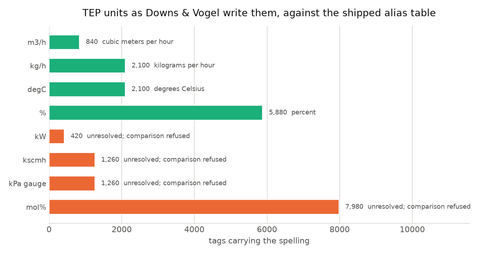
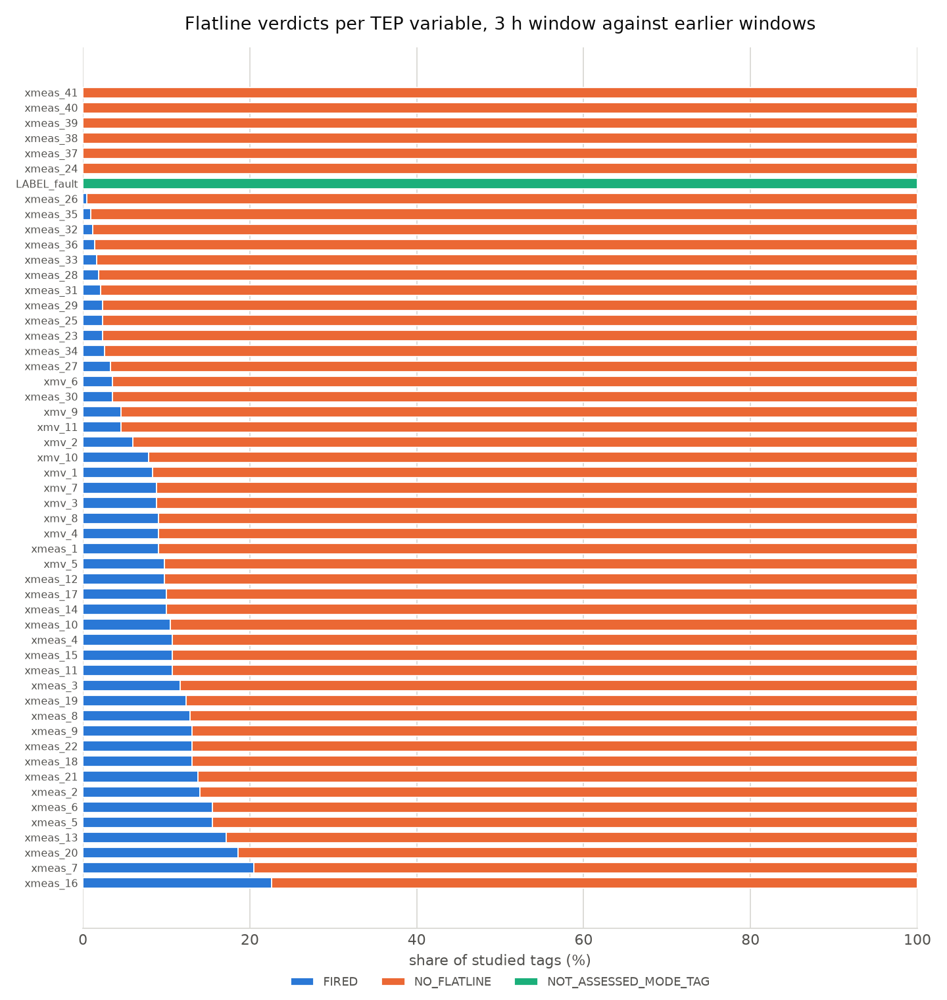
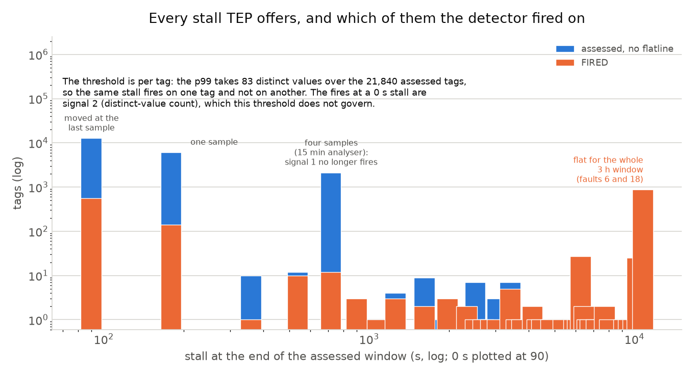
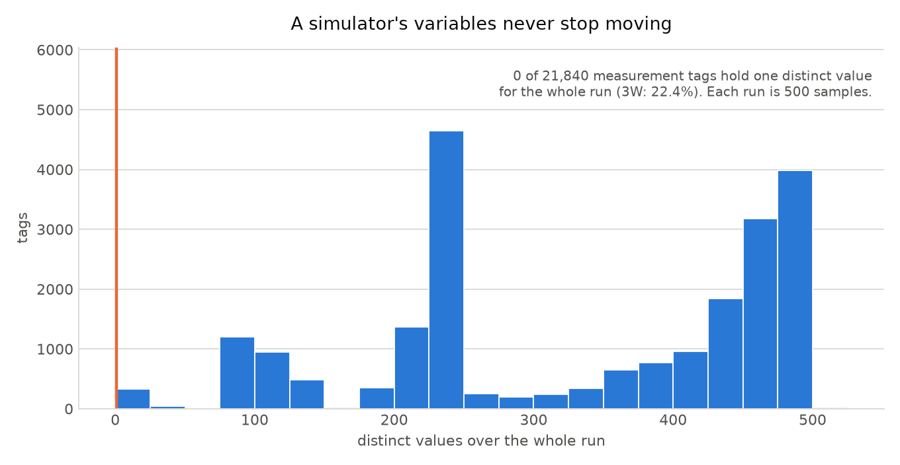

# Stage 1 on a simulator: Tennessee Eastman (Rieth 2017)

**The profile stage finds nothing to refuse on a simulator, and that is the point of running it.** Across 22,260 tags the data-physics layer found 0 gaps, 0 duplicate timestamps, 0 non-monotonic positions, 0 samples below GOOD, and issued 0 refusals; coverage and valid fraction are 1.000 on every tag. Every profile rule that had something to say about 3W - gap classification, absent columns, unmapped quality codes, whole-life freezes - is asking a question about a historian, and a simulator has no historian. That is the contrast the two 3W sections of BENCHMARKS.md exist to be read against.

Three things did come out of it. The one place TEP touches the real world is its engineering units, and 10,920 of 21,840 non-MODE tags carry a spelling the alias table refuses to resolve. The flatline detector's 1,688 fires are led by 866 real ones - the two faults that trip the plant, where the flowsheet genuinely goes flat. And the first run of this study found a library defect on the way there: the p99 the detector compares a stall against came back as the sampling period on all 21,840 assessed tags, because it was computed from the wrong differences. That is now fixed, and the numbers below are the ones after the fix.

## Provenance

| field | value |
|---|---|
| dataset | Harvard Dataverse `doi:10.7910/DVN/6C3JR1` version 1.0 |
| downloaded | 2 files, 518,741,211 bytes: `TEP_FaultFree_Training.RData`, `TEP_Faulty_Training.RData` |
| manifest sha256 | `95f369c2b2b8eb6abc34eac3d003d312fcb5d8b1105d7c42876044c69e27cd0f` |
| code | tagledger 0.1.0 @ `46e8d3b1bfe11afb51ef373d338cfc9e768ba3d2` |
| converted | 420 runs (20 per fault x 21 faults), 22,260 archives, 210,000 source rows |
| studied | 420 runs, 22,260 tags, 166 s wall on 14 processes |

Commands:

```console
uv run python scripts/fetch_tep.py --dest data/tep --yes
uv sync --extra tep
uv run python scripts/convert_tep.py --src data/tep --out data/tep_archives --runs-per-fault 20
uv run python examples/studies/tep_profile/run_study.py --window-s 10800 --jobs 14
uv run python examples/studies/tep_profile/make_report.py
```

## What was studied, and what was not

The Rieth 2017 re-simulation publishes 500 runs of each of 21 conditions (fault-free plus faults 1-20) in each of two splits. The training pair alone is 518,741,211 bytes and would convert to 556,500 archives, so this study takes a documented subset: **simulationRun 1-20 of every fault, training splits only**. That is 420 runs, 22,260 archives, 210,000 rows. The testing splits (884 MB) were not fetched: profiling is descriptive and scores nothing, so a held-out split buys it nothing.

Each run is 500 samples at 180 s, so 25 h of simulated plant. Each archive is read twice - once over its whole extent for the physics block, once over its last 3 h for the flatline assessment. The 3W study used a 1 h window; at TEP's 3-minute sampling 1 h is 20 samples, which is too few for a distinct-value count to mean much and is shorter than the fault-free lead-in of a training run. 3 h is 60 samples per window, and every archive is the same length, so every tag gets the same reference depth: 7 earlier windows on 22,260 tags.

## TEP has no clock, so the timestamps are invented

A TEP row is numbered, not stamped: the RData columns are `faultNumber`, `simulationRun`, `sample` and 52 process variables, and nothing in the file names an instant. tagledger stores UTC only and refuses naive timestamps at ingest, so the converter synthesises one - `2000-01-01T00:00:00+00:00 + 180 s x (sample - 1)` - and writes `timestamp_synthetic: true` into every run's `RUN.json`. All 420 runs share that clock, because each is an independent simulation from its own t=0; the instants are an addressing scheme, not a history. Any number this study reports about time - coverage, gaps, the flatline window - is a statement about the sample grid, and nothing else. That is a decision, not an observation, which is why it is recorded per run rather than mentioned once in a README.

The audit agrees the grid is exact: 0 duplicate timestamps, 0 non-monotonic positions and 0 DST transitions across 22,260 tags. It could hardly say otherwise about a grid this code generated - which is the point of saying it out loud.

## Coverage, gaps and quality

Coverage over the studied tags: min 1.0000, median 1.0000, max 1.0000; 0 tags fall below 1.000. Valid fraction: min 1.0000, median 1.0000, max 1.0000; 0 below 1.000. On 3W those two numbers disagreed on 2,824 tags, because a historian that emits a row every second still emits rows with nothing in them. Here they agree everywhere, because the simulator wrote a value into every cell: 0 non-finite values in 210,000 rows x 52 variables.

No gap of any class was found in any studied tag. The gap classifier - the part of the profile with the most rules, and the part that earns the `unknown` class on 3W - had nothing to classify.

Quality is assumed and labelled as assumed. A simulator emits no quality column because it has nothing to report, so the converter writes `SIMULATED` on every row, declares it in the tag's `quality_codes`, and sets `quality_assumed` so every profile prints *quality ASSUMED at ingest*. That is 11,130,000 GOOD, 0 UNCERTAIN and 0 BAD samples, with 0 tags reporting an unmapped code. The converter refuses a run holding a non-finite value rather than coding it GOOD; no run in this subset triggered that.

TEP publishes no engineering ranges, so `eng_range` is `None` on every tag and the clipped fraction is `null` on all 22,260 of them (0 produced a number, 0 were censored). Same answer as 3W, same reason.

## Units are the only real-world contact

Downs & Vogel (1993) publish the engineering unit of every TEP variable, and the converter carries that table verbatim rather than normalising it: 21,840 non-MODE tags across 8 spellings. Half of them do not resolve.

| spelling | variables | tags | resolves to |
|---|---:|---:|---|
| `%` | 14 | 5,880 | percent |
| `degC` | 5 | 2,100 | degrees Celsius |
| `kPa gauge` | 3 | 1,260 | **unresolved; comparison refused** |
| `kW` | 1 | 420 | **unresolved; comparison refused** |
| `kg/h` | 5 | 2,100 | kilograms per hour |
| `kscmh` | 3 | 1,260 | **unresolved; comparison refused** |
| `m3/h` | 2 | 840 | cubic meters per hour |
| `mol%` | 19 | 7,980 | **unresolved; comparison refused** |



10,920 of 21,840 tags (26 of 52 variables) carry one of `kPa gauge`, `kW`, `kscmh`, `mol%`. Those four are not one problem:

- `kPa gauge` is the refusal `docs/SCHEMA.md` already documents. A gauge pressure is read against local atmosphere and the alias table has no column for a pressure datum, so registering it as `kPa` would make every comparison wrong by about an atmosphere. Leaving it unresolved is the correct answer, not a gap.
- `mol%` is a composition basis, not a bare percentage. It shares a symbol with the `%` that `xmv_*` carries and means something else; resolving both to `percent` would make a valve position comparable with a mole fraction.
- `kscmh` is thousand *standard* cubic metres per hour - the same reference-condition problem as `Nm3/h`, which the table does carry with `reference_condition: true`. This is a table gap, and a declarable one.
- `kW` is plain SI power that pint reads without complaint. This is the same kind of table gap the 3W study found in `Pa`, and the same kind of thing only a real units file surfaces.

The table is left alone here. Two of the four are refusals the schema argues for on purpose, and the other two are alias rows whose reference semantics deserve their own change rather than a line added inside a study.

## Flatline verdicts

Each tag's last 3 h window was assessed against the earlier equal-size windows of the same run.

| verdict | tags | share |
|---|---:|---:|
| `FIRED` | 1,688 | 7.6% |
| `NO_FLATLINE` | 20,152 | 90.5% |
| `NOT_ASSESSED_MODE_TAG` | 420 | 1.9% |



420 of those tags are the `LABEL_fault` MODE archives, and every one is declined as state-valued: a label holds its state until the fault starts, which is the label working, not a sensor freezing. Of the 21,840 measurement tags, 21,840 were assessed and 1,688 fired (7.7%).

| fired on signal(s) | tags |
|---|---:|
| 2 | 711 |
| 1 | 684 |
| 1;2 | 293 |

### Where the fires come from

Every stall the detector measured is one of 38 values, and a few of them carry almost every tag, because the sample grid is exact and the plant's own dynamics are the only source of variety:

| stall at window end | tags | what it is |
|---|---:|---|
| 0 s | 12,677 | the value moved at the last sample |
| 180 s | 6,039 | one sample; no tag's p99 is below 180 s, so it never fires |
| 720 s | 2,121 | four samples: a 15-minute analyser read on a 3-minute grid |
| 10800 s | 866 | no change anywhere in the window |
| 6300 s | 27 | plant dynamics |
| 10260 s | 25 | plant dynamics |



One population accounts for 51.3% of the 1,688 fires, and it is the one worth having. The population that used to sit beside it was an artefact, and it is gone.

**The slow analysers no longer fire, and that is the fix showing.** `xmeas_37`-`xmeas_41` are the composition analysers on the product stream: in the source they change once every five samples and hold in between, so on a 180 s grid the last sample of every run sits 720 s past their last update, on every run, because every run shares the same grid and the same phase. The first run of this study reported all 2,100 of them FIRED - five variables on all 420 runs - because their reference p99 came back as the 180 s sample period and 720 s beats it. Timed between actual change events their p99 is 900 s, which is the composition-analyser sampling period of the plant they simulate, and a 720 s hold no longer beats it: every one of them now returns `NO_FLATLINE`. The staircase was always a staircase; only the threshold was wrong.

**The two faults that stop the plant: 866 tags across 33 runs whose value does not change once in the whole 3 h window.** Every one of them is in fault 6 or fault 18 - 13 of the 20 fault-18 runs, 20 of the 20 fault-6 runs - and they run 24-29 variables deep per run. In `fault06_run001` the A feed flow `xmeas_1` reaches exactly 0.0 and stays there; fault 6 in the Downs & Vogel table is a loss of that feed, and the plant trips, taking most of the flowsheet flat with it. These are the fires worth having, and the only ones here a plant engineer would call a flatline. They are 51.3% of the fires the detector reported.

### The p99 change interval, and the defect that used to flatten it

Signal 1 compares a stall against "the tag's own p99 of historical change intervals" (`src/tagledger/detectors/flatline.py:12-14`). Across the 21,840 assessed tags that p99 now takes 83 distinct values, from 180 s to 5400 s. Four of them cover 98.6% of the tags: 180 s on 12,249, 360 s on 6,933, 900 s on 2,054, 540 s on 296. A tag that updates every sample and a tag that updates every fifth sample no longer get the same reference.

They used to. The first run of this study found the p99 taking exactly one value - 180 s, the sample period - on all 21,840 tags, and that was a library defect rather than a property of TEP. `reference_history` marked the adjacent sample pairs whose value differed and then collected **the spacing of those pairs**, not the time between successive changes:

```python
changed = values.ne(values.shift()).to_numpy(dtype=bool, na_value=False)[1:]
deltas = good["timestamp"].diff().dt.total_seconds().to_numpy()[1:]
...
intervals = [float(d) for d in deltas[changed & same_window]]
```

On any evenly sampled archive every element of `deltas` is the sample period, so every element of `intervals` was too, whatever the tag did. The quantity the docstring names - how long this tag normally goes between changes - is the diff of the timestamps *at* the change points, and it was never computed. The effect was that signal 1 fired on any tag holding a value for two samples or more, which is why a 15-minute analyser read as a flatline here and why the 3W profile study saw a p99 of 1 s on a 1 Hz record. That study read the 1 s as a consequence of dense data; TEP, sampled 180 times slower, gave the same answer scaled by exactly 180, which is what made it structural rather than incidental.

The fix (`fix(api): time reference change intervals between change events`) diffs the timestamps of the change events inside each reference window. On TEP it takes FIRED from 3,827 tags to 1,688: the 2,100 analyser fires go to zero, and the 866 plant-trip fires - the ones on ground truth - all survive it, which is the check that matters.

| variable | FIRED | of |
|---|---:|---:|
| `xmeas_16` | 95 | 420 |
| `xmeas_7` | 86 | 420 |
| `xmeas_20` | 78 | 420 |
| `xmeas_13` | 72 | 420 |
| `xmeas_6` | 65 | 420 |
| `xmeas_5` | 65 | 420 |
| `xmeas_2` | 59 | 420 |
| `xmeas_21` | 58 | 420 |
| `xmeas_22` | 55 | 420 |
| `xmeas_18` | 55 | 420 |
| `xmeas_9` | 55 | 420 |
| `xmeas_8` | 54 | 420 |

### No manipulated variable is held fixed in this distribution

The classic Downs & Vogel plant has a manipulated variable the base-case controller never moves - the agitator speed, XMV(12) - and the expectation going into this study was that a whole-life-constant `xmv_*` would light the flatline detector up the way a frozen transmitter does on 3W. It does not happen here, for a reason worth writing down: **the Rieth 2017 RData carries `xmv_1` through `xmv_11` only.** XMV(12) is not in the file. Every manipulated variable that is present moves under closed-loop control at nearly every sample.

0 of 21,840 measurement tags hold exactly one distinct value across their whole run (0.0%); on 3W that figure was 22.4%, and it is the gate the population baseline at stage 4 exists to get past. The least-varying variables in this subset, by their minimum distinct count over any run:

| variable | fewest distinct values in any run |
|---|---:|
| `xmeas_9` | 9 |
| `xmeas_38` | 87 |
| `xmeas_40` | 92 |
| `xmeas_41` | 93 |
| `xmeas_39` | 96 |
| `xmeas_37` | 98 |
| `xmeas_5` | 120 |
| `xmeas_6` | 124 |



The tag at the bottom of that table is worth opening. `fault06_run004:xmeas_9` holds 9 distinct values over 500 rows, spanning 120.36 to 120.44 degC in steps of 0.01. It is not a stuck sensor and it is not a quiet one: it is a reactor temperature under tight control, published rounded to two decimals. **The distinct-value signal on this dataset is partly measuring the source's decimal precision**, and a variable whose controlled range is narrower than its stored resolution will look frozen to any counting rule. Nothing in the archive records how many digits the simulator kept, so nothing downstream can correct for it.

## Refusals

No archive was refused. All 22,260 studied tags read cleanly. Every profile refusal - naive timestamps, a missing quality column, a string on a measurement tag, a censored baseline - names a way a historian can be wrong, and the conversion had already turned the two that TEP can reach (no clock, no quality column) into recorded decisions, each marked in the archive metadata.

## What a simulator does and does not test

The 3W profile study listed seven ways real data disagreed with the synthetic backbone. TEP sits between the two, and being explicit about which side it is on is the reason this section exists.

1. **It exercises the ingest decisions, not the physics rules.** TEP forces two declarations, a synthesised clock and an assumed quality code, and both travel with the archive where a reader can see them. That is the part of the profile this dataset tests end to end.
2. **It cannot exercise the gap classifier at all.** Zero gaps of any class. The rules that decide whether silence is compression, an outage or `unknown` never run, and no amount of TEP will make them run.
3. **It exercises the freeze detector in one narrow, real way.** 0 tags are frozen for their whole run, so the 3W case - a transmitter pinned for its entire archive, which no self-referencing threshold can reach - does not occur here at all. What does occur is a plant that trips: 866 tags in 33 runs of two faults go flat for a whole window and the detector says so. That is a true positive on ground truth, and it is 51.3% of the fires. The other 822 are tags that stalled for longer than their own history says they usually do, scattered across 46 variables rather than concentrated in five.
4. **Its units are real and its numbers are not.** The one thing TEP inherits from a real plant is the Downs & Vogel unit table, and that is precisely where the profile refuses: 10,920 tags unresolved, comparison refused. A validation backbone whose only real-world contact is the part the library declines to guess about is a fair description of what a simulator is worth here.
5. **Ground truth is the thing it does have.** Every run carries `LABEL_fault` with the fault number per row and the onset sample recorded in `RUN.json` (192,400 faulty rows over 210,000). The profile does not use it. Stages 3 and above will, and TEP is where a detector number can be checked against a fault whose start time is known exactly rather than inferred from a folder name.

## Files

| path | what |
|---|---|
| `run_study.py` | profiles every archive, writes `results/per_tag.csv` |
| `make_report.py` | this report, `results/summary.json`, `out/*.png` |
| `results/summary.json` | every number above, machine-readable (committed) |
| `results/per_tag.csv` | one row per studied tag, 38 columns (committed) |
| `results/run.json` | window size, wall time, tag count (committed) |
| `results/benchmarks_section.md` | the BENCHMARKS.md REAL block, generated from `summary.json` |
